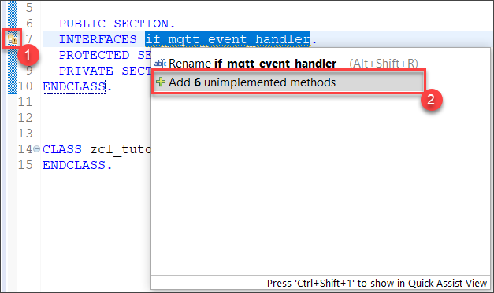
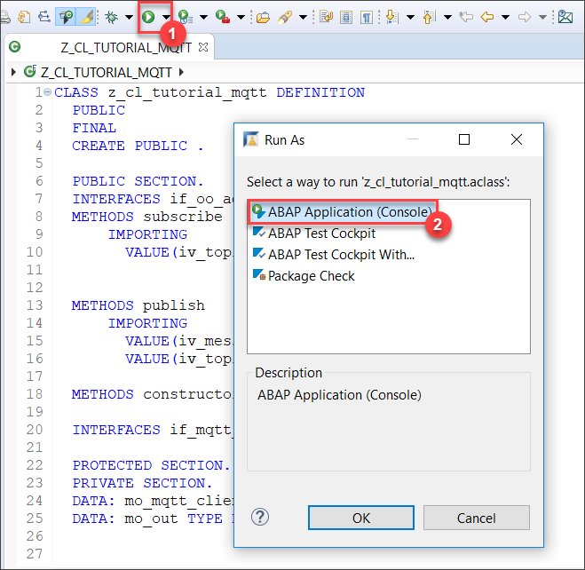
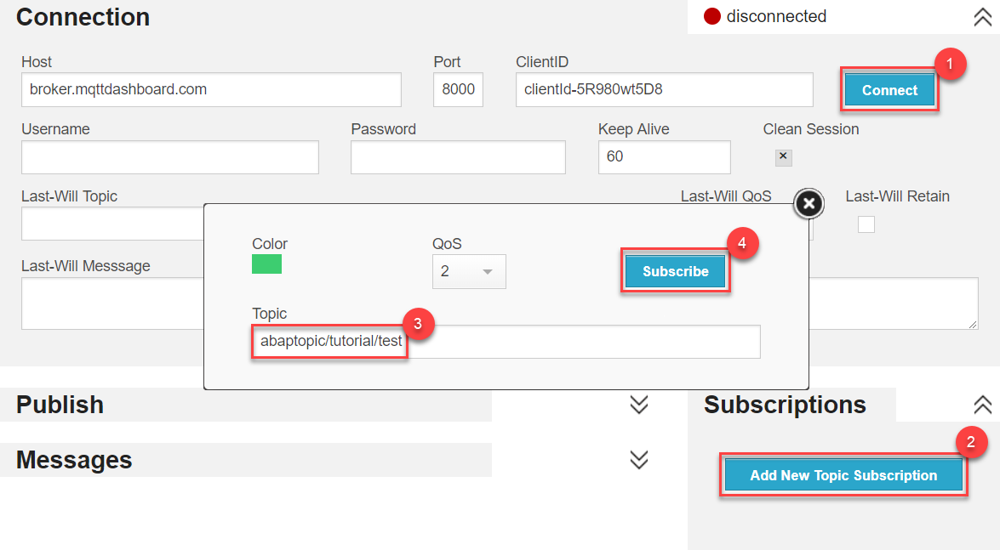

## Prerequisites
- [Create an ABAP project in Eclipse](https://developers.sap.com/tutorials/abap-create-project.html)
- The ABAP MQTT Client is available on **ABAP Platform 1809** and above.
- You need to use **ABAP Development Tools**.

## Details
### You will learn
  - How to publish an MQTT message in ABAP
  - How to receive MQTT messages in ABAP


### Time to Complete
**20 Min**.

---
In this tutorial, you will create a simple ABAP class that can publish and receive messages using the MQTT protocol.

[ACCORDION-BEGIN [Step 1: ](Create a new ABAP class)]
Create a new ABAP class called `ZCL_TUTORIAL_MQTT` and implement the interface `IF_MQTT_EVENT_HANDLER` by adding the snippet to the `PUBLIC SECTION` of your class:
```abap
INTERFACES if_mqtt_event_handler.
```
Next, add the 6 unimplemented abstract methods by clicking the light bulb to the right of the line you just inserted and select **Add 6 unimplemented methods**.



[DONE]
[ACCORDION-END]


[ACCORDION-BEGIN [Step 2: ](Create the MQTT Client and connect to the broker)]
Now you need to create a new MQTT Client and connect to your MQTT message broker. For the example shown in this tutorial, you can use a public broker hosted by [HiveMQ](http://www.hivemq.com/) or any other broker of your choice. In a more serious project, please use a different broker.

You'll handle all of this in the constructor. First add this method definition to the `PUBLIC SECTION` of your class:
```abap
METHODS constructor.
```

Add the data definition of this local object to the `PRIVATE SECTION` of your class, you will need it in a moment.

```abap
DATA: mo_mqtt_client TYPE REF TO if_mqtt_client.
```

The constructor passes the URL of the HiveMQ MQTT broker and the event handler instance to a factory method `CREATE_BY_URL`, which returns a new MQTT Client object `MO_MQTT_CLIENT`. Finally, a connection to the specified message broker is established.

Paste the following method into your class implementation.
```abap
METHOD constructor.
  TRY.
      " create MQTT client
      cl_mqtt_client_manager=>create_by_url(
        EXPORTING
          i_url            = 'ws://broker.hivemq.com:8000/mqtt'
          i_event_handler  = me
        RECEIVING
          r_client        = mo_mqtt_client ).

      " establish the connection
      mo_mqtt_client->connect( ).
    CATCH cx_mqtt_error.
      " to do: error handling, e.g. write error log!
  ENDTRY.
ENDMETHOD.
```
[DONE]
[ACCORDION-END]

[ACCORDION-BEGIN [Step 3: ](Implement the PUBLISH method)]
Create a new method to publish messages. First, add this method definition to the `PUBLIC SECTION` of your class.

```abap
METHODS publish
      IMPORTING
        VALUE(iv_message) TYPE string
        VALUE(iv_topic)   TYPE string .
```

This `PUBLISH` method creates a new MQTT message, specifies its content, quality of service and topic, and finally publishes the message.

Paste this method into your class implementation.
```ABAP
METHOD publish.
  TRY.
      " create message with specific quality of service (QoS)
      DATA(lo_mqtt_message) = cl_mqtt_message=>create( ).
      lo_mqtt_message->set_qos( if_mqtt_types=>qos-at_least_once ).
      lo_mqtt_message->set_text( iv_message  ).
      " publish message to topic
      mo_mqtt_client->publish(
                EXPORTING i_topic_name = iv_topic
                          i_message    = lo_mqtt_message ).
    CATCH cx_mqtt_error.
      " to do: error handling, e.g. write error log!
  ENDTRY.
ENDMETHOD.
```
>The Quality of Service (QoS) specifies if the message is sent once without the receiver acknowledging it (at most once), sent multiple times until the receiver acknowledges receiving it (at least once) or if the two parties should engage in a two-level handshake to ensure exactly one copy of the message is received (exactly once).

[DONE]
[ACCORDION-END]

[ACCORDION-BEGIN [Step 4: ](Publish an MQTT message)]
Add the interface `IF_OO_ADT__CLASSRUN` to your class by copying the following code to the `PUBLIC SECTION` of your class:
```abap
INTERFACES if_oo_adt_classrun.
```

Now implement the method `IF_OO_ADT__CLASSRUN~MAIN`. Therefore, use the following snippet as your implementation:

```abap
METHOD if_oo_adt_classrun~main.
  DATA(lo_mqtt_class) = NEW zcl_tutorial_mqtt( ).
  lo_mqtt_class->publish( iv_topic = 'abaptopic/tutorial/test' iv_message = 'Hello MQTTTTTTTT World ;-)' ).
ENDMETHOD.
```

>You can change the topic in order to avoid interference with other users completing this tutorial.

Now, simply **activate and execute** the class as an **ABAP Application (Console)** to publish the message.

**Congratulations, you just sent your first MQTT message via ABAP!**

You can use the [HiveMQ Websocket Client](http://www.hivemq.com/demos/websocket-client/) to subscribe to your topic and monitor the messages you're sending.


>1. Click on the "Connect" button.
2. Choose "Add New Topic Subscription".
3. In the popup window, enter `abaptopic/tutorial/test` or the topic you decided to use.
4. Finally, click the "Subscribe" button.

[DONE]
[ACCORDION-END]

[ACCORDION-BEGIN [Step 5: ](Implement the ON_MESSAGE method)]
Whenever your event handler receives a message, you want to log it to the console. To do so, save the `OUT` object passed to you by the `IF_OO_ADT_CLASSRUN~MAIN` method as a local object. Add the following line of code to the `PRIVATE SECTION` of your class definition.

```abap
DATA: mo_out TYPE REF TO if_oo_adt_classrun_out.
```

Replace the `IF_OO_ADT_CLASSRUN~MAIN` method with the implementation below to save the `OUT` object.

```abap
METHOD if_oo_adt_classrun~main.
  DATA(lo_mqtt_class) = NEW zcl_tutorial_mqtt( ).
  lo_mqtt_class->mo_out = out.
  lo_mqtt_class->publish( iv_topic = 'abaptopic/tutorial/test' iv_message = 'Hello MQTT World ;-)' ).
ENDMETHOD.
```


Now specify what happens once your event handler receives a message. The code below will display a popup with a message in the format of: `Received message "Test message" in topic "abaptopic/tutorial/test"`

Replace your `ON_MESSAGE` method with the following code to write any received MQTT message to the console:

```abap
METHOD if_mqtt_event_handler~on_message.
  TRY.
      " Concatenate strings to form message for console output
      DATA(lv_message) = 'Received message "' && i_message->get_text( ) && '" in topic "' && i_topic_name && '"'.
      " output message
      mo_out->write( lv_message ).
    CATCH cx_ac_message_type_pcp_error cx_mqtt_error.
      " to do: error handling, e.g. write error log!
  ENDTRY.
ENDMETHOD.
```

[DONE]
[ACCORDION-END]

[ACCORDION-BEGIN [Step 6: ](Subscribe to an MQTT topic)]
After you have implemented the `ON_MESSAGE` method, you can subscribe to a topic to receive messages from the broker. To do so, create a new MQTT topic filter. Specify the topic you want to subscribe to and the Quality of Service of your choice.


Add this method definition to the `PUBLIC SECTION` of your class.
```abap
METHODS subscribe
      IMPORTING
        VALUE(iv_topic) TYPE string .
```

Then implement the method using the following snippet:

```abap
METHOD subscribe.
  TRY.
      " subscribe to topic filter with QoS
      DATA(lt_mqtt_topic_filter_qos) =
            VALUE if_mqtt_types=>tt_mqtt_topic_filter_qos(
                          ( topic_filter = iv_topic
                           qos          = if_mqtt_types=>qos-at_least_once ) ).

      mo_mqtt_client->subscribe(
          EXPORTING
             i_topic_filter_qos = lt_mqtt_topic_filter_qos ).
    CATCH cx_mqtt_error.
      " to do: error handling, e.g. write error log!
  ENDTRY.
ENDMETHOD.
```
[DONE]
[ACCORDION-END]

[ACCORDION-BEGIN [Step 7: ](Test your program)]
Add the following snippet to the `IF_OO_ADT__CLASSRUN~MAIN` method you have implemented earlier.
```abap
lo_mqtt_class->subscribe( 'abaptopic/tutorial/test' ).
lo_mqtt_class->publish( iv_topic = 'abaptopic/tutorial/test' iv_message = 'Are you reading this?' ).
WAIT UP TO 5 SECONDS.
```
Your MQTT Client will subscribe to the specified topic, publish a message to the same topic, and the broker will send it back. This will trigger the `ON_MESSAGE` method.

If you want to test your application further you can use the [HiveMQ Websocket Client](http://www.hivemq.com/demos/websocket-client/) to publish and receive messages.

Paste your ABAP Development Tools Console output below to validate that you completed the tutorial.

[VALIDATE_1]
[ACCORDION-END]

[ACCORDION-BEGIN [Step 8: ]([Optional] Unsubscribe and disconnect)]
Instead of leaving the connection open, you can also unsubscribe from a topic and terminate your connection to the broker.

Add this method definition to the `PUBLIC SECTION` of your class.
```abap
METHODS terminate.
```

Implement the `TERMINATE` method by copying the following code into you class implementation:

```abap
METHOD terminate.
  TRY.
      " unsubscribe from all topics using the wildcard '#'
      DATA(lt_mqtt_topic_filter) = VALUE if_mqtt_types=>tt_mqtt_topic_filter(
                                          ( topic_filter =  '#' ) ).

      mo_mqtt_client->unsubscribe(
                   EXPORTING i_topic_filter = lt_mqtt_topic_filter ).
      " disconnect from broker
      mo_mqtt_client->disconnect( ).
    CATCH cx_mqtt_error.
      " to do: error handling, e.g. write error log!
  ENDTRY.
ENDMETHOD.
```
You can now call the `TERMINATE` method from your `IF_OO_ADT__CLASSRUN~MAIN` method by adding the following line to the end of the `MAIN` method.
```abap
lo_mqtt_class->terminate( ).
```
[DONE]
[ACCORDION-END]
