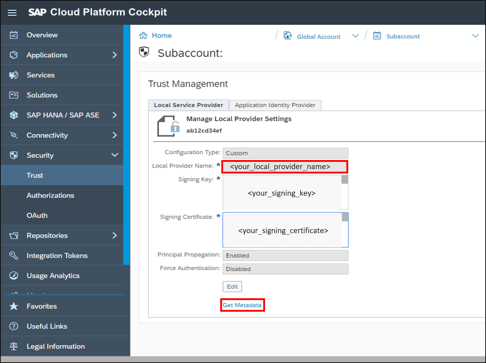

## Prerequisites  
- **Tutorials:** [`Set up trust between identity authentication and SAP Cloud Platform subaccount`](https://developers.sap.com/tutorials/abap-custom-ui-trust-settings.html)
- **Authorizations:** You must assign business catalog **`SAP_CORE_BC_COM`** to your user.

## Details
### You will learn
- How to create a OAuth communication system and user
- How to specify the SAP Web IDE link from SAP Cloud Platform
- How to upload the certificate

This tutorial focuses on creating an OAuth communication systems. To create such an OAuth communication system, you must insert the link address from SAP Cloud Platform, add your host name, edit and upload a certificate so that the S/4HANA system trusts your SAP Cloud Platform subaccount.

### Time to Complete
**15 Min**.

---

[ACCORDION-BEGIN [Step 1: ](Open communication system application)]
Navigate to **Communication Systems** tile to start the application.


[ACCORDION-END]

[ACCORDION-BEGIN [Step 2: ](Create communication system)]
Create a new communication system by clicking **New**.


[ACCORDION-END]

[ACCORDION-BEGIN [Step 3: ](Add system ID and system name)]
By adding a system ID, system name and clicking **Create**, you are able to register a new communication system.


[ACCORDION-END]

[ACCORDION-BEGIN [Step 4: ](Copy link address)]
Switch back to your SAP Cloud Platform cockpit, go to **Services** and select **SAP Web IDE**. Copy the link address of **Go to Service**. This will be needed in the creation process of the communication system.


[ACCORDION-END]

[ACCORDION-BEGIN [Step 5: ](Add host name)]
Add your host name. This information can be found on SAP Cloud Platform. It corresponds to the link address copied from Step 4 of this tutorial.


[ACCORDION-END]

[ACCORDION-BEGIN [Step 6: ](Add inbound communication user to system)]
Click **`+`** to add a user for inbound communication. Inbound communication means that the here defined system is used from a communication partner to call from external into the S/4HANA system. Doing this, the user that will be added next has to be used to get authorized.


[ACCORDION-END]

[ACCORDION-BEGIN [Step 7: ](Create communication user)]
Click **New User** to create one.


[ACCORDION-END]

[ACCORDION-BEGIN [Step 8: ](Add user data and password)]
Enter a **user name** and **description** for your user. Give your user a password and click **Create**.


[ACCORDION-END]

[ACCORDION-BEGIN [Step 9: ](Confirm user to add)]
The new user will be generated by clicking **OK**.


[ACCORDION-END]

[ACCORDION-BEGIN [Step 10: ](Get SAP Cloud Platform subaccount's metadata)]
Switch to your SAP Cloud Platform subaccount. Open **trust settings** and download the metadata by clicking **Get Metadata**. Also copy the local provider name for later use.



[ACCORDION-END]

[ACCORDION-BEGIN [Step 11: ](Create certificate from metadata)]
Take your downloaded metadata file from SAP Cloud Platform and open it with an editor of your choice.

1. Copy the code between both tags in another file.

2. Add also the begin and end tag to your copied code:

    ```swift
          -----BEGIN CERTIFICATE-----
               your_copied_code
          -----END CERTIFICATE-----

    ```
3. Save your changes as `.cer` file.


[ACCORDION-END]

[ACCORDION-BEGIN [Step 12: ](Upload signing certificate to communication system)]
Go back to your SAP S/4HANA Cloud system and open your created communication system draft. Edit your draft and enable it for OAuth 2.0 by checking the enabled box. Then upload the certificate by clicking upload signing certificate. Enter the provider name, which is the subaccount's local service provider's name. You copied it a few steps before. Click **Save**.


With this step, you've uploaded your certificate to your communication system. Now your S/4HANA system trusts your SAP Cloud Platform subaccount.

[ACCORDION-END]
