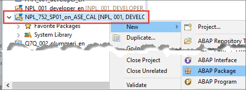
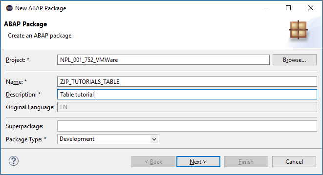
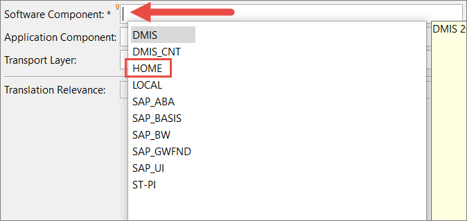
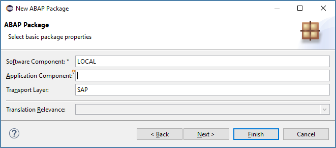
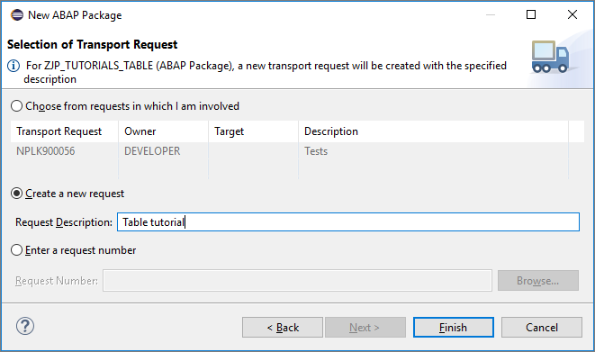
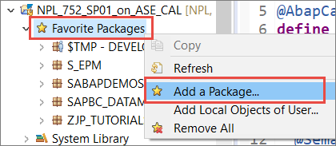
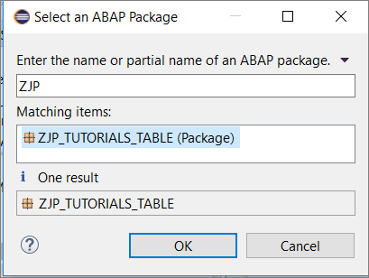

## Details
### You will learn  
- How to create **ABAP packages** and **transport requests** and why they are important. You will create an ABAP package and add it to your *Favorite packages* list in ABAP Development Tools (ADT).

You will create a package in the ABAP Development Tools. Later, you will use this package to group all the subsequent development objects you create in this group of tutorials.

Generally you create one project for each backend connection, and then, inside that project, one package for each self-contained development unit – containing all the relevant development objects. A set of packages delivered together form a software component.

Each package is then assigned to a transport layer.

For more information, see [SAP Help Portal: ABAP Packages](https://help.sap.com/viewer/c238d694b825421f940829321ffa326a/7.5.10/en-US/4ec14bab6e391014adc9fffe4e204223.html).

**Transport layer**: A package property that defines the transport behavior of a package – whether and how a package and all its development objects are transported.

To export (or import) ABAP development objects into/from another system, you transport them, by adding them to a **transport request**. In these tutorials, you simply bundle all your objects in one request. However, in the real world, you cannot change a running system. Therefore, you generally have at least 3 systems: **Development, Consolidation**, and **Production**. These 3 systems all form one **transport layer**, as shown in the following image:

  

In the AS ABAP developer edition, we offer only one layer, **SAP**, the standard layer for SAP applications. In a real-world system, you will get a whole list of layers. Why? Well, you often want to transport objects to several different production systems. For example, you may want to transport some of the same objects to both a Financials system and an HCM system. To do this, you create two or more transport layers, as shown in the following image:

  

For more information, see [SAP Library: Transport Layer](https://help.sap.com/viewer/c238d694b825421f940829321ffa326a/7.5.10/en-US/4ec218e26e391014adc9fffe4e204223.html)

**Software component**: Defines a delivery and product unit of a SAP software product. It comprises a set of packages that are delivered in a single unit. (You do not need to know the details of software components to complete this tutorial, but if you need more information, see [SAP Library: Software Component](https://help.sap.com/viewer/c238d694b825421f940829321ffa326a/7.5.10/en-US/4ec1e23b6e391014adc9fffe4e204223.html)

---

[ACCORDION-BEGIN [Step 1: ](Create a package)]

Select the project you created previously, then choose *<Project>* > **New > ABAP Package**:

[DONE]

[ACCORDION-END]

[ACCORDION-BEGIN [Step 2: ](Define the package)]

1. Enter the following and choose **Next**:
    - Name = **`Zxx_TUTORIALS`**, where **`xx`** = your initials
    - Description = **Table tutorial**
    - Package type = **Development**

    

2. Choose a **Software Component**, by placing the cursor in the field and choosing **Autocomplete (Ctrl+Space)**, then choose **HOME** (default for customer developments):

      

3. Choose the following, then choose Next:
    - Application Component (optional) = `CA` (Cross-Application)
    - Transport layer = SAP (for SAP Standard Objects, default for application programming).
      (Note: In a real SAP System, you would have many options, but in this developer edition, we have reduced the options for size and simplicity's sake.)

      

4. Accept the default proposal for the transport request if one exists and choose **Enter**. Otherwise, choose a new request, enter a description, such as "Table tutorial", then choose Finish:

      

[DONE]

[ACCORDION-END]

[ACCORDION-BEGIN [Step 3: ](Add to favorite packages)]
(Optional, but recommended): Finally, add this new packages to your **Favorite packages**:

1. In your project, select (right-click on)  **Favorite packages**, then choose  **Add a package…**:

    

2. Enter the first three characters of your package (**`Zxx`**, where **`xx`** = your initials), then choose the package, then choose **OK**:

    

The package is added to the list.

And that's it. You can now group development objects that belong together in one package.

[DONE]

[ACCORDION-END]

[ACCORDION-BEGIN [Step 4: ](Test yourself)]

[VALIDATE_1]

[ACCORDION-END]

---
