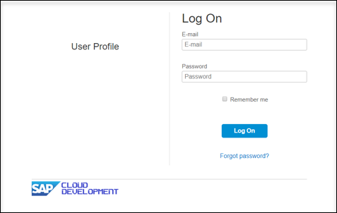
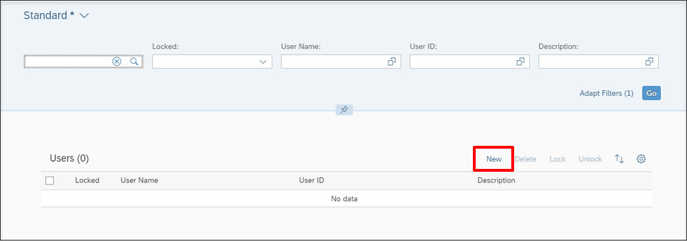
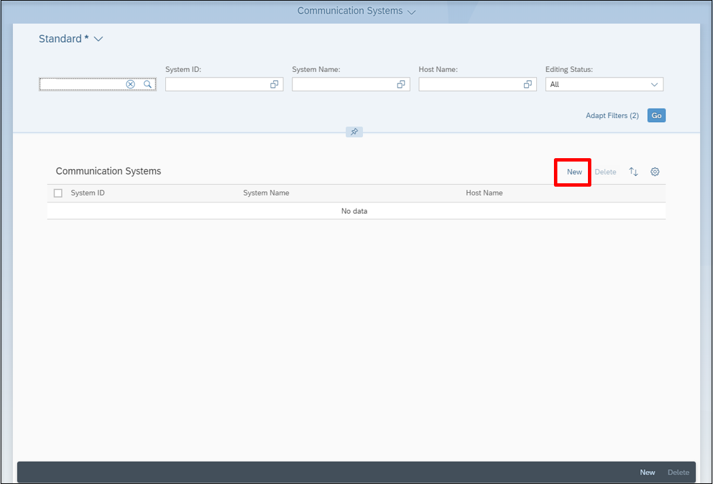
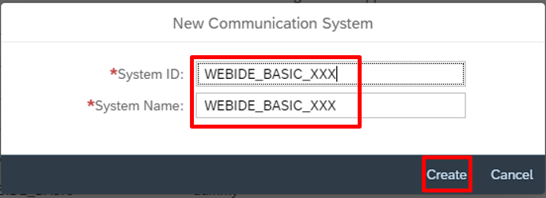
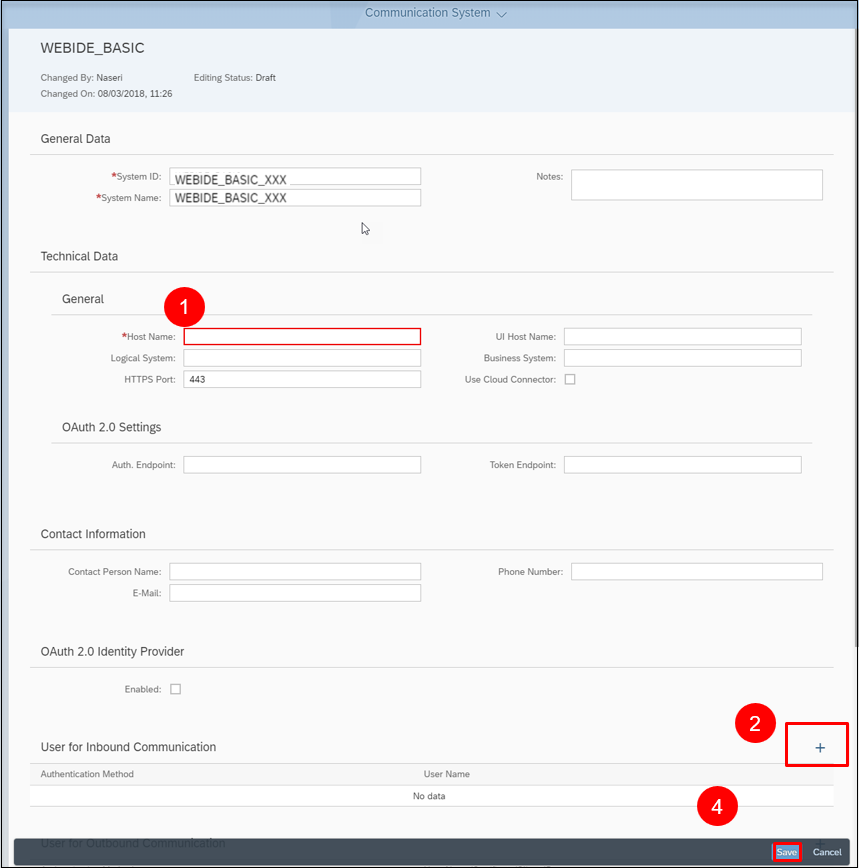
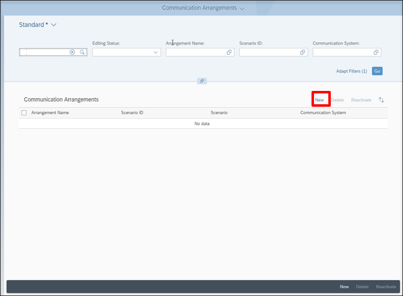
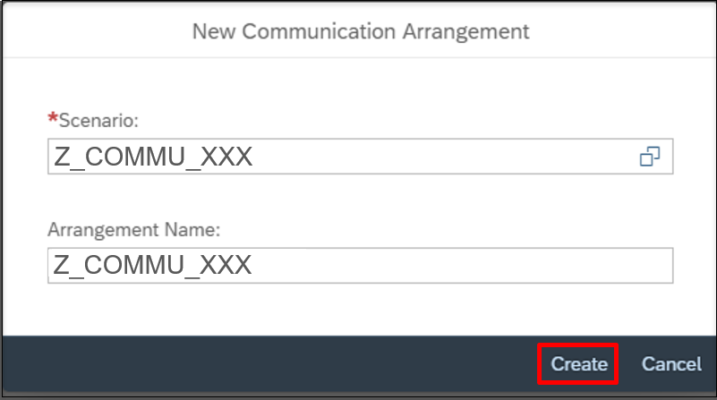
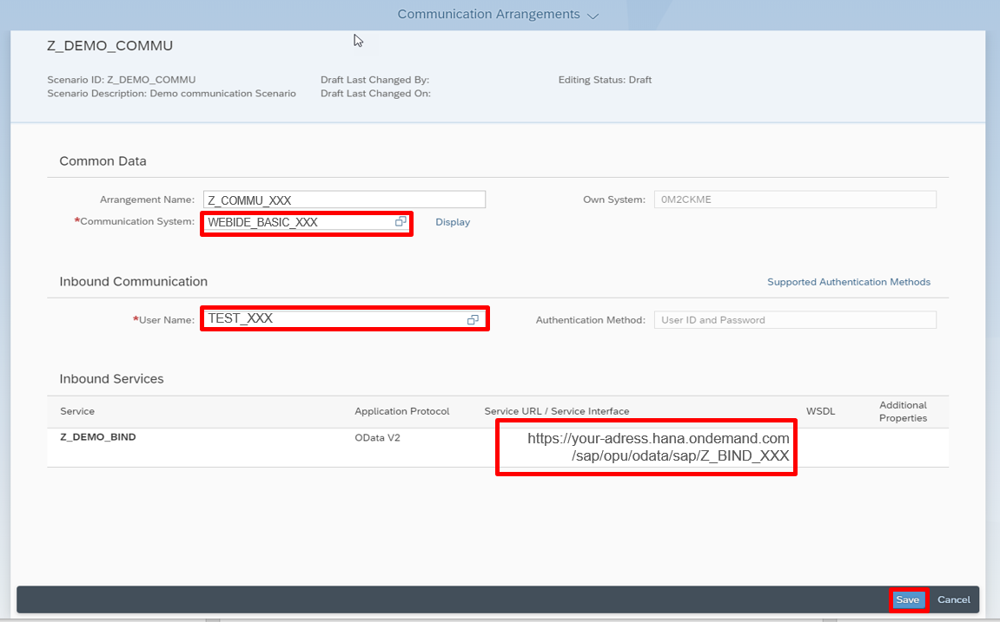

## Details
### You will learn  
- How to create a communication user
- How to create a communication system
- How to create a communication arrangement

In this tutorial, wherever `xxx` appears, use a number (e.g. `000`).

---

[ACCORDION-BEGIN [Step 1: ](Login to SAP Fiori Launchpad)]

1. Login with the developer user and password in SAP Fiori Launchpad.

2. Navigate to  **Communication Management**.

[DONE]
[ACCORDION-END]

[ACCORDION-BEGIN [Step 2: ](Create communication user)]

1. Navigate to **Maintain Communication User**.

2. Create a new user by clicking **New**.

[DONE]
[ACCORDION-END]

[ACCORDION-BEGIN [Step 3: ](Add communication user data)]

1. Enter a user name and description for your user.
2. Give your user a password.
3. Click **Create**.

[DONE]
[ACCORDION-END]

[ACCORDION-BEGIN [Step 4: ](Create communication system)]

1. Navigate back to Home and then to **Communication System**.

2. Create a new communication system by clicking **New**.

[DONE]
[ACCORDION-END]

[ACCORDION-BEGIN [Step 5: ](Add system ID)]

1. Add a system ID and system name
2. Click on **Create**
A new communication system will be registered.

[DONE]
[ACCORDION-END]

[ACCORDION-BEGIN [Step 6: ](Add communication system data)]

1. Add your host name.
2. Click  **+** button to add the created communication user for inbound communication. Inbound communication means that the here defined system is used from a communication partner to call from external into the S/4HANA system.
3. Click **Save**.

[DONE]
[ACCORDION-END]

[ACCORDION-BEGIN [Step 7: ](Create communication arrangement)]

1. Navigate back to Home and then to **Communication Arrangement**.

2. Create a new communication arrangement by clicking **New**.

[DONE]
[ACCORDION-END]

[ACCORDION-BEGIN [Step 8: ](Select scenario)]

Select your scenario and click on **Create**.

[DONE]
[ACCORDION-END]

[ACCORDION-BEGIN [Step 9: ](Add communication arrangement data)]

1. Add your communication system and select the communication user which you created in the first step in this tutorial.
2. Copy this service URL / service interface from created communication arrangement, you will need it in next steps.
3. Click **Save**.

[DONE]
[ACCORDION-END]

[ACCORDION-BEGIN [Step 10: ](Check the service URL)]

1. Paste your service URL in a browser or in Postman.
2. Use the communication user and password.
3. Check if you can connect to the service and there is no error.

[DONE]
[ACCORDION-END]

[ACCORDION-BEGIN [Step 11: ](Test yourself)]

[VALIDATE_1]
[ACCORDION-END]

---
