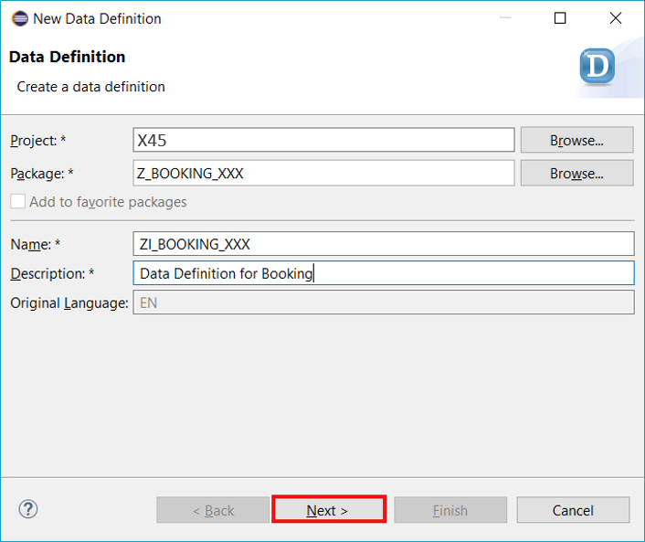
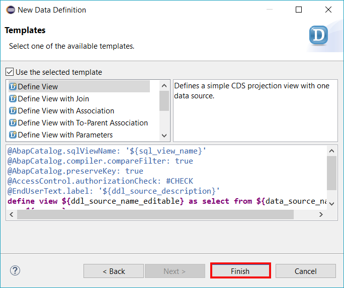
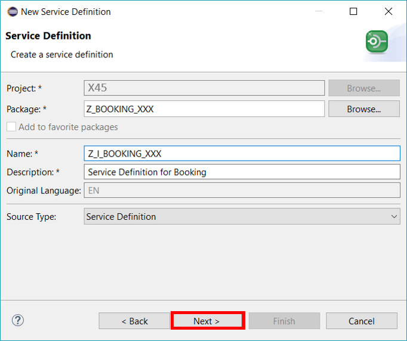
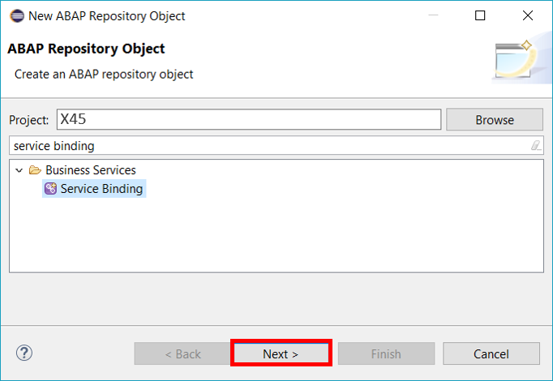
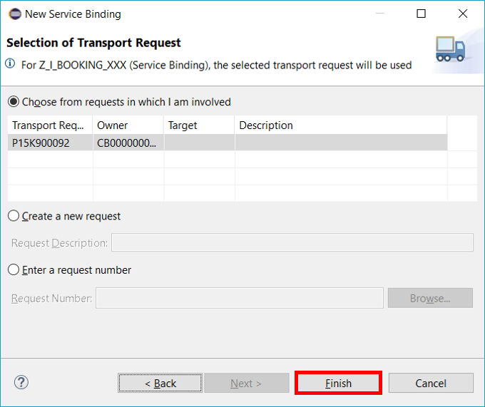
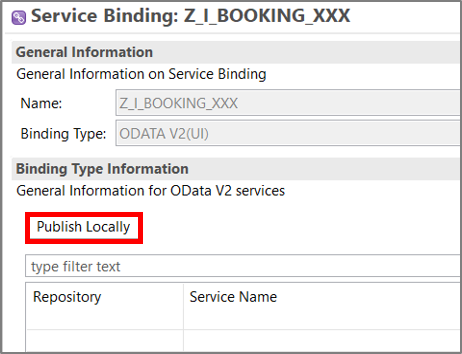
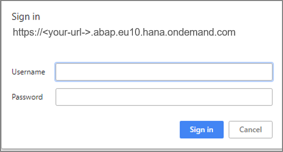
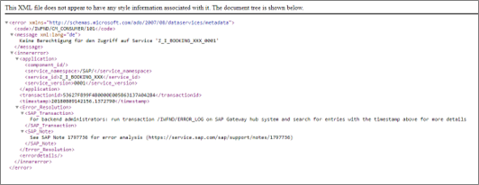

## Prerequisites  
- SAP Cloud Platform ABAP Environment user
- Business Catalog `SAP_CORE_BC_EXT_TST` assigned to your business user
- Initial development setup

## Details
### You will learn
- How to create a database table
- How to create Core Data Services

In this tutorial, wherever `XXX` appears, use a number (e.g. `000`).

---

[ACCORDION-BEGIN [Step 1: ](Open Eclipse)]
Select to your ABAP package created in tutorial **Create Simple Database Table for ABAP Environment** and create a Core Data Services (CDS) data definition.


[DONE]
[ACCORDION-END]

[ACCORDION-BEGIN [Step 2: ](Create data definition)]
  1. Search for **data definition**, select it and click **Next**.

      

  2. Enter a name and a description for your data definition `ZI_BOOKING_XXX`.

      

  3. Select a new transport request and click **Next**.

      

  4. Select **Define View template** and press **Finish**.

      

[DONE]
[ACCORDION-END]

[ACCORDION-BEGIN [Step 3: ](Specify SQL view)]
  1. Specify the `sql view name` in the view definition as **`ZV_BOOKING_XXX`**.

      

  2. Specify your data source after the select from statement as **`ztbooking_xxx`**.

      

  3. Specify your data definition as shown below. The keyword key is used to specific a key element and the keyword as is used to define alias names. The two associations `I_Country` and `I_Currency` are defined and exposed in the projection. The element `CurrencyCode` is specified as currency key for the element Cost which is an amount field. The view entity is specified as searchable using the view annotation `@Search.searchable: true` and the element `CustomerName` is specified as default search element using the element annotation `@Search.defaultSearchElement: true`.

    ```swift
    @AbapCatalog.sqlViewName 'ZV_BOOKING_XXX'
    @AbapCatalog.compiler.compareFilter : true
    @AbapCatalog.preserveKey: true
    @AccessControl.authorizationCheck: #CHECK
    @EndUserText.label : 'Data Definition Booking'
    @Search.searchable : true
    define view ZI_BOOKING_XXX
       as select from ztbooking_xxx as Booking
       association [0..1] to I_Country  as _Country  on $projection.country = _Country.country
       association [0..1] to I_Currency as _Currency on $projection.CurrencyCode = _Currency.Currency

       {
         key booking              as Booking,
             @Search.defaultSearchElement: true
             customername         as CustomerName,
             numberofpassengers   as NumberOfPassengers,
             emailaddress         as EmailAddress,
             country,
             dateofbooking        as DateOfBooking,
             dateoftravel         as DateOfTravel,
             @Semantics.amount.currencyCode: 'CurrencyCode'
             cost,
             @Semantics.currencyCode: true
             currencycode          as CurrencyCode,
             lastchangedat         as LastChangedAt,

             _Country,
             _Currency       
    }
    ```
  4. Save and activate.

      

[DONE]
[ACCORDION-END]

[ACCORDION-BEGIN [Step 4: ](Add UI annotation)]
  1. Go back to the data definition and used the **`@UI`** annotations to add the UI-specific semantics. Add following UI annotation in front of your data definition.

      

    ```swift
        @UI: {
      headerInfo: {
      typeName: 'Booking',
      typeNamePlural: 'Bookings',
      title: { type: #STANDARD, value: 'Booking' }
      }
    }
    ```

  2. Replace your code with following:

    ```swift
    define view ZI_Booking_XXX
      as select from ztbooking_xxx as Booking
      association [0..1] to I_Country  as _Country  on $projection.country = _Country.Country
      association [0..1] to I_Currency as _Currency on $projection.CurrencyCode = _Currency.Currency
    {

          @UI.facet: [
            {
              id:       'Booking',
              purpose:  #STANDARD,
              type:     #IDENTIFICATION_REFERENCE,
              label:    'Booking',
              position: 10 }
          ]


          @UI: {
              lineItem: [ { position: 10, importance: #HIGH, label: 'Booking ID' } ],
              identification:[ { position: 10, label: 'Booking ID' } ]
              }
      key booking                                as Booking,

          @UI: {
            lineItem: [ { position: 20, label: 'Customer', importance: #HIGH } ],
            identification:[ { position: 10, label: 'Customer' } ]
          }
          @Search.defaultSearchElement: true
          customername                           as CustomerName,

          @UI: {
          lineItem: [ { position: 30, label: 'No of Passengers', importance: #HIGH } ],
          identification:[ { position: 30, label: 'No of Passengers' } ]
          }
          numberofpassengers                     as NumberOfPassengers,

          @UI: {
               identification:[ { position: 40, label: 'Email' } ]
           }
          emailaddress                           as EmailAddress,

          @UI: {
               identification:[ { position: 50, label: 'Country' } ]
           }
          country,

          @UI: {
               identification:[ { position: 60, label: 'Booked On' } ]
           }
          dateofbooking                          as DateOfBooking,

          @UI: {   identification:[ { position: 70, label: 'Traveling on' } ]    }
          dateoftravel                           as DateOfTravel,


          @UI: {
          lineItem: [ { position: 40, label: 'Cost', importance: #HIGH } ],
          identification:[ { position: 80, label: 'Cost' } ]
          }
          @Semantics.amount.currencyCode: 'CurrencyCode'
          cost,

          @UI: { identification:[ { position: 90, label: 'Currency' } ]     }
          @Semantics.currencyCode: true
          currencycode                           as CurrencyCode,

          @UI: { identification:[ { position: 100, label: 'Last Changed At' } ] }
          lastchangedat                          as LastChangedAt,

          //publich associations
          _Country,
          _Currency
    }
    ```

  3. Save and activate your data definition.

      

[DONE]
[ACCORDION-END]

[ACCORDION-BEGIN [Step 5: ](Open other repository object)]
Right-click on your package and navigate to **New** > **Other ABAP Repository Object** from the appearing context menu.


[DONE]
[ACCORDION-END]

[ACCORDION-BEGIN [Step 6: ](Create service definition)]
  1. Search for **service definition**, select the appropriate entry and click **Next**.

      

  2. Create a service definition and call it **`Z_I_BOOKING_XXX`**.

      

  3. Click **Finish** to complete your transport request.

      

[DONE]
[ACCORDION-END]

[ACCORDION-BEGIN [Step 7: ](Expose entities)]
  1. Expose the **`ZI_Booking_XXX`** and the **`I_Country`** view entities.

    ```swift
      @EndUserText.label: 'Service Definition for Booking'

      define service Z_I_Booking_XXX {
      expose ZI_Booking_XXX as Booking;
      expose I_Country  as Country;
      }
    ```

  2. Save and activate your service definition.

      

[DONE]
[ACCORDION-END]

[ACCORDION-BEGIN [Step 8: ](Open other repository object)]
Right-click on your package and navigate to **New** > **Other ABAP Repository Object** from the appearing context menu.


[DONE]
[ACCORDION-END]

[ACCORDION-BEGIN [Step 9: ](Create service binding)]
  1. Search for **service binding**, select the appropriate entry and click **Next**.

      

  2. Create a service binding definition and call it **`Z_I_BOOKING_XXX`**.

      

  3. Click **Finish** to complete your transport request.

      

  4. Save and activate your service binding.

      

[DONE]
[ACCORDION-END]

[ACCORDION-BEGIN [Step 10: ](Publish locally)]
Click **Publish Locally** to publish your service binding.



[DONE]
[ACCORDION-END]

[ACCORDION-BEGIN [Step 11: ](Check your metadata)]
  1. Click on the created URL to see your result.

      

  2. Sign in with your communication user and password.

      

  3. Check your result:

      

[DONE]
[ACCORDION-END]

[ACCORDION-BEGIN [Step 12: ](Open SAP Fiori elements view)]
  1. Go back to your service binding **`Z_I_BOOKING_XXX`**
   Open the preview for SAP Fiori elements app on the right side.

      

   2. Check your result:

      

[DONE]
[ACCORDION-END]

[ACCORDION-BEGIN [Step 13: ](Test yourself)]
Write following UI annotation as a header Information:

- `typeName`: `Test`
- `typeNamePlural`: `Tests`
- `title`:
  - `type`: `#STANDARD`
  - `value`: `testyourself`

[VALIDATE_1]
[ACCORDION-END]
