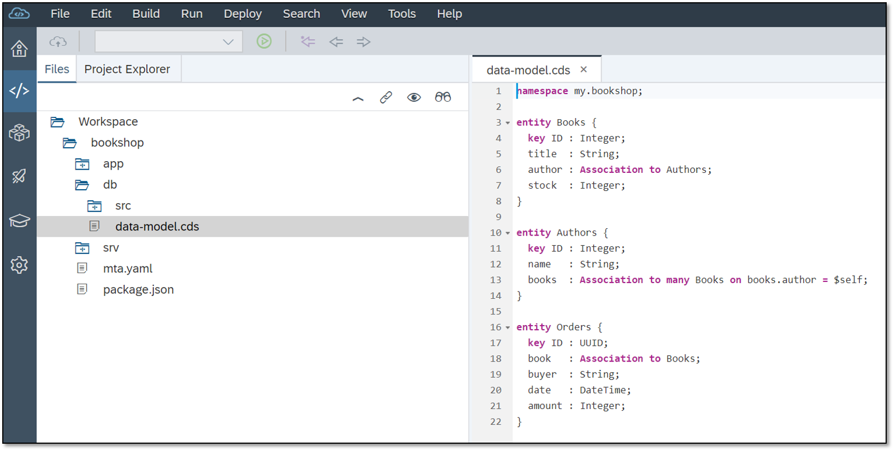
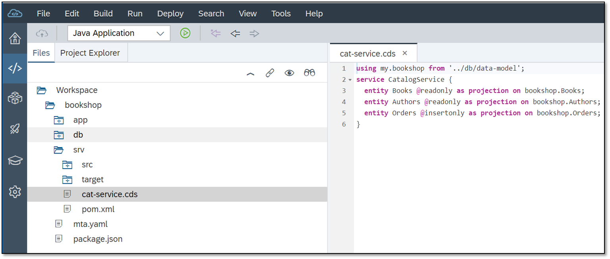
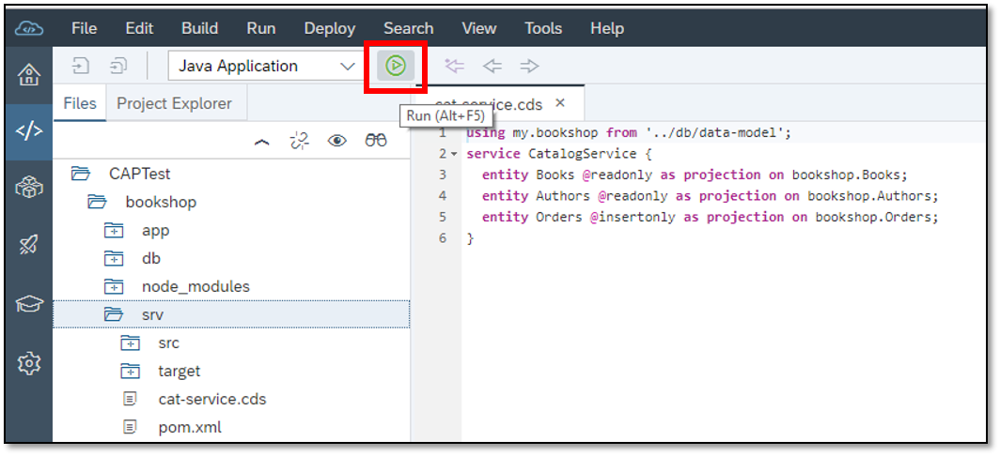

## Prerequisites  
 - **Tutorials:** [Enable SAP Web IDE Full-Stack](https://www.sap.com/developer/tutorials/webide-multi-cloud.html)
 - Select a Cloud Foundry space. See [Select a Cloud Foundry Space](https://help.sap.com/viewer/825270ffffe74d9f988a0f0066ad59f0/CF/en-US/98f49286ac05492f88428c603d146fc3.html)

## Details
### You will learn  
  - How to develop a simple business service on SAP Cloud Platform using the application programming model and SAP Web IDE Full-Stack.

---

[ACCORDION-BEGIN [Step 1: ](Start a project)]

1. In SAP Web IDE choose **File** | **New** | **Project from Template**.
2. Search for **SAP Cloud Platform Business Application**.

    >If you do not see the template, make sure **All Categories** is selected from the **Category** drop-down menu and try again.

3. Enter **`bookshop`** as the project name and choose **Next**.
4. Complete the **Project Details** tab as shown in the screenshot:

    >You should update the **Java Package** to match the namespace used in this sample application, which is `my.bookshop`.

5. Choose **Finish**.

[DONE]

[ACCORDION-END]

[ACCORDION-BEGIN [Step 2: ](Define a data model)]

1. Open `db/data-model.cds` and replace the template with the following CDS definitions:

    ```
    namespace my.bookshop;

    entity Books {
      key ID : Integer;
      title  : String;
      author : Association to Authors;
      stock  : Integer;
    }

    entity Authors {
      key ID : Integer;
      name   : String;
      books  : Association to many Books on books.author = $self;
    }

    entity Orders {
      key ID : UUID;
      book   : Association to Books;
      buyer  : String;
      date   : DateTime;
      amount : Integer;
    }
    ```

    

2. Save the file.

[VALIDATE_1]

[ACCORDION-END]

[ACCORDION-BEGIN [Step 3: ](Define a service)]

1. Go to `srv/my-service.cds` and open the context menu.
2. Choose **Rename** and change the file name to **`cat-service.cds`**.
3. Open `cat-service.cds` and replace the template with the following CDS definitions:

    ```
    using my.bookshop from '../db/data-model';
    service CatalogService {
      entity Books @readonly as projection on bookshop.Books;
      entity Authors @readonly as projection on bookshop.Authors;
      entity Orders @insertonly as projection on bookshop.Orders;
    }
    ```

    
4. Save the file.

[VALIDATE_2]

[ACCORDION-END]

[ACCORDION-BEGIN [Step 4: ](Test-run the service)]

1. Click on the **`srv`** module and choose **Run** from the global toolbar.

    

    >This might take a few minutes because a new cloud container has to be initialized and started. Subsequent restarts are much faster, because hot deployment is used.

2. Go to the **Run Console** and click on the URL.

    

    A new browser window opens containing a link to the OData service.
3. Click on the service link.
The OData service document opens.
4. Add **`/$metadata`** to the URL and refresh.
The OData metadata document opens in EDMX format.
5. Replace `/$metadata` with **`/Books`**.
An error message is displayed because we have not added a database yet.

[DONE]

[ACCORDION-END]

---
