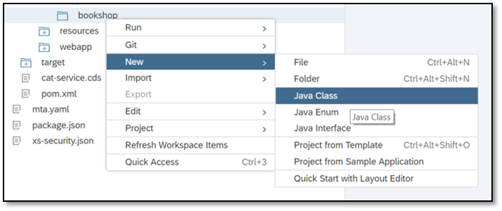

## Prerequisites  
 - [Add a Database to Your Business Application](https://developers.sap.com/tutorials/cp-apm-03-add-database.html)

## Details
### You will learn  
  - How to add custom handlers in your service model to adapt to situations that are not covered by the generic service provider

---

[ACCORDION-BEGIN [Step 1: ](Add a new Java class)]

1. In the **`srv`** module, go to `src/main/java/my/bookshop` and open the context menu.

2. Choose **New | Java Class**.

    

3. Enter **`OrdersService`** as the name and choose **Next**.

    

4. Choose **Finish**.

    The `OrdersService.java` file is created.

[DONE]

[ACCORDION-END]

[ACCORDION-BEGIN [Step 2: ](Add custom code)]

1. Open the new `OrdersService.java` file and replace the template with the following code:

    ```java
    package my.bookshop;

    import java.util.ArrayList;
    import java.util.List;

    import com.sap.cloud.sdk.service.prov.api.*;
    import com.sap.cloud.sdk.service.prov.api.annotations.*;
    import com.sap.cloud.sdk.service.prov.api.exits.*;
    import com.sap.cloud.sdk.service.prov.api.request.*;
    import com.sap.cloud.sdk.service.prov.api.response.*;
    import org.slf4j.*;

    public class OrdersService {

      private static final Logger LOG = LoggerFactory.getLogger (OrdersService.class.getName());

      @BeforeRead (entity="Orders", serviceName="CatalogService")
      public BeforeReadResponse beforeReadOrders (ReadRequest req, ExtensionHelper h){
        LOG.error ("##### Orders - beforeReadOrders ########");
        return BeforeReadResponse.setSuccess().response();
      }

      @AfterRead (entity = "Orders", serviceName="CatalogService")
      public ReadResponse afterReadOrders (ReadRequest req, ReadResponseAccessor res, ExtensionHelper h) {
        EntityData ed = res.getEntityData();
        EntityData ex = EntityData.getBuilder(ed).addElement("amount", 1000).buildEntityData("Orders");
        return ReadResponse.setSuccess().setData(ex).response();
      }

      @AfterQuery (entity = "Orders", serviceName="CatalogService")
      public QueryResponse afterQueryOrders (QueryRequest req, QueryResponseAccessor res, ExtensionHelper h) {
        List<EntityData> dataList = res.getEntityDataList(); //original list
        List<EntityData> modifiedList = new ArrayList<EntityData>(dataList.size()); //modified list
        for(EntityData ed : dataList){
    		  EntityData ex = EntityData.getBuilder(ed).addElement("amount", 1000).buildEntityData("Orders");
    		  modifiedList.add(ex);
    	  }
        return QueryResponse.setSuccess().setData(modifiedList).response();
      }
    }  
    ```

1. Save your changes.

    >In this sample code, we set a value of 1000 for the property amount of each returned entity in reading operations.

[DONE]

[ACCORDION-END]

[ACCORDION-BEGIN [Step 3: ](Run the application)]

1. Right-click the **`srv`** module and choose **Run | Java Application**.

2. Go to the **Run Console** and click on the URL.

3. Add **`CatalogService/Orders`** to the URL.

    Look for **amount** and enter the value in the text area below.

[VALIDATE_1]

[ACCORDION-END]


---
