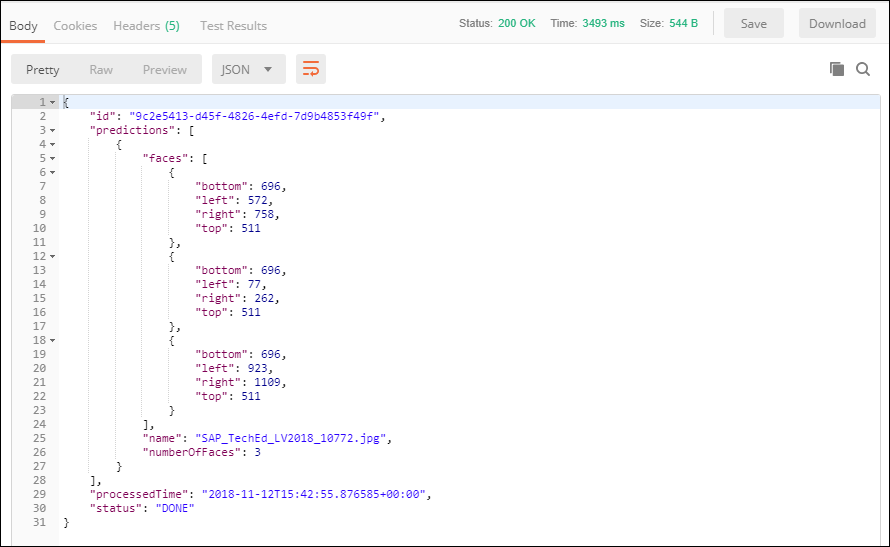

## Prerequisites
 - [Create a Machine Learning Foundation service instance on the Cloud Foundry environment](https://developers.sap.com/tutorial-navigator.html?mlfs-cf-create-instance.html)
 - [Install Postman as a REST client](https://developers.sap.com/tutorials/api-tools-postman-install.html)
 - [Get your OAuth Access Token using a REST Client](https://developers.sap.com/tutorial-navigator.html?mlfs-cf-oauth-token-rest.html)

## Details
### You will learn
  - Call an API from a REST client like Postman
  - The basics about Machine Learning Foundation Service for Face Detection

> ### **Note:** This service was in alpha version when this tutorial was released.

[ACCORDION-BEGIN [Step](The Face Detection Service)]

The Face Detection service can be used for detecting faces in an image or a set of images and returns information declaring boundary box for each face in every image.

This is the list of accepted file extensions:

|Name                  | Description
|----------------------|--------------------
| **Archive file**     | `zip`, `tar`, `gz`, `tgz`
| **Image file**       | `jpg`, `jpe`, `jpeg`, `png`, `gif`, `bmp`

The images should be RGB, or 8-bit gray scale.

If an archive file is provided, no additional files can be provided.

The input file (or the archive file) is provided using form data (as an element named ***files*** in the form data).

The service will return a JSON response that includes the bounding boxes coordinates for the identified faces.

For more details, you can check the [Inference Service for Face Detection on the SAP API Business Hub](https://api.sap.com/api/face_detection_api/resource).

[DONE]
[ACCORDION-END]

[ACCORDION-BEGIN [Step](Call the API)]

Open a new tab in ***Postman***.

Make sure that the ***`my-l-foundation`*** environment is selected.

On the **Authorization** tab, select **Bearer Token**, then enter **`{{OAuthToken}}`** as value.


> ### **Note:**: the **`OAuthToken`** environment variable can be retrieved following the [Get your OAuth Access Token using a REST Client](https://developers.sap.com/tutorial-navigator.html?mlfs-cf-oauth-token-rest.html) tutorial.

Fill in the following additional information:

Field Name               | Value
:----------------------- | :--------------
<nobr>HTTP Method</nobr> | POST
<nobr>URL<nobr>          | <nobr>`https://mlftrial-face-detector.cfapps.eu10.hana.ondemand.com/api/v2alpha1/image/face-detection`</nobr>

> **Note** As a reminder, the URL depends on you Cloud Platform landscape region but for the trial landscape only ***Europe (Frankfurt)*** provide access to the Machine Learning Foundation services.

On the **Body** tab, keep **`form-data`** selected. Add a new key named **files** and switch it to **File** instead of **Text** (default).

Select your image file.


If you are missing some inspiration, you can use the [US Olympic Men's Basketball ***Dream Team*** from 92 which includes the 12 players and the coach
](https://www.usab.com/~/media/72206858ea284365962d6be945bda5ba.ashx?as=1&iar=1).

 - <a href="https://www.usab.com/~/media/72206858ea284365962d6be945bda5ba.ashx?as=1&iar=1" target="blank" download="Teamjpg.jpg">Dream Team</a>

Click on **Send**.

You should receive a response that includes a series of faces entries:



```json
"faces": [
    {"bottom":239, 	"left":607, 	"right":659, 	"top":188},
	{"bottom":401, 	"left":319, 	"right":371, 	"top":349},
	{"bottom":233, 	"left":103, 	"right":146, 	"top":190},
	{"bottom":343, 	"left":181, 	"right":233, 	"top":291},
	{"bottom":142, 	"left":271, 	"right":314, 	"top":98},
	{"bottom":242, 	"left":362, 	"right":405, 	"top":199},
	{"bottom":360, 	"left":487, 	"right":538, 	"top":308},
	{"bottom":84, 	"left":376, 	"right":419, 	"top":41},
	{"bottom":65, 	"left":516, 	"right":559, 	"top":22},
	{"bottom":151, 	"left":636, 	"right":679, 	"top":108},
	{"bottom":209, 	"left":232, 	"right":275, 	"top":166},
	{"bottom":204, 	"left":496, 	"right":540, 	"top":161},
	{"bottom":58, 	"left":161, 	"right":197, 	"top":22}
]
```

Each entry in the response represents a box that identify one of the player face.

Here is the results represented on the [US Olympic Men's Basketball ***Dream Team*** from 92 which includes the 12 players and coach
](https://www.usab.com/~/media/72206858ea284365962d6be945bda5ba.ashx?as=1&iar=1):

<table border="0">
	<tr><td></div></td></tr><tr><td><canvas id="canvas_1"/></td></tr>
</table>

<script>
function myFunction(imagId) {
	var oImg = document.getElementById("img_" + imagId);;
	var oCanvas = document.getElementById("canvas_" + imagId);
	oCanvas.width = oImg.width;
	oCanvas.height = oImg.height * oImg.width / oImg.naturalWidth;

	var ctx = oCanvas.getContext("2d");
    ctx.drawImage(oImg, 0, 0, oImg.width, oImg.height * oImg.width / oImg.naturalWidth);

    ctx.lineWidth="3";
    ctx.strokeStyle="red";
	ctx.fillStyle = "white";
	ctx.font = "14pt Arial";

	ctx.scale( oCanvas.width  / oImg.naturalWidth, oCanvas.height / oImg.naturalHeight);

    return ctx;
}

window.onload = function() {
	var oImg    = document.getElementById("img_1");

	oImg.onload = function(){
		var ctx = myFunction("1")
		ctx.strokeRect(607,188,659-607,239-188);  ctx.fillText("1", 607, 188);
		ctx.strokeRect(319,349,371-319,401-349);  ctx.fillText("2", 319, 349);
		ctx.strokeRect(103,190,146-103,233-190);  ctx.fillText("3", 103, 190);
		ctx.strokeRect(181,291,233-181,343-291);  ctx.fillText("4", 181, 291);
		ctx.strokeRect(271,98,314-271,142-98);  ctx.fillText("5", 271, 98);
		ctx.strokeRect(362,199,405-362,242-199);  ctx.fillText("6", 362, 199);
		ctx.strokeRect(487,308,538-487,360-308);  ctx.fillText("7", 487, 308);
		ctx.strokeRect(376,41,419-376,84-41);  ctx.fillText("8", 376, 41);
		ctx.strokeRect(516,22,559-516,65-22);  ctx.fillText("9", 516, 22);
		ctx.strokeRect(636,108,679-636,151-108);  ctx.fillText("10", 636, 108);
		ctx.strokeRect(232,166,275-232,209-166);  ctx.fillText("11", 232, 166);
		ctx.strokeRect(496,161,540-496,204-161);  ctx.fillText("12", 496, 161);
		ctx.strokeRect(161,22,197-161,58-22);  ctx.fillText("13", 161, 22);
    }
	oImg.src="https://www.usab.com/~/media/72206858ea284365962d6be945bda5ba.ashx?as=1&iar=1";
};
</script>

Here is a simple HTML code you can use to visualize other results:

```HTML
<html>
<body>
<table border="0">
	<tr><td></div></td></tr><tr><td><canvas id="canvas_1"/></td></tr>
</table>

<script>
function myFunction(imagId) {
	var oImg = document.getElementById("img_" + imagId);;
	var oCanvas = document.getElementById("canvas_" + imagId);
	oCanvas.width = oImg.width;
	oCanvas.height = oImg.height * oImg.width / oImg.naturalWidth;

	var ctx = oCanvas.getContext("2d");
    ctx.drawImage(oImg, 0, 0, oImg.width, oImg.height * oImg.width / oImg.naturalWidth);

    ctx.lineWidth="3";
    ctx.strokeStyle="red";
	ctx.fillStyle = "white";
	ctx.font = "14pt Arial";

	ctx.scale( oCanvas.width  / oImg.naturalWidth, oCanvas.height / oImg.naturalHeight);

    return ctx;
}

window.onload = function() {
	var oImg    = document.getElementById("img_1");

	oImg.onload = function(){
		var ctx = myFunction("1")
		ctx.strokeRect(607,188,659-607,239-188);  ctx.fillText("1", 607, 188);
		ctx.strokeRect(319,349,371-319,401-349);  ctx.fillText("2", 319, 349);
		ctx.strokeRect(103,190,146-103,233-190);  ctx.fillText("3", 103, 190);
		ctx.strokeRect(181,291,233-181,343-291);  ctx.fillText("4", 181, 291);
		ctx.strokeRect(271,98,314-271,142-98);  ctx.fillText("5", 271, 98);
		ctx.strokeRect(362,199,405-362,242-199);  ctx.fillText("6", 362, 199);
		ctx.strokeRect(487,308,538-487,360-308);  ctx.fillText("7", 487, 308);
		ctx.strokeRect(376,41,419-376,84-41);  ctx.fillText("8", 376, 41);
		ctx.strokeRect(516,22,559-516,65-22);  ctx.fillText("9", 516, 22);
		ctx.strokeRect(636,108,679-636,151-108);  ctx.fillText("10", 636, 108);
		ctx.strokeRect(232,166,275-232,209-166);  ctx.fillText("11", 232, 166);
		ctx.strokeRect(496,161,540-496,204-161);  ctx.fillText("12", 496, 161);
		ctx.strokeRect(161,22,197-161,58-22);  ctx.fillText("13", 161, 22);
    }
	oImg.src="https://www.usab.com/~/media/72206858ea284365962d6be945bda5ba.ashx?as=1&iar=1";
};
</script>
</body>
</html>
```

You will notice that the rectangle uses the following format: (left, top, right - left, bottom - top)

[DONE]
[ACCORDION-END]

[ACCORDION-BEGIN [Step](Validate your results)]

Provide an answer to the question below then click on **Validate**.

[VALIDATE_1]
[ACCORDION-END]
---
