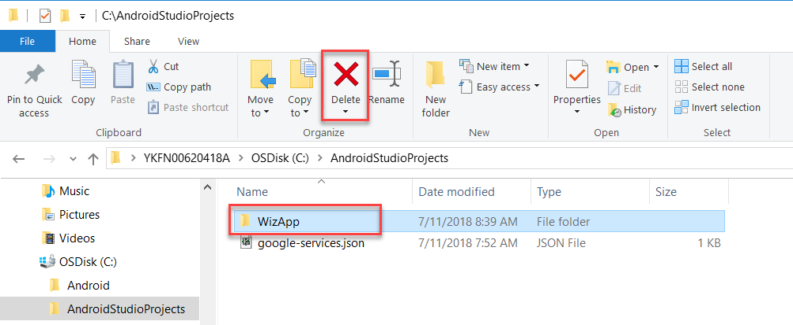
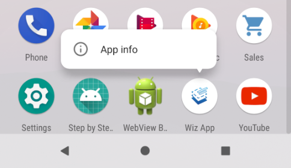
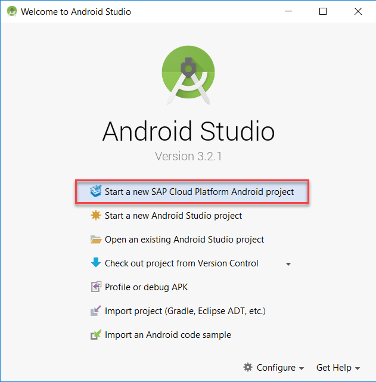
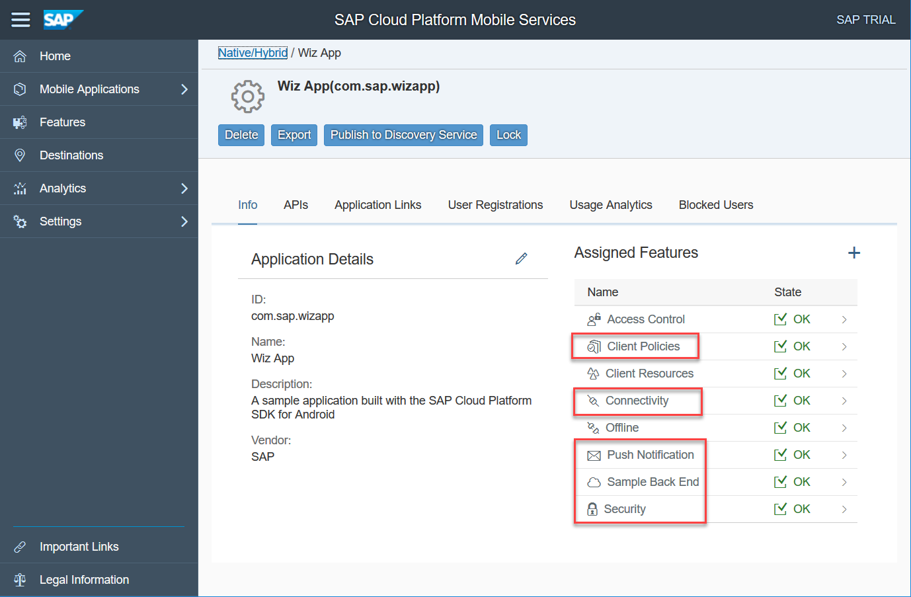
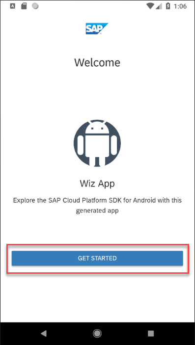
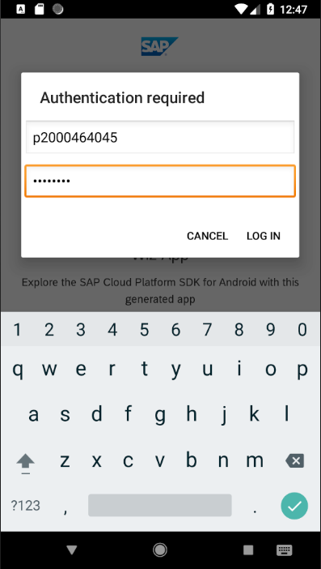
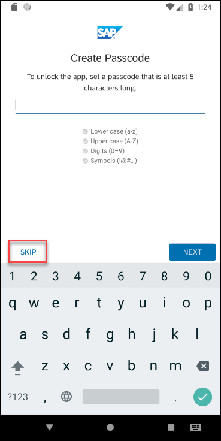
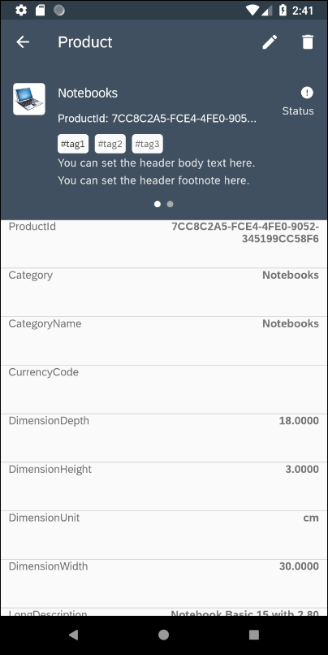

## Prerequisites  
 - **Proficiency:** Beginner

## Details
### You will learn  
  - How to create an Android app using the Android Studio integrated SAP Wizard.

### Time to Complete
**15 Min**

---

[ACCORDION-BEGIN [Step 1: ](Setup)]

If Android Studio is running, close it.

If there is an existing project at `C:\AndroidStudioProjects\WizApp`, delete it.

If there is an emulator running and an app on it named Wiz App, delete it (Long press, App info, UNINSTALL).

Check if the emulator has airplane mode enabled.  

If so, turn it off by swiping down from the top of the emulator and clicking on the airplane icon.  

All set, let's begin!

[DONE]
[ACCORDION-END]

[ACCORDION-BEGIN [Step 2: ](Create and run the project)]
Open **Android Studio**.

Choose **Start a new SAP Cloud Platform Android project**.

> **Note**: The SAP Cloud Platform SDK has been pre-installed on this machine from <a target="_blank" href="https://www.sap.com/developer/trials-downloads/additional-downloads/sap-cloud-platform-sdk-for-android-15508.html">Trial Downloads</a>. For further installation details see <a target="_blank" href="https://help.sap.com/doc/c2d571df73104f72b9f1b73e06c5609a/Latest/en-US/docs/user-guide/getting-started/installing.html">Installing the SAP Cloud Platform SDK for Android</a>.

The wizard can save the server connection details for multiple servers. A preconfigured account has been provided.
Click **Next** on the **Server Connection** tab.

> **Note**: If the values are missing, the following values can be used:

| Field | Value |
|----|----|
| Account Name | `SAP Cloud Platform Mobile Services Trial` |
| Admin API URL | `https://hcpms-p2000464045trial.hanatrial.ondemand.com/` |
| Admin UI URL | `https://hcpmsadmin-p2000464045trial.dispatcher.hanatrial.ondemand.com/?hc_reset` |
| Username | p2000464045 |
| Password | SCP!2pwd |

On the **Cloud Configuration** tab select **Use Existing** and set the Application ID to **`com.sap.wizapp`**.
Click **Next** to configure the OData Services.

The application configuration has already been created and has added multiple features of the SAP Cloud Platform Mobile Services. The configuration can be viewed by clicking the **Go to cockpit** link in the bottom left of the wizard page.

The SAP Cloud Platform Mobile Services provides a sample backend destination named `com.sap.edm.sampleservice.v2` that is being used here to provide data for the application. It contains product categories, product, supplier, customer and sales order data.
Click **Next**.

On the **Project Configuration** tab provide the following configuration data:

| Field | Value |
|----|----|
| Project Name | `Wiz App` |
| Project Namespace | `com.sap.wizapp` |
| Project Configuration | `C:\AndroidStudioProjects\WizApp` |
| Password | Password for your trial account user |

Uncheck **Use Discovery Service for Application bootstrapping**, check the **Enable Logging** and **Enable Upload** checkboxes to enable the log level to be set by the user and have the ability to upload the log to the server. Also Check the **Enable Push** checkbox to enable push notification support in the app.
Now you have to browse for the `google-services.json` at path `C:\AndroidStudioProjects\`. This will enable the app to work with Google Firebase notifications.
Click **Finish**

After clicking **Finish**, a project is created.

Click the **Run** toolbar icon.

Choose the emulator to run the app on.

[DONE]
[ACCORDION-END]

[ACCORDION-BEGIN [Step 3: ](Explore the app)]
The welcome screen is shown the first time the app is run.

Sign in with the following credentials:

| Field | Value |
|----|----|
| User Name | `p2000464045` |
| Password | `SCP!2pwd` |

The credentials are used to authenticate against the SAP Cloud Platform Identity Service, are  securely stored by the app, and do not need to be re-entered.

The passcode (or fingerprint if enabled) screen provides an additional layer of security for your app.

The first screen of the app shows the different entities that are in the sample OData service.

Tap on `Products` to reach the below list screen.

Tap on a list item to show an editable detail screen.

[VALIDATE_1]
[ACCORDION-END]

---
