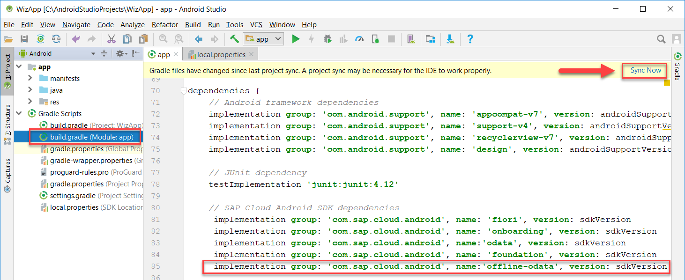
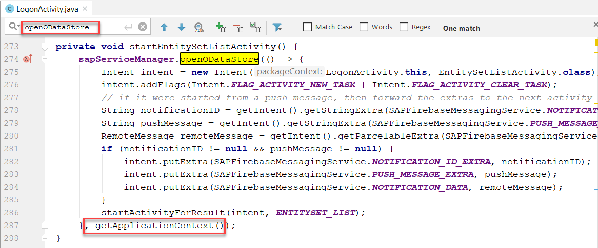
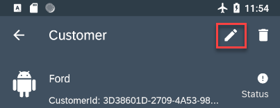
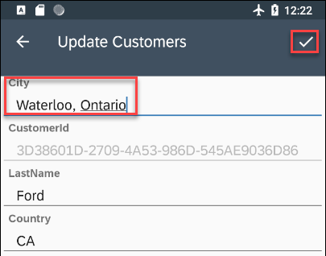
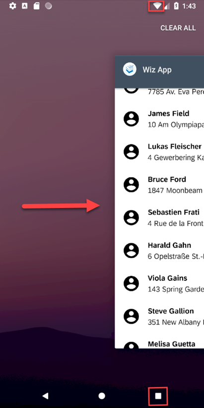

## Details
### You will learn  
  - How to enable Offline OData in your Android application

---

[ACCORDION-BEGIN [Step 1: ](Add dependency to build.gradle document)]

In Android Studio, add the following line to the list of dependencies in the app's **`build.gradle`** file to include the <a target="_blank" href="https://help.sap.com/doc/c2d571df73104f72b9f1b73e06c5609a/Latest/en-US/docs/user-guide/odata/Offline_OData_Introduction.html">Offline OData</a> framework and click on **`Sync Now`**.

```Java
implementation group:'com.sap.cloud.android', name:'offline-odata', version: sdkVersion
```



[DONE]
[ACCORDION-END]

[ACCORDION-BEGIN [Step 2: ](Add code to open offline store)]

Press **`Ctrl+N`** and enter **`SAPServiceManager.java`**.

Add the following imports.

```Java
import android.content.Context;
import android.util.Log;
import com.sap.cloud.mobile.odata.core.AndroidSystem;
import com.sap.cloud.mobile.odata.offline.OfflineODataDefiningQuery;
import com.sap.cloud.mobile.odata.offline.OfflineODataException;
import com.sap.cloud.mobile.odata.offline.OfflineODataParameters;
import com.sap.cloud.mobile.odata.offline.OfflineODataProvider;
import java.net.MalformedURLException;
import java.net.URL;
```

In the `SAPServiceManager` class comment out (Select and press Ctrl /) the following variable.

`//private OnlineODataProvider provider;`

In the same class add the following variables.

```Java
private OfflineODataProvider provider;
private static final String TAG = SAPServiceManager.class.getName();
```

Delete or comment out the methods **`openODataStore`** and **`getServiceRoot`** as they will be replaced in the next step.

Add the below methods.

```Java
public void openODataStore(Action0 callback, Context context) {
    setupOfflineOData(context);
    callback.call();
}

private void setupOfflineOData(Context context) {
    try {
        if (configurationData.loadData()) {
            //Initialize application context for use by OfflineODataProvider
            AndroidSystem.setContext(context);
            //commonly set parameters include setStoreEncryptionKey, setStoreName, setStorePath
            OfflineODataParameters offParam = new OfflineODataParameters();
            String serviceUrl = configurationData.getServiceUrl();
            URL url = new URL(serviceUrl + CONNECTION_ID_ESPMCONTAINER);
            provider = new OfflineODataProvider(url, offParam, ClientProvider.get());
            //Specifies which entities we wish to include in the offline store
            provider.addDefiningQuery(new OfflineODataDefiningQuery("Customers", "Customers", false));
        }
  } catch (MalformedURLException e) {
      e.printStackTrace();
  } catch (OfflineODataException e) {
      e.printStackTrace();
  }
  //opens the offline store.  This can take a minute or so the first time it is called as it is created and populated.
  Log.d(TAG, "About to call open on the offline store.");
  provider.open(() -> {
      Log.d(TAG, "Offline store opened.");
      eSPMContainer = new ESPMContainer(provider);
      syncOfflineData();  //TODO could be triggered via a menu action
  }, (OfflineODataException offlineODataException) -> {
      Log.d(TAG, "Offline store did not open.", offlineODataException);
  });
}

public void syncOfflineData() {
    //send the local changes to the back end OData service
    Log.d(TAG, "About to call provider.upload.");
    provider.upload(() -> {
        Log.d(TAG, "Successfully uploaded the changed data.");
        //get changes from the back end OData service.
        provider.download(() -> {
            Log.d(TAG, "Successfully downloaded the changed data.");
        }, (error) -> {
            Log.d(TAG, "Failed when downloading the changed data with error: " + error.getMessage());
        });
    }, (error) -> {
        Log.d(TAG, "Failed when uploading the changed data with error: " + error.getMessage());
    });
}

public String getServiceRoot() {
    if (configurationData.loadData()) {
        String serviceUrl = configurationData.getServiceUrl();
        if (serviceRoot == null) {
            serviceRoot = serviceUrl + "/" + CONNECTION_ID_ESPMCONTAINER;
        }
    }
    else {
        throw new IllegalStateException("SAPService manager configurationData.loadData() failed.");
    }
    return serviceRoot;
}
```

Press **`Ctrl+N`** and enter **`LogonActivity.java`**.

Press **`Ctrl+F`** and enter **`openODataStore`**. In the `LogonActivity.java` add the application context to the `openODataStore` call as a parameter as shown below:



```Java
}, getApplicationContext());
```

[DONE]
[ACCORDION-END]

[ACCORDION-BEGIN [Step 3: ](Run and explore the application)]
Run the application, upon reaching the home screen, it may take a few moments for the offline store to open.

> The first time the app is opened it will take longer to open the offline store as it needs to be created and populated.  Make sure Wi-Fi is enabled. Consult the `Logcat` log and wait for the following messages to appear.


Turn on airplane mode on your device (swipe down from the top of the emulator and click on the airplane icon) which simulates having no network connection. Notice that Wi-Fi and mobile data are switched off.


Navigate to the list of customers by tapping the **Customers** row. Now tap on a customer.

To edit the customer tap the "Edit Customer" icon.



Change a field of a customer such as the city, and save your changes.



To show that the data is stored offline and then synchronized turn off airplane mode and fully close the app.



Re-open the app and check the `Logcat`. It shows the upload and download operations were successful. The previously made change is now synced with the backend OData service.


> This example does not handle conflicts. Details on this topic are available at <a target="_blank" href="https://help.sap.com/doc/c2d571df73104f72b9f1b73e06c5609a/Latest/en-US/docs/user-guide/odata/Offline_OData_Handling_Errors_And_Conflicts.html">Offline OData Conflicts</a>.

Congratulations! You have created an offline enabled application and have completed this TechEd App Space mission.  A version of these tutorials that includes the full setup is available at <a target="_blank" href="https://developers.sap.com/group.sdk-android.html">Get Started with SAP Cloud Platform SDK for Android</a>.

[VALIDATE_1]
[ACCORDION-END]

---
