## Details
### You will learn  
  - How to use the SAP Cloud Platform Web IDE to create an application in the Neo environment
  - How to consume a SAP Cloud Platform Connectivity destination

---

[ACCORDION-BEGIN [Step ](Create a HTML5 project)]

1. Go to the Neo environment in the SAP Cloud Platform Cockpit (https://account.hanatrial.ondemand.com/) and open the **Services** menu in the side panel.

    

2. Navigate to the SAP Web IDE Full-Stack tile and click on it.
3. Hit **Go To Service** to open the SAP Web IDE Full-Stack.

    

4. Click on **New** in the header toolbar to create a **Project from Template**.

    

5. Select **SAPUI5 Application** and choose the latest SAPUI5 version **SAP Innovation** and confirm with **Next**.

    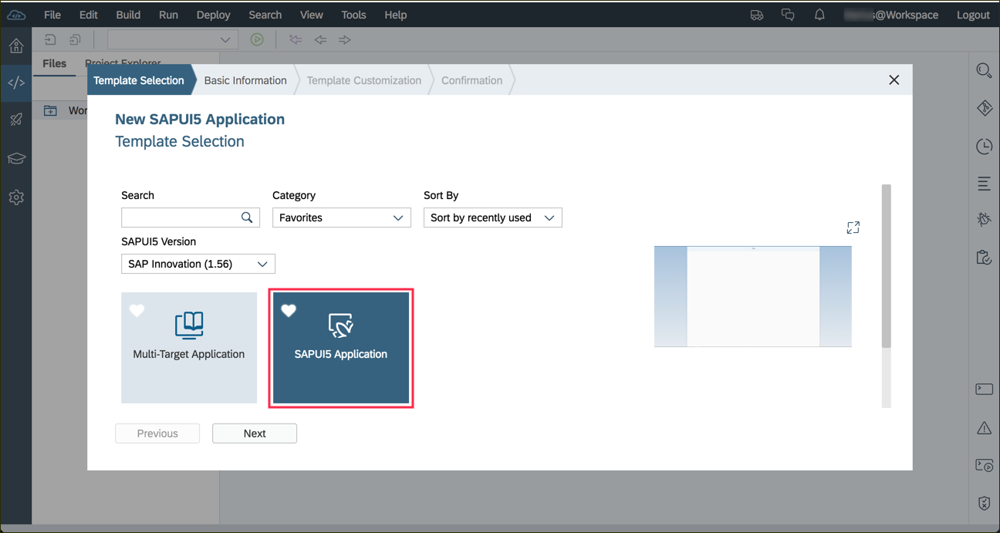

6. Enter the **Project name** and the **Namespace** (e.g. **`PurchaseOrderApp`** and **`com.sap.teched18.msgraph`**) you want to use.

    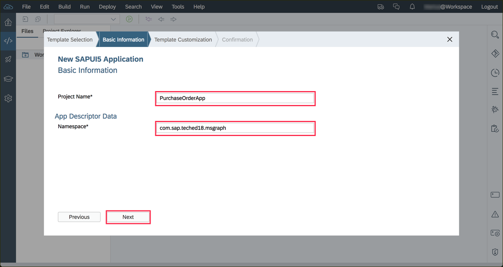

7. Change the default name of the view to **`MainView`** and create the app by clicking **Finish**.

    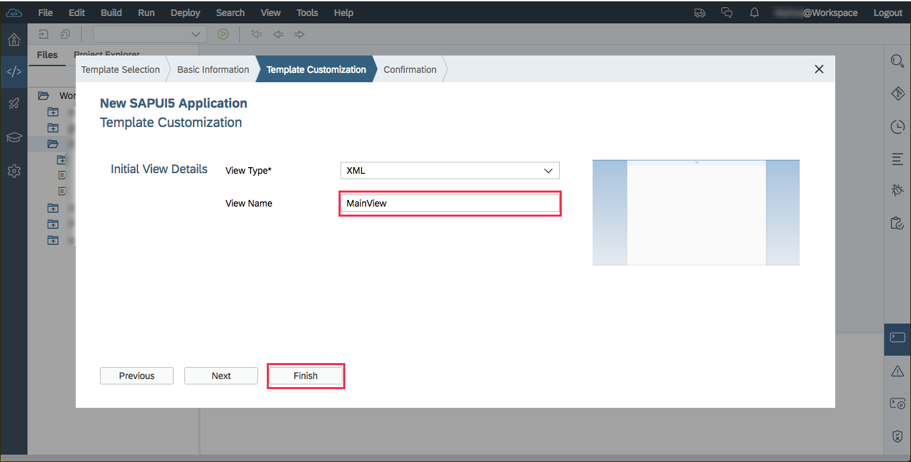

> It's worth bookmarking the SAP Web IDE in your browser if you haven't done so already.

[DONE]
[ACCORDION-END]

[ACCORDION-BEGIN [Step ](Connect the application to the destination)]

1. Open the context menu with a right click on the project and select **New** on the first and **OData Service** on the second hierarchy level.

    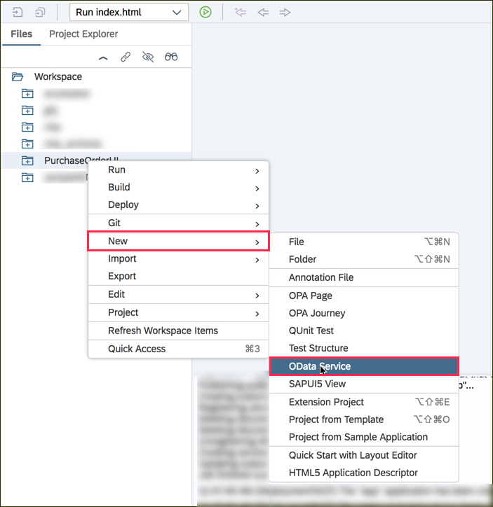

2. Select **Service Catalog** as the **Source type** and **SAP GATEWAY** as the source. You can search for **`purchase`** to find the OData service of interested (`SEPMRA_PO_APV`) easily.

    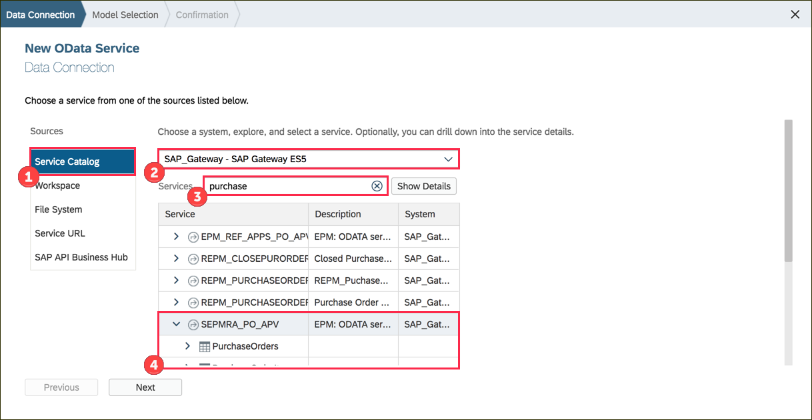

3. Make sure the service is selected and click **Next**

    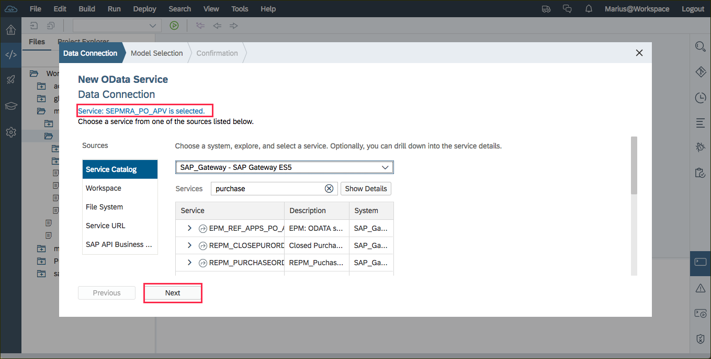

 Keep the default selection **Use default model** and click **Next** to get to the confirmation page. Press **Finish** to confirm the everything.

> This wizard modified the `manifest.json` file of your project.


[VALIDATE_2]
[ACCORDION-END]
[ACCORDION-BEGIN [Step ](Test the connected OData service)]

1. Test the application by clicking on the run button.

    

2. Click F12 open the development tools of your browser on Windows or `cmd + alt + i` on Mac.
3. Select the **Network** tab and **filter** the network traffic for **`meta`** to find the request, which is sent to the destination. Click one the request to check the status code of this request. It should be 200 (OK).

    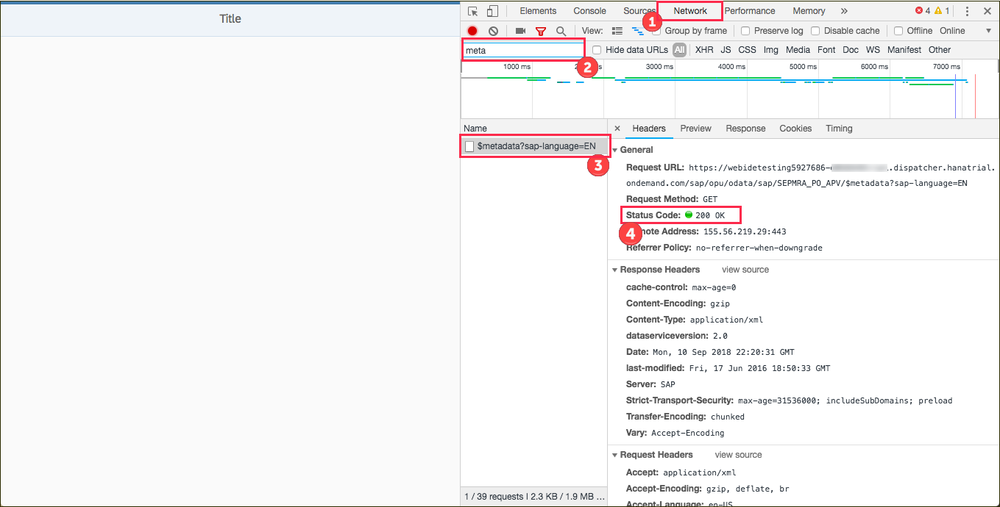

> In case this request fails, there has been a issue while creating the destination in the Neo environment. Please make go back to the previous tutorial to make sure the destination is set up correctly

[DONE]
[ACCORDION-END]
[ACCORDION-BEGIN [Step ](Add a list to the view)]
Replace the existing `<Page>` element with the following snippet to add an instance of `sap.m.List` to the `MainView.view.xml` file. You can find the file in the `webbapp > view` folder within your HTML5 project.

```xml
<Page
  title="Purchase Orders">
  <!-- INSERT IN STEP 5 OF THE NEXT TUTORIAL -->
  <content>
    <List
    noDataText="No purchase orders found"
    items="{/PurchaseOrders}" >
      <StandardListItem
        type="Navigation"
        title="{POId}"
        description="{SupplierName}"
        press="onClickPO"/>
    </List>
  </content>
</Page>
<!-- INSERT CODE IN STEP 5.2 HERE -->
```
This page will display all existing purchase orders in a list.

[DONE]
[ACCORDION-END]


[ACCORDION-BEGIN [Step ](Add the details page)]

> Caution: The property `controllerName` (here `com.sapteched18.msgraph.PurchaseOrderApp.controller.MainView`) corresponds to your namespace and project name you have defined in the wizard in Step 1.6. So make sure they fit together. If you have chosen a different namespace and project as shown in the screenshot, please adjust your code accordingly.

1. Replace the XML Declaration in the `MainView.view.xml` file with the following snippet to make use of more SAPUI5 libraries.
```xml
<mvc:View controllerName="com.sap.teched18.msgraph.PurchaseOrderApp.controller.MainView" xmlns:html="http://www.w3.org/1999/xhtml" xmlns:f="sap.ui.layout.form" xmlns:layout="sap.ui.layout" xmlns:mvc="sap.ui.core.mvc" displayBlock="true" xmlns="sap.m">
  <App id="idAppControl">
```
2. Add a new page which will be used to show the details of a single purchase order.
```xml
<Page
  id="details"
  title="Details"
  navButtonPress="onNavButtonPress"
  showNavButton="true">
  <f:SimpleForm
    columnsM="1"
    editable="false"
    layout="ResponsiveGridLayout"
    singleContainerFullSize="false" >
    <f:content>
      <!-- INSERT CODE IN SUB STEP 5.3 HERE -->
    </f:content>
  </f:SimpleForm>
</Page>
```
3. Add the form controls with the associated layout information.
```xml
<Label text="Purchase Order ID" width="100%">
  <layoutData>
    <layout:GridData span="L4 M4" />
  </layoutData>
</Label>
<Text text="{POId}" />
<Label text="Supplier Name" >
  <layoutData>
    <layout:GridData span="L4 M4" />
  </layoutData>
</Label>
<Text text="{SupplierName}" />
<Label text="OrderedByName" >
  <layoutData>
    <layout:GridData span="L4 M4" />
  </layoutData>
</Label>
<Text text="{OrderedByName}" />
<Label text="DeliveryAddress" >
  <layoutData>
    <layout:GridData span="L4 M4" />
  </layoutData>
</Label>
<Text text="{DeliveryAddress}" />
<Label text="GrossAmount" >
  <layoutData>
    <layout:GridData span="L4 M4" />
  </layoutData>
</Label>
<Text text="{GrossAmount}" />
<Label text="CurrencyCode" >
  <layoutData>
    <layout:GridData span="L4 M4" />
  </layoutData>
</Label>
<Text text="{CurrencyCode}" />
<Label text="ItemCount" >
  <layoutData>
    <layout:GridData span="L4 M4" />
  </layoutData>
</Label>
<Text text="{ItemCount}" />
<Label text="Changed At" >
  <layoutData>
    <layout:GridData span="L4 M4" />
  </layoutData>
</Label>
<Text text="{ChangedAt}" />
<Label text="DeliveryDateEarliest" >
  <layoutData>
    <layout:GridData span="L4 M4" />
  </layoutData>
</Label>
<Text text="{DeliveryDateEarliest}" />
<Label text="LaterDelivDateExist" >
  <layoutData>
    <layout:GridData span="L4 M4" />
  </layoutData>
</Label>
<Text text="{LaterDelivDateExist}" />
```

[DONE]
[ACCORDION-END]

[ACCORDION-BEGIN [Step ](Add navigation logic)]
1. Handle the click events, which will be triggered once the user clicks on the list items. Paste the following function to the empty object (second parameter of the `Controller.extend` method) in the `MainView.controller.js` (`webbapp > controller`) file.
```javascript
onClickPO: function (oEvent) {
  var oApp = this.getView().getContent()[0];
  var sBindingPath = oEvent.getSource().getBindingContext().getPath();
  var oDetailsPage = oApp.getPages()[1].bindElement(sBindingPath);
  oApp.to(oDetailsPage.getId());
},
// INSERT CODE IN SUB-STEP 6.2 HERE
```
2.  Also add an event handler to navigate back to the first page
```javascript
onNavButtonPress: function (oEvent) {
  var oApp = this.getView().getContent()[0];
  var oStartPage = oApp.getPages()[0];
  oApp.back(oStartPage.getId());
},
// INSERT IN STEP 7 OF THE NEXT TUTORIAL
```

[DONE]
[ACCORDION-END]
[ACCORDION-BEGIN [Step ](Deploy to the Neo environment)]

1. Now the application is ready to be deployed! Right click on the project and select the operation **Deploy** and the target **SAP Cloud Platform**.

    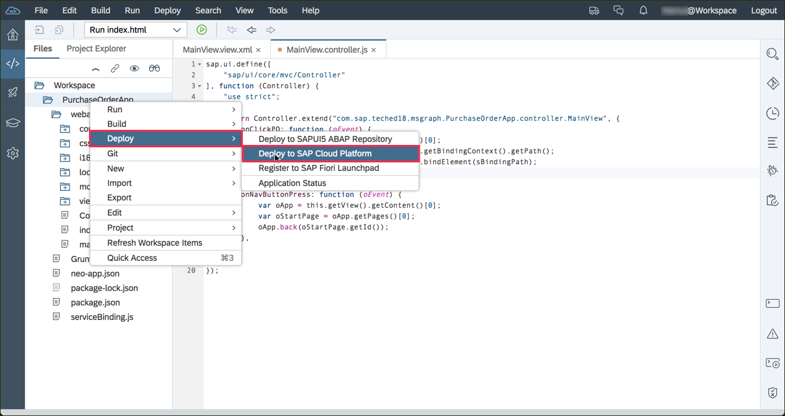

2. You can use the default parameter in the dialog and confirm with **Deploy**

    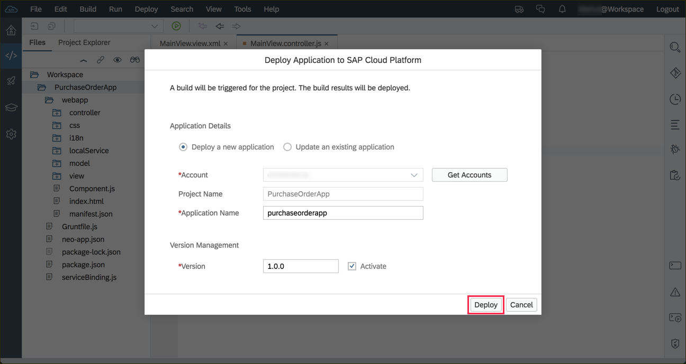

3. The deployment process will take a while. Once it's done, **Open the active version of the application**

    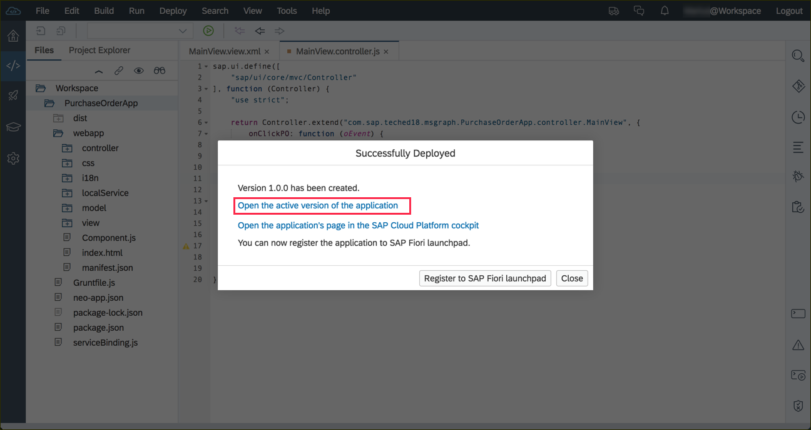

4. You should now be able to access your deployed application. Congrats!

    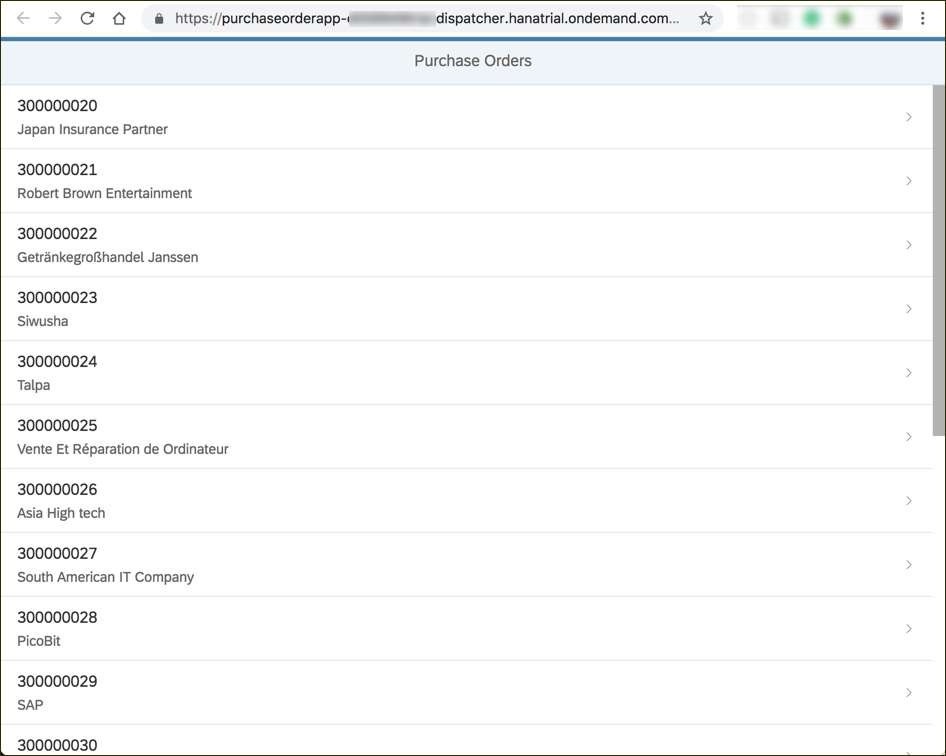

Insert the URL of your running web application below:

[VALIDATE_7]
[ACCORDION-END]

---
