## Details
### You will learn  
how to start an instance of the workflow definition that you have defined.

---
[ACCORDION-BEGIN [Step 1: ](Add the workflow apps to your homepage)]
1. In your Web browser, open the cockpit of [SAP Cloud Platform](https://account.hanatrial.ondemand.com/cockpit).
2. Choose **Neo Trial**.
3. Select **Services** from the left-hand navigation.
4. Search for the **Workflow** service. Then select it, and choose **Fiori Launchpad (Default Site)**.
    > Note: For a global account, you can configure a user's access rights to the SAP Fiori launchpad using the Portal service.
5. In the SAP Fiori launchpad, open your user menu (person icon).

6. Choose **App Finder**.
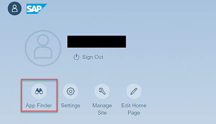
7. Enter the respective app name in the search field, and click the pin icon to add these apps from the workflow catalog to your homepage:
      - My Inbox
      - Monitor Workflows (Definitions): Shows the deployed workflows and allows to start and download the workflow model.
      - Monitor Workflow (Instances): Shows the running workflow instances and helps in monitoring them.
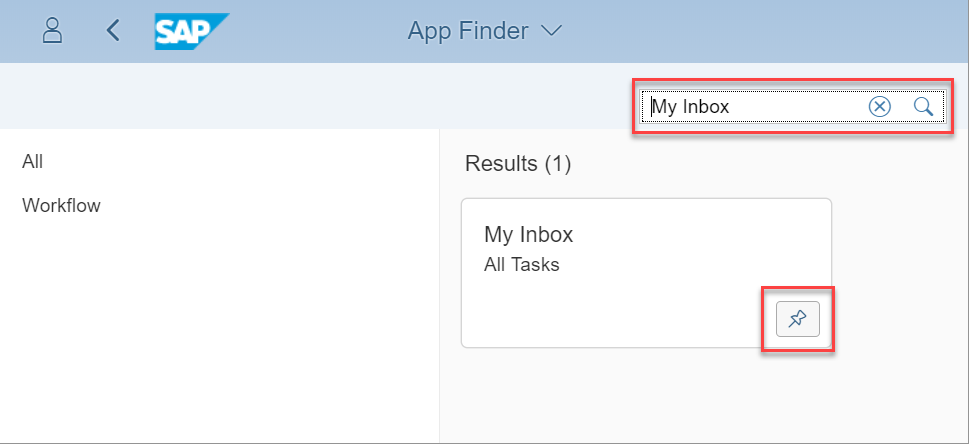

You now see the apps on your SAP Fiori launchpad homepage.
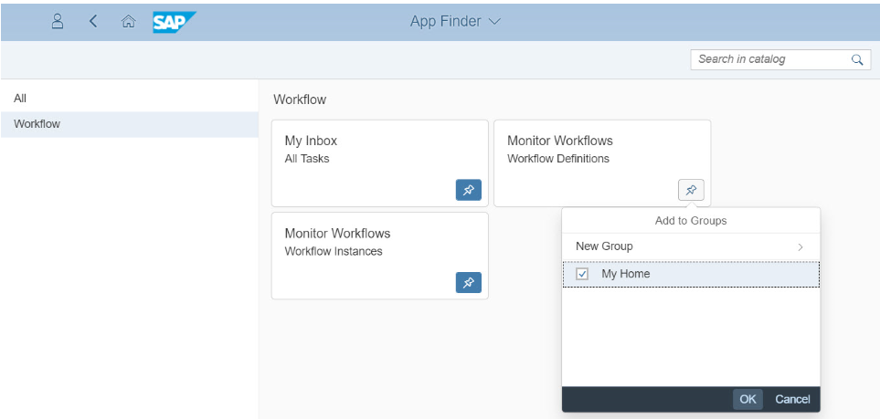

[ACCORDION-END]

[ACCORDION-BEGIN [Step 2: ](Display your workflow definition and start an instance)]
1. To access your deployed workflow, open the **Monitor Workflow - Workflow Definitions** tile.
  The workflow is displayed and the version number is "1". The version number increases every time you deploy the workflow.
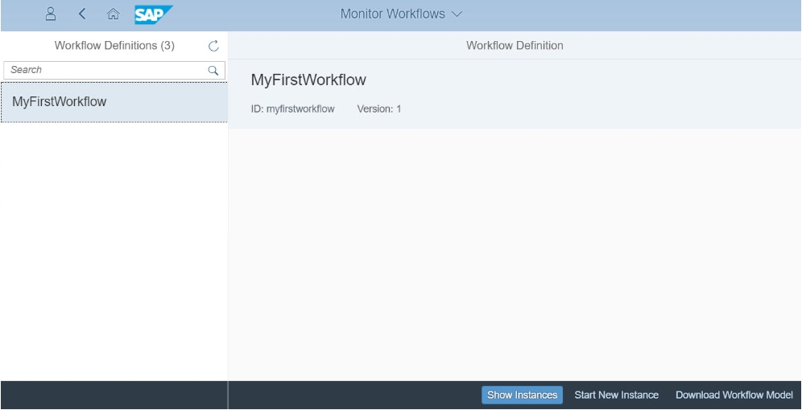

    > Note:
    You can display the running instances for a workflow with **Show Instances** (there are none yet).
    Typically, you would start a new workflow instance either from a UI or from another application using the workflow service REST API.

2. For testing purposes, choose **Start New Instance**.
3. On the popup, choose **Start New Instance**.
   Once the workflow has started, a confirmation message is displayed.

    >Note: Because the workflow you modelled contains only a start and an end event, starting an instance is immediately completed and therefore not visible under "Show instances". (You can still retrieve completed instances through the REST API.)

    >Excursion: When you start a workflow, you can provide a JSON structure as input data. These JSON objects get stored within the workflow as context data. You can use them throughout the workflow, for example, in gateways, user tasks, or service tasks. For more information about handling workflow data, see [Manage Workflows Using the Monitor Workflows App] (https://help.sap.com/viewer/aa302ee52d3a4420b6cc3ecaaeee2ee7/Cloud/en-US/e6163e119ba645d0ae6a31022b670381.html).

[ACCORDION-END]

[ACCORDION-BEGIN [Step 3: ](Access the workflow editor)]
1. Open SAP Web IDE Full-Stack:
    1. In your Web browser, open the cockpit of [SAP Cloud Platform](https://account.hanatrial.ondemand.com/cockpit).
    2. Choose **Neo Trial**.
    3. Then select **Services** from the left-hand navigation.
    4. Search for the **Workflow** service. Then select it, and choose **SAP Web IDE Full-Stack**.
2. In the navigation area of SAP Web IDE, choose **</>** (Development), and navigate to the **Workspace** folder.
3. Right-click the workflow file, and choose **Open With** | **Workflow Editor**.
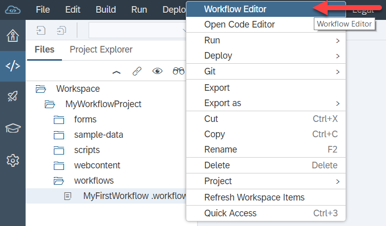

[ACCORDION-END]

[ACCORDION-BEGIN [Step 4: ](Add a user task to the workflow)]
1. Choose the **User Task** icon from the palette.

2. Move the task icon between the start and end events until the arrow appears in green.
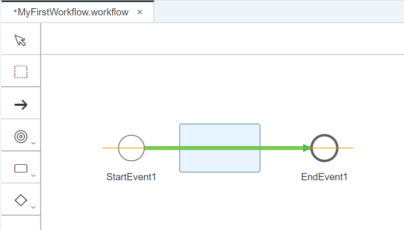
3. Select the task box and in the **Name** field on the **General** tab, change the name to `ApproveBook`.
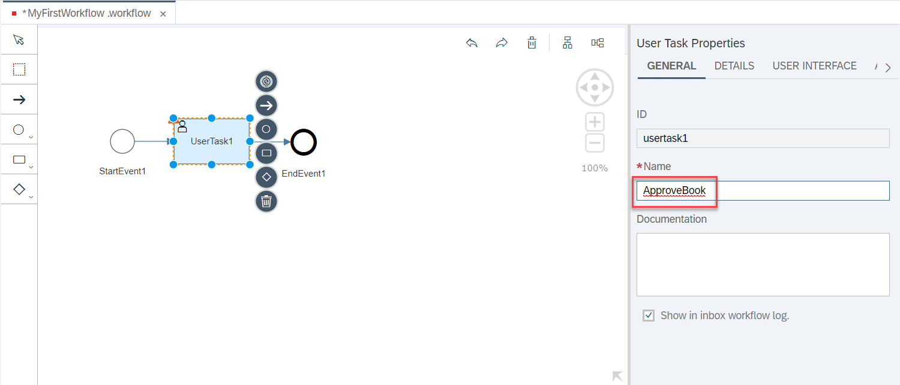
4. Switch to the **Details** tab.
5. Under **Display Texts**, define the task subject, that is, the text that the user sees in his or her inbox.
   To show the book name, use an expression that references a field from the sample JSON structure. For more information about using expressions, see [Expressions](https://help.sap.com/viewer/f85276c5069a429fa37d1cd352785c25/Cloud/en-US/9f91b1c0fac3414d9cba1015dea381f1.html).
   In the **Subject** field, enter `Approve ${context.product}`.
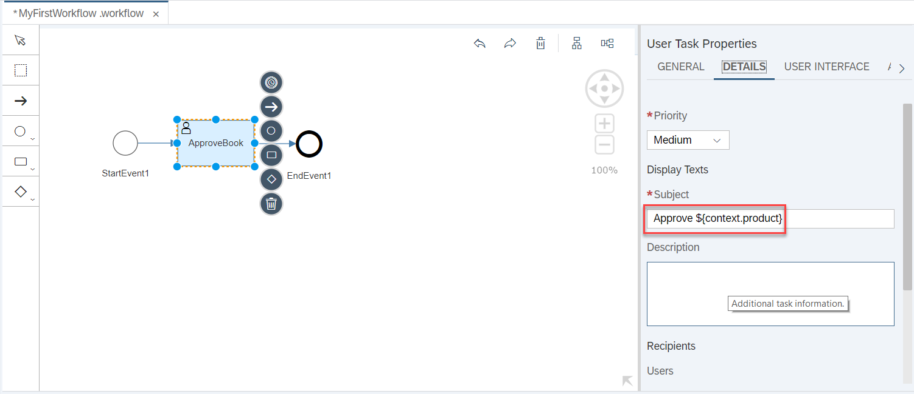
6. Under **Recipients**, define who will receive the task. Enter your user ID exactly as displayed in the user info.
    > Note: The field is case sensitive.

7. Under **User Interface**, enter dummy entries ('test') for the application and component names of the SAPUI component, which displays the task in the inbox.
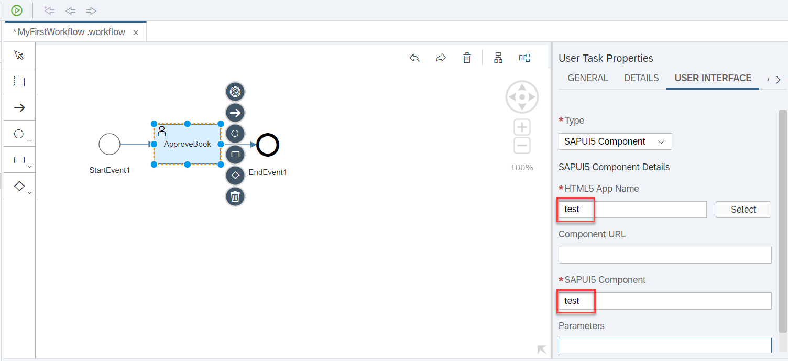
8. Make sure that no element of the workflow is selected.
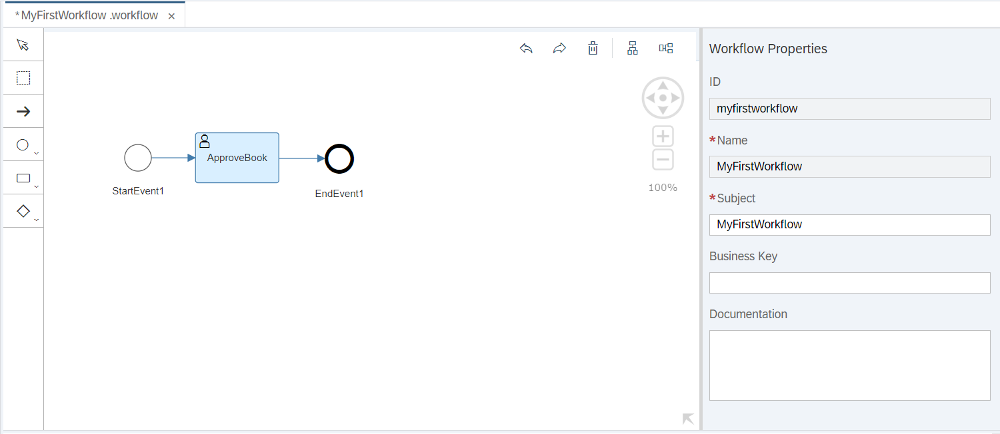
9. Save and deploy the workflow again.
    > Note: To deploy your workflow:
    1. Select the workflow file in the workspace.
    2. Open the context menu and select **Deploy** | **Deploy to SAP Cloud Platform Workflow**.

[ACCORDION-END]

[ACCORDION-BEGIN [Step 5: ](Start a new workflow instance)]
1. In the SAP Fiori launchpad, open the **Monitor Workflow - Workflow Definitions** tile.
   Note that the version of your workflow definition has increased from "1" to "2".
2. Choose **Start New Instance**.
3. Leave the standard JSON input as is, and choose **Start New Instance**.
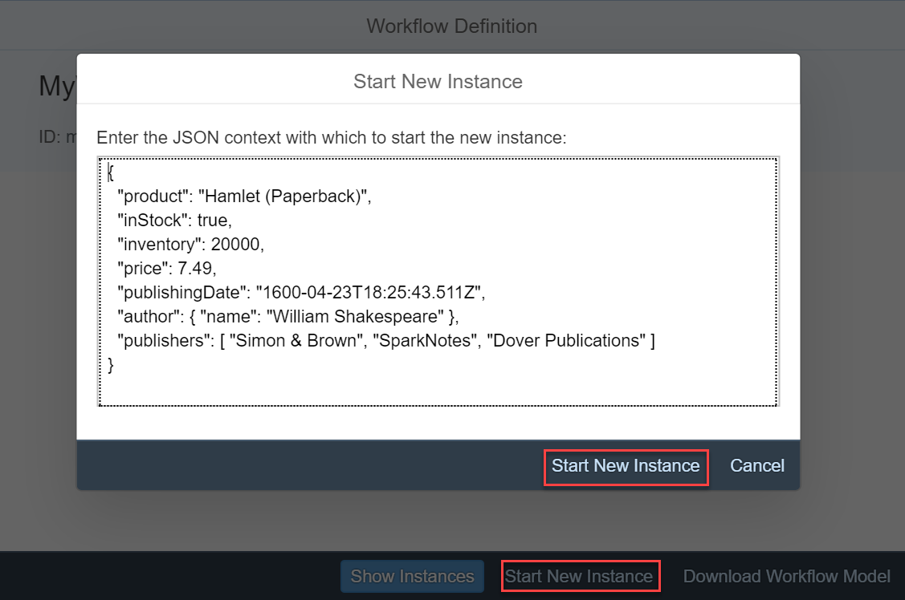
4. Choose **Show Instances**.
   The execution log shows a task waiting in the inbox.
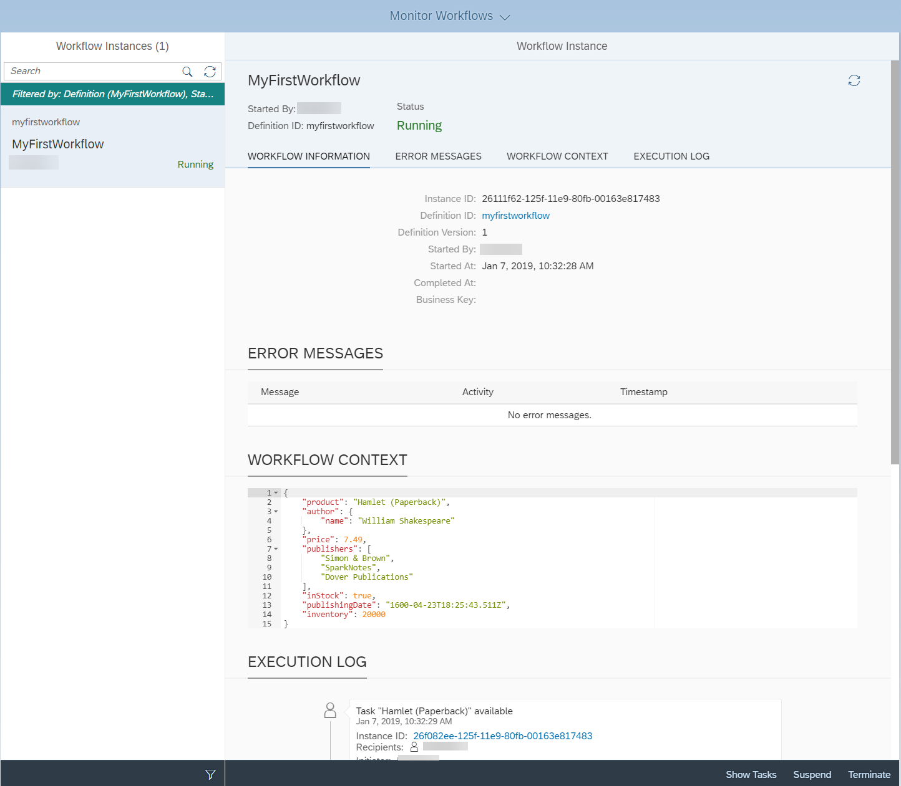

[ACCORDION-END]

[ACCORDION-BEGIN [Step 6: ](Open the task in My Inbox)]
1. Go back to the Fiori launchpad homepage. The **My Inbox** tile shows one open task.
   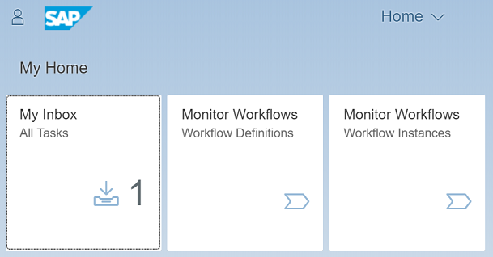
2. Open the inbox. The task and some header information is displayed, but no further details or actions are given.

[ACCORDION-END]

---
