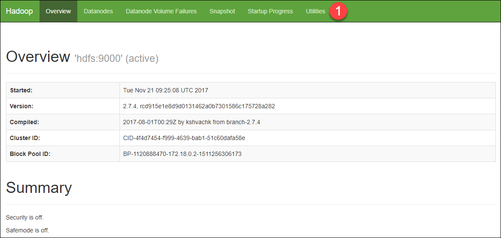
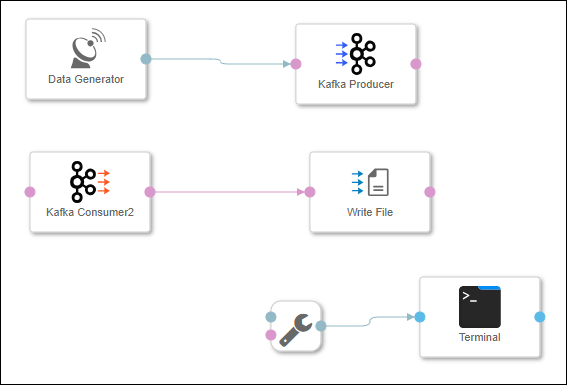
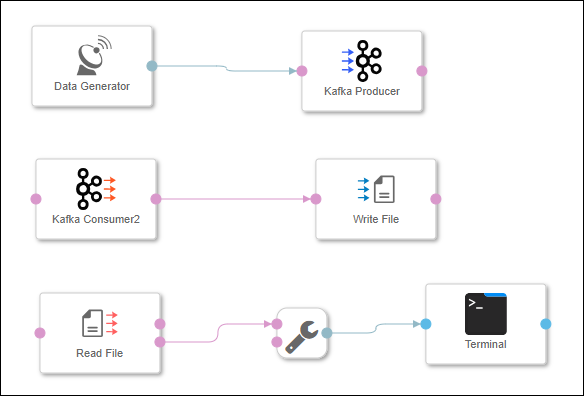
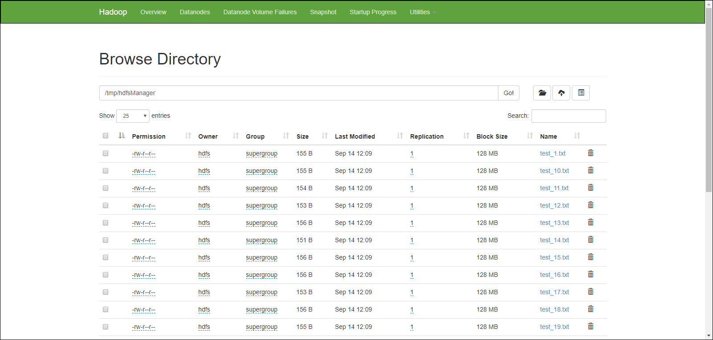

## Prerequisites

## Details
### You will learn  
During this tutorial, you will learn how to store sensor data in the Hadoop Distributed File System (HDFS). You will use an **Write File** operator for this.

### Time to Complete
**15 Min**

---

[ACCORDION-BEGIN [Step 1: ](Start and Check Hadoop)]
The SAP Data Hub, developer edition per default comes with an Apache Hadoop installation. But we have to start the HDFS container separately. If you have not yet done the same, below are the steps to do the same.

Open a new command prompt and run the following command :

```sh
docker run -ti --publish 127.0.0.1:50070:50070 --name hdfs --hostname hdfs --net dev-net datahub run-hdfs
```

After the installations are completed, the container would be started. You would be able to see the following output in the command prompt :


Open `http://localhost:50070` and check that HDFS is up and running.

  

Navigate to **Utilities** | **Browse the file system (1)** and display the `/tmp/hdfsManager` directory (when you install SAP Data Hub, developer edition initially, this directory is empty).

[ACCORDION-END]

[ACCORDION-BEGIN [Step 2: ](Add and configure Write File Operator)]
Open the pipeline which you have created during the previous tutorials (`test.myFirstPipeline`) in the modelling environment `http://localhost:8090`. For this, select the **Graphs** tab in the tab bar on the left side and search for `test.myFirstPiepline`.

Remove the connection between the **`Kafka Consumer2`** operator and the **`ToString` Converter** operator.

Add a **Write File** operator to the pipeline by drag & drop. Then connect the `message` out port of the **`Kafka Consumer2`** operator to the `inFile` port of the **Write File** operator.

  

Configure the **Write File** operator. You need to maintain the following properties:

| Property                       | Value                                 |
| ------------------------------ | ------------------------------------- |
| `Service`                       | `hdfs`                               |
| `Mode`                       | `overwrite`                               |
| `path`                         | `/tmp/hdfsManager/test_<counter>.txt` |

Click on the text box for **Connection** value and configure the following properties:

  

The **Write File** operator will write the received data to files in the `/tmp/hdfsManager` directory. The files follow the scheme `test_<counter>.txt` (whereas `<counter>` is an incremental integer).

[ACCORDION-END]

[ACCORDION-BEGIN [Step 3: ](Add and configure Read File Operator)]
Add a **Read File** operator to the pipeline by drag & drop. Then connect the `outFile` message port of the **Read File** operator to the `ininterface` port of the **`ToString` Converter** operator.

  

Configure the **Read File** operator. You need to maintain the following properties:

| Property                       | Value                               |
| ------------------------------ | ----------------------------------- |
| `Service`                       | `hdfs`                               |
| `path`                         | `/tmp/hdfsManager/`                 |
| `onlyReadOnChange`             | `true`                              |

Click on the text box for **Connection** value and configure the following properties:

   

Afterwards press the **Save** button.

[ACCORDION-END]

[ACCORDION-BEGIN [Step 4: ](Execute the data pipeline)]
Press the **Run** button to execute the pipeline.

When the **Status** tab indicates that the pipeline is running, use the context menu **Open UI** of the **Terminal** operator to see the generated sensor data.

In contrast to the previous tutorial, this time the generated sensor data is not sent from the **`Kafka Consumer2`** operator to the **Terminal** operator directly, but via HDFS. Hence the **Terminal** also shows you information about the created files.

Open `http://localhost:50070` and display the `/tmp/hdfsManager` directory. The longer the pipeline runs, the more files you will find there.

  

Stop the pipeline by pressing the **Stop** button.

[ACCORDION-END]

---
