## Prerequisites  
- **Tutorials:** [Get a Free Trial Account on SAP Cloud Platform](https://www.sap.com/developer/tutorials/hcp-create-trial-account.html) and [Enable SAP Cloud Platform Mobile Services](https://www.sap.com/developer/tutorials/fiori-ios-hcpms-setup.html)
- **Development environment:** Apple iMac, MacBook or MacBook Pro running Xcode 10 or higher
- **SAP Cloud Platform SDK for iOS:** Version 3.0

## Details
### You will learn  
  - How to create a Fiori for iOS application
  - What the SAP Cloud Platform SDK for iOS Assistant can generate.

Before you start, make sure you:

  - Have downloaded SAP Cloud Platform SDK for iOS **version 3.0**.
  - Have a trial account on SAP Cloud Platform. See [Get a Free Trial Account on SAP Cloud Platform](https://www.sap.com/developer/tutorials/hcp-create-trial-account.html).
  - Have enabled SAP Cloud Platform Mobile Services. See [Enable SAP Cloud Platform Mobile Services](https://www.sap.com/developer/tutorials/fiori-ios-hcpms-setup.html).

---

[ACCORDION-BEGIN [Step 1: ](Configure SAP Cloud Platform SDK for iOS Assistant)]

> If you have already configured the SAP Cloud Platform SDK for iOS Assistant, you can **skip this step** and proceed with "Step 2 - Run the SAP Cloud Platform SDK for iOS Assistant".

This step provides simplified steps to configure the SAP Cloud Platform SDK for iOS Assistant application using the SAP Cloud Platform Mobile Services cockpit.

Log on to your SAP Cloud Platform trial account at [https://account.hanatrial.ondemand.com/](https://account.hanatrial.ondemand.com/) and once logged in, navigate to **Services**. Scroll down to **Mobile Services** and click on the **Development & Operations** tile. In the **Development & Operations - Overview** page, click the **Go to Service** link to open a new window to **SAP Cloud Platform Mobile Services**.

> Alternatively, you can go directly to `https://hcpmsadmin-<your_user_id>trial.dispatcher.hanatrial.ondemand.com/`

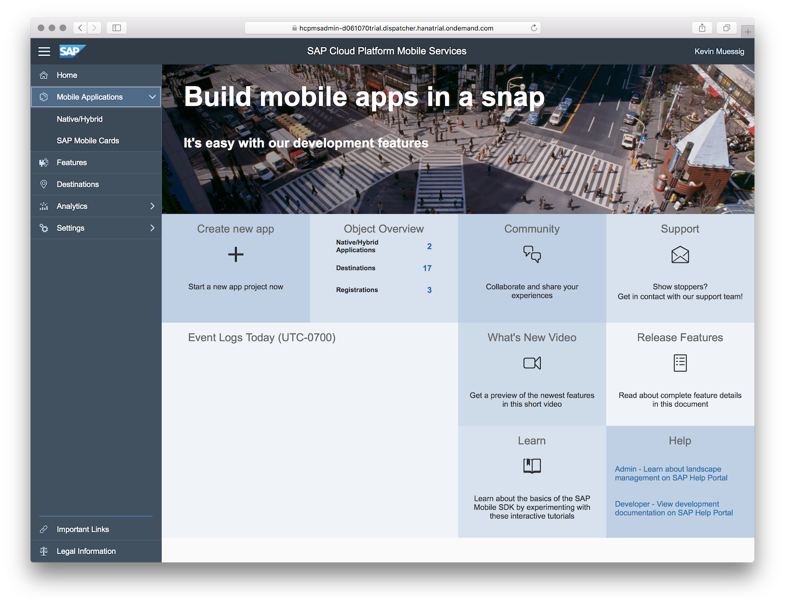

Once you're logged in to **SAP Cloud Platform Mobile Services**, click the **Important Links** tab in the lower left bottom. The **Important Links** section opens.

Locate the tile **SAP Cloud Platform SDK for iOS Assistant** and click the **Importing URLs directly into Assistant** link:

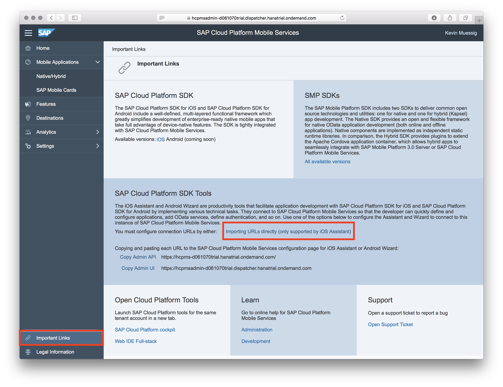

You should now see the following pop-up:

Click **Allow**. The SAP Cloud Platform SDK for iOS Assistant application will start. The **Add Mobile Services Account** settings dialog will open, and both **API URL** and **UI URL** parameters are pre-populated automatically:

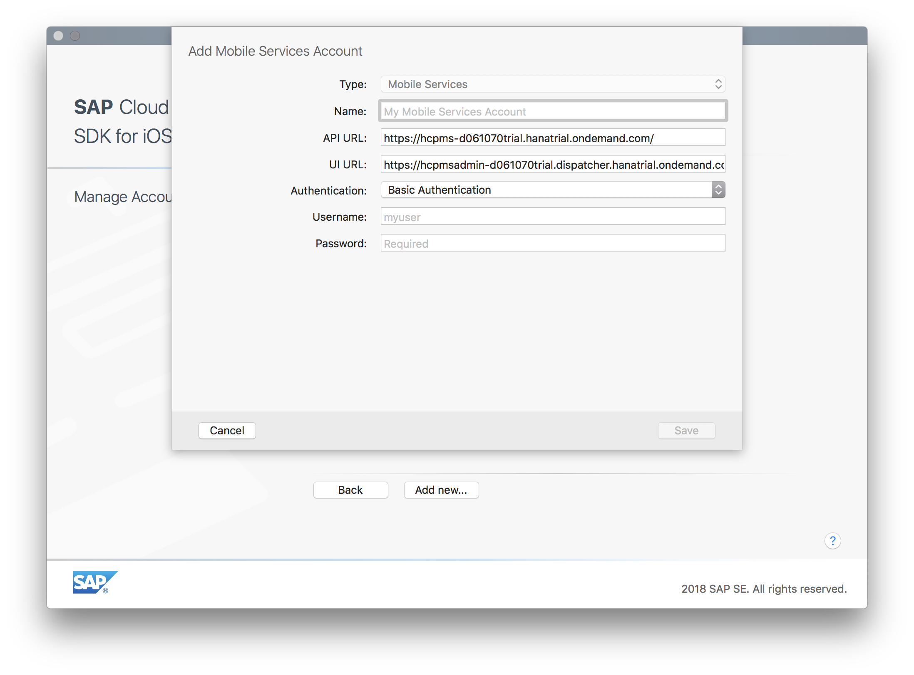

Provide the following additional details:

| Field | Value |
|----|----|
| Name | A descriptive name for the configuration, for instance `SAP Cloud Platform Mobile Services` |
| Authentication Type | `Basic Authentication` |
| User | Your trial account user |
| Password | Password for your trial account user |

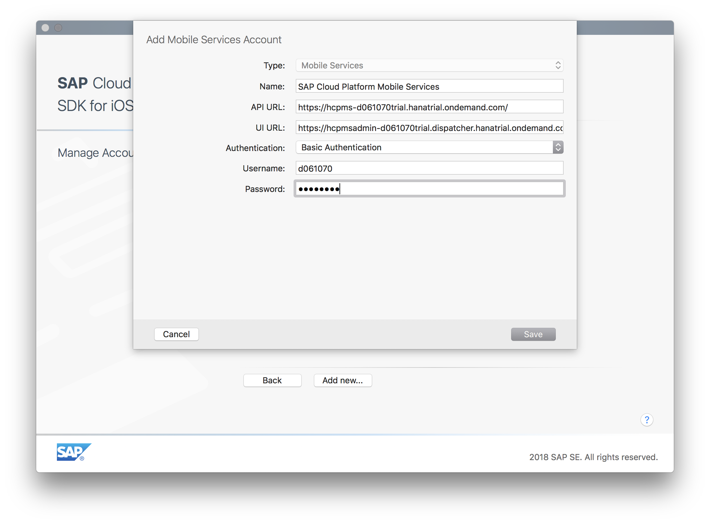

Click **Save** when finished. The account is now added to the SDK Assistant:

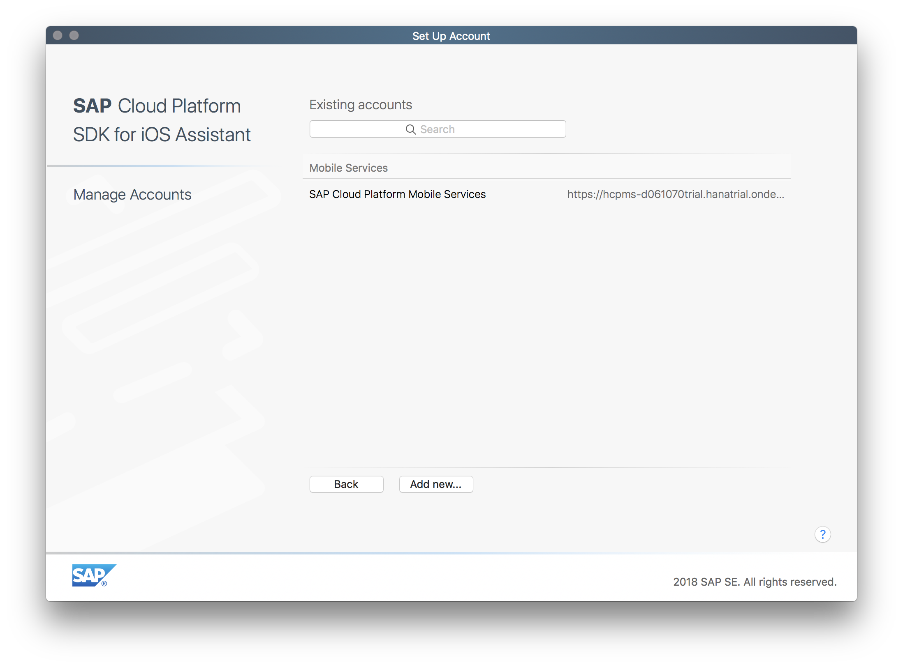

[DONE]
[ACCORDION-END]

[ACCORDION-BEGIN [Step 2: ](Run the SAP Cloud Platform SDK for iOS Assistant)]

> If you went through "Step 1 - Configure SAP Cloud Platform SDK for iOS Assistant", the SAP Cloud Platform SDK for iOS Assistant is already running and you may continue to "Step 3 - Create an Xcode Project".

Double-click the **SAP Cloud Platform SDK for iOS Assistant** icon to start the application. If no applications have been generated previously, you will see the initial screen:

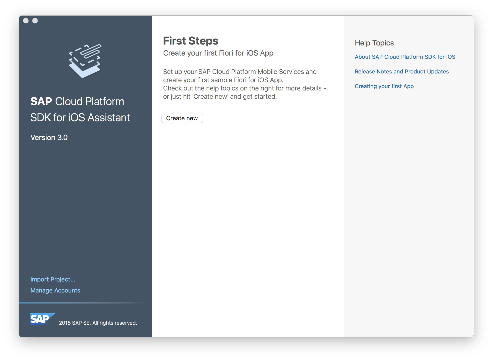

[DONE]
[ACCORDION-END]

[ACCORDION-BEGIN [Step 3: ](Create a new application)]

Click the **Create new** button in the **First Steps** section. The first page of the Xcode project generation wizard lets you define the project properties.

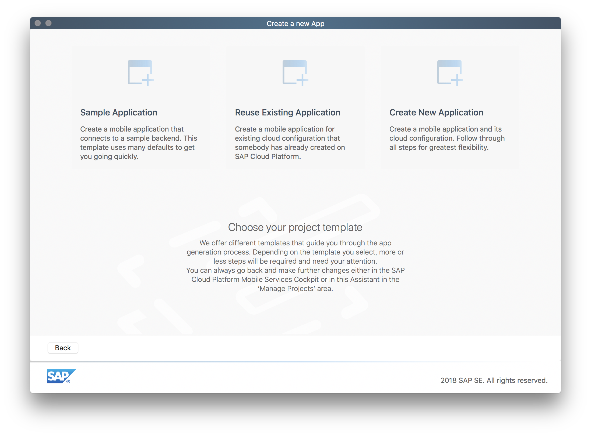

Click the **Create new Application** tile on the right site of the **Create a new App** page. This will allow us to setup our application project the most flexible way.

Next select your **SAP Cloud Platform Mobile Services account** and click **Next**.
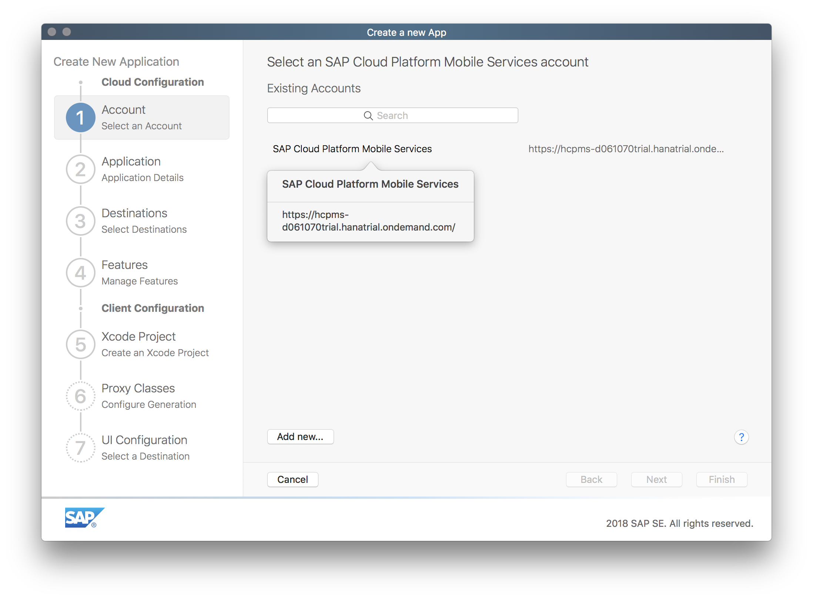

In the **Add an SAP Cloud Platform Mobile Services application** page, add the needed application details to create an application in your mobile services account.

Enter the following details:

| Field | Value |
|----|----|
| Application Name | `MyDeliveries` |
| Application Identifier | `com.sap.tutorials.demoapp.MyDeliveries` |
| Authentication | `OAuth2` |

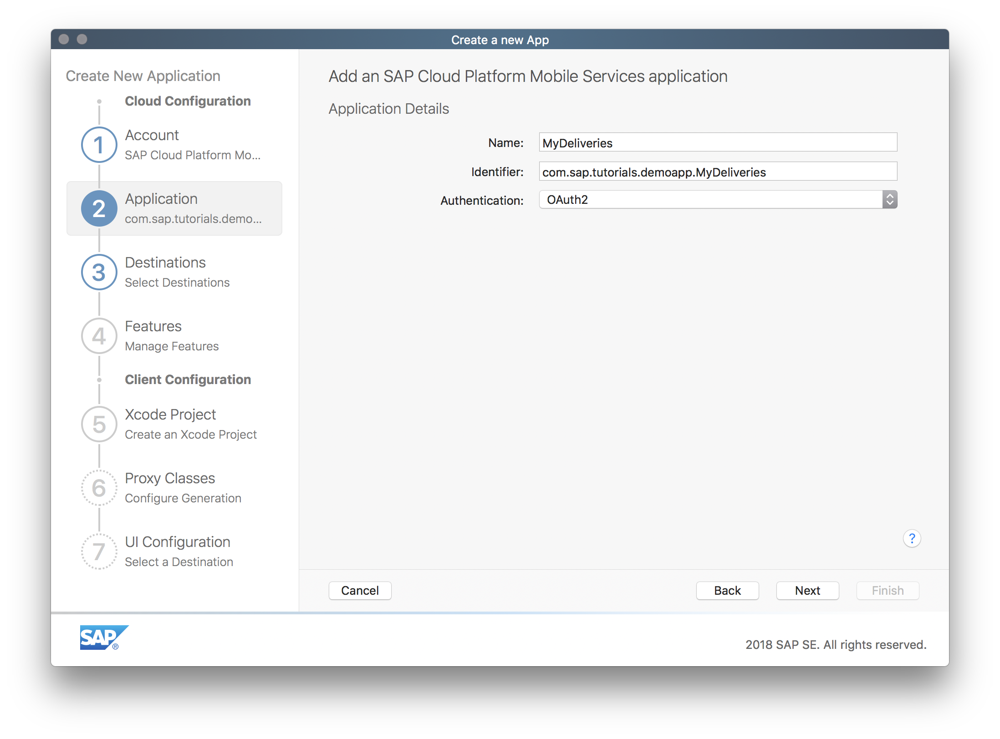

Click **Next** to advance to the **Destinations** step.

[DONE]
[ACCORDION-END]

[ACCORDION-BEGIN [Step 4: ](Create a new destination)]

In the **Destinations** page, you can define the backend connection. Here you will add the OData endpoint for the `DeliveryService` OData service.

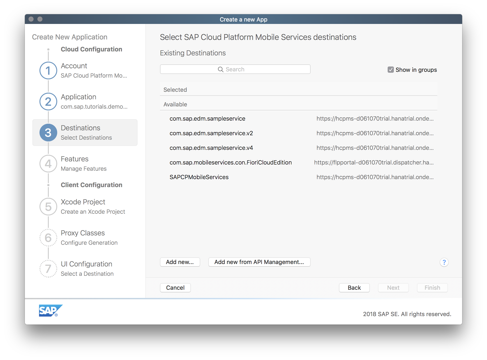

Click the **Add new...** button. A dialog opens:

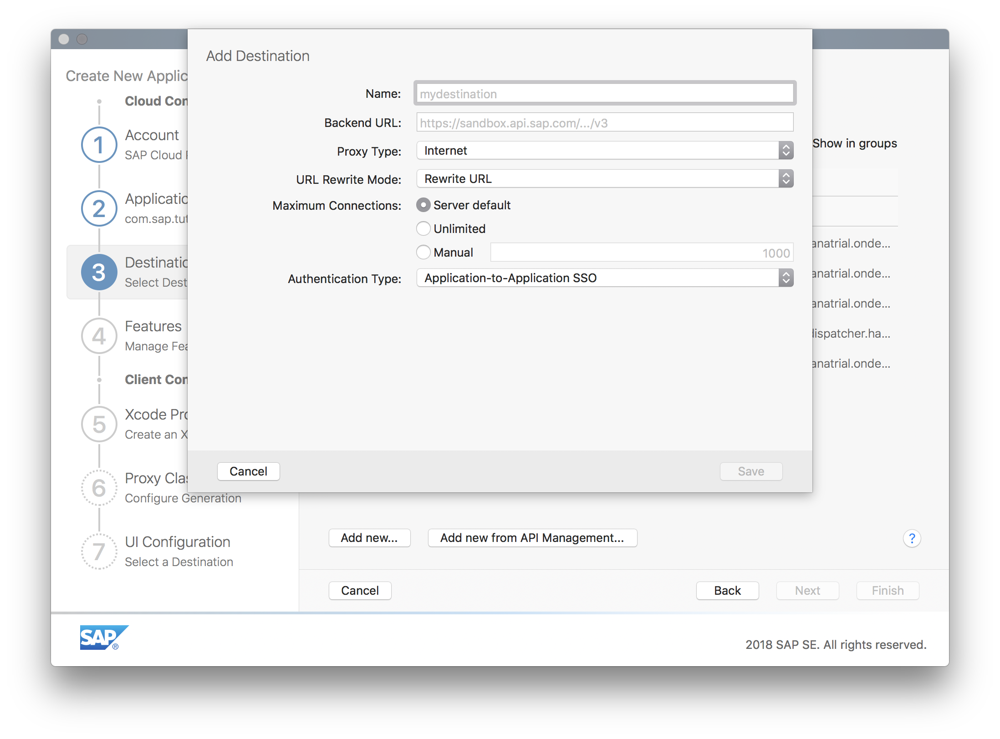

Enter the following details:

| Field | Value |
|----|----|
| Name | `com.sap.tutorials.demoapp.MyDeliveries` |
| Backend URL | `https://sapdevsdd27584c4.us2.hana.ondemand.com/codejam/wwdc/services/DeliveryService.xsodata` |
| Proxy Type | `Internet` |
| URL Rewrite Mode | `Rewrite URL` |
| Maximum connections | `Server default` |
| Authentication Type | `No Authentication` |

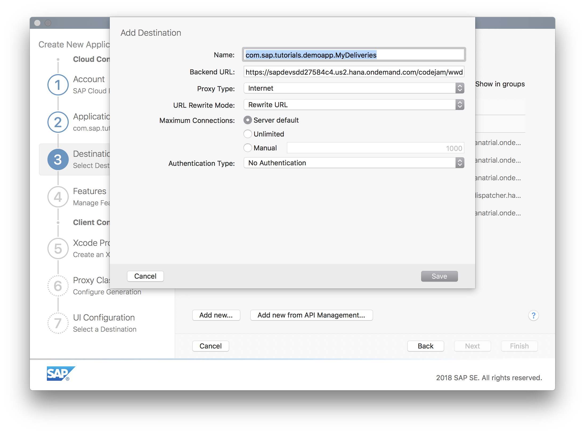

Click **Save** to save the new destination pointing to the backend. It is automatically selected:

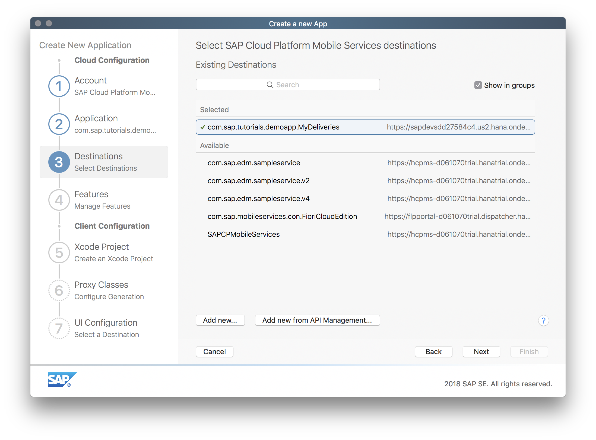

Click **Next** to advance to the **Features** step.

[DONE]
[ACCORDION-END]

[ACCORDION-BEGIN [Step 5: ](Enable features)]

In the **Optional Features** page, you have the option to generate a **Master-Detail Application**, enable **logging** and **log uploads**, enable **remote notifications**, use **Discovery Service** and whether to use **Online** or **Offline** OData.

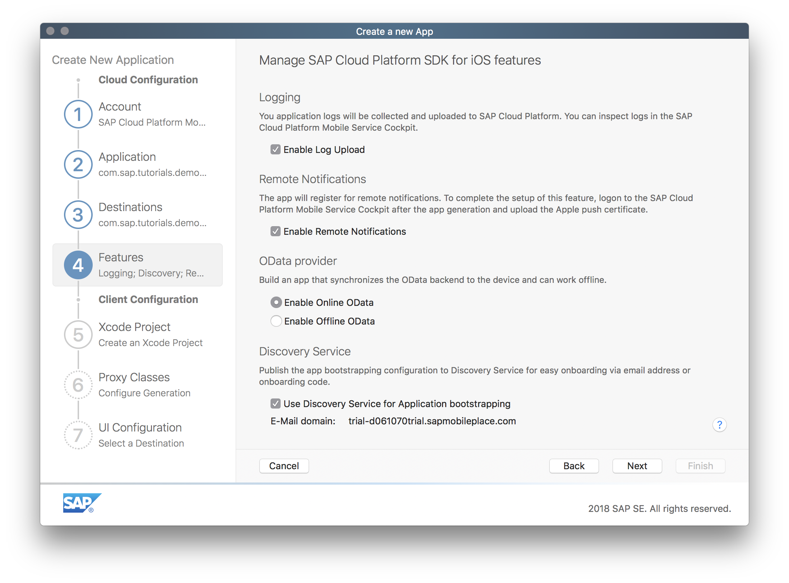

Make sure the checkboxes **Enable Log Upload**, **Enable Remote Notifications** and **Use Discovery Service for Application bootstrapping** are selected, and the **OData Provider** radio button is set to **Enable Online OData** and click **Next** to proceed to the **Xcode Project** step.

[DONE]
[ACCORDION-END]

[ACCORDION-BEGIN [Step 6: ](Set up Xcode Project)]

In the **Xcode Project configuration** page you will setup your actual Xcode project for development later on.
Enter the following details:

| Field | Value |
|----|----|
| Product Name | `MyDeliveries` |
| Organization Name | `<your company name>` |
| Organization Identifier | `com.sap.tutorials.demoapp` |
| Path | `<choose a local destination>` |

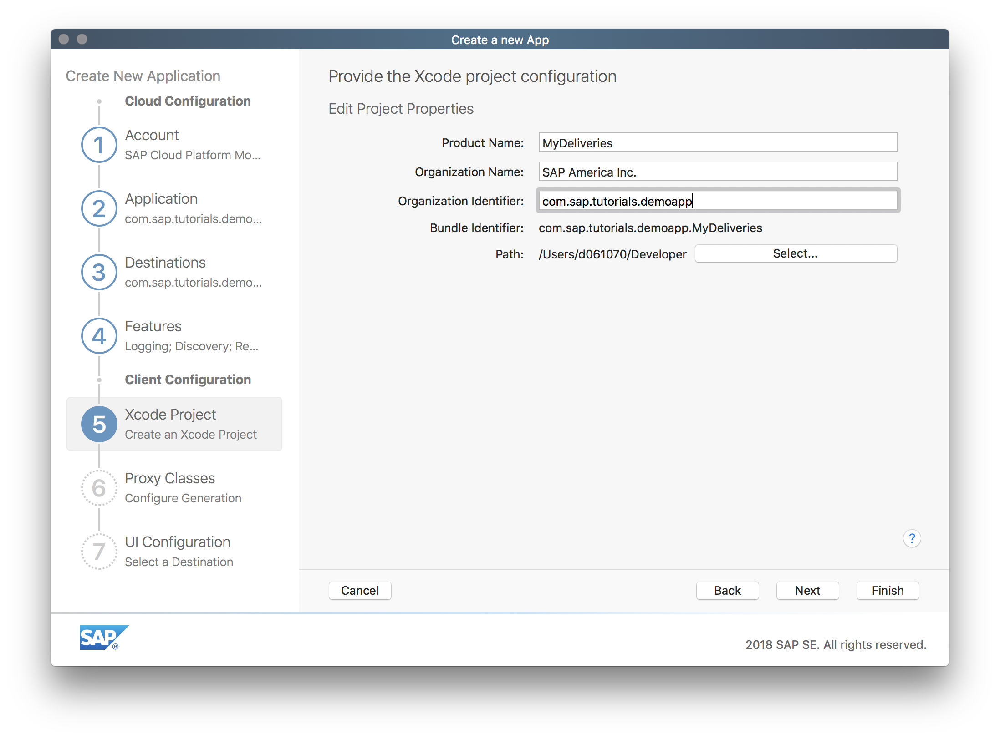

Click **Next** to advance to the **Proxy Classes** step. Here you can see what destination is going to be used to pull the Metadata of the OData Service to generate the OData Proxy Classes.

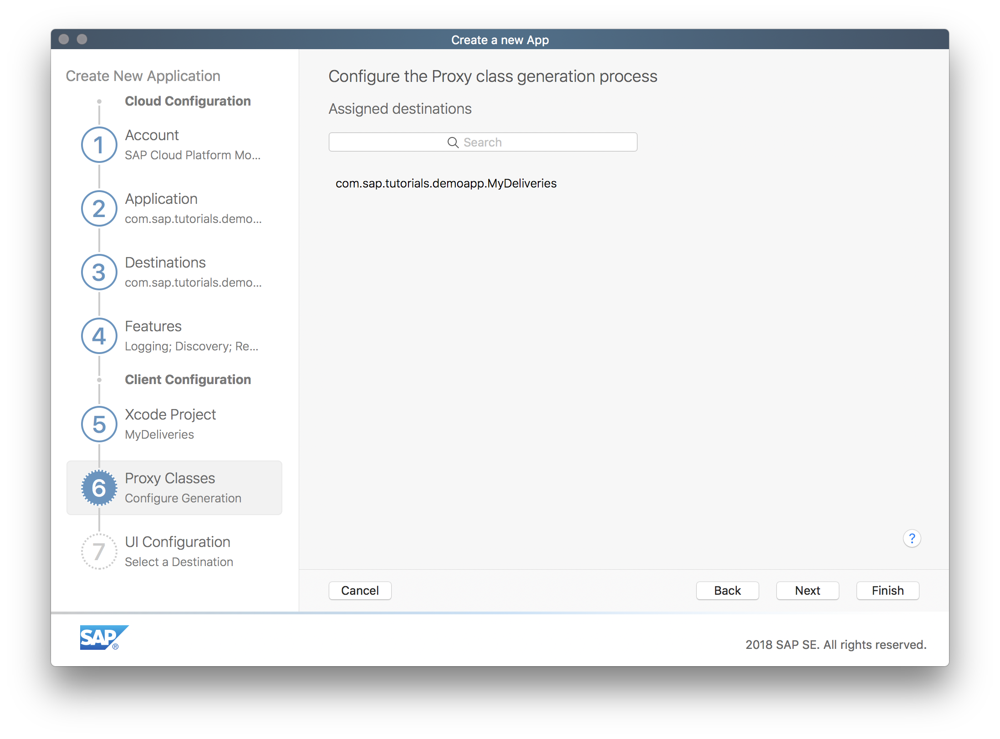

Click **Next** to go to the **UI Configuration** step. Set the **Destination** radio button to **Master / Detail View with Onboarding for destination:** and click finish.

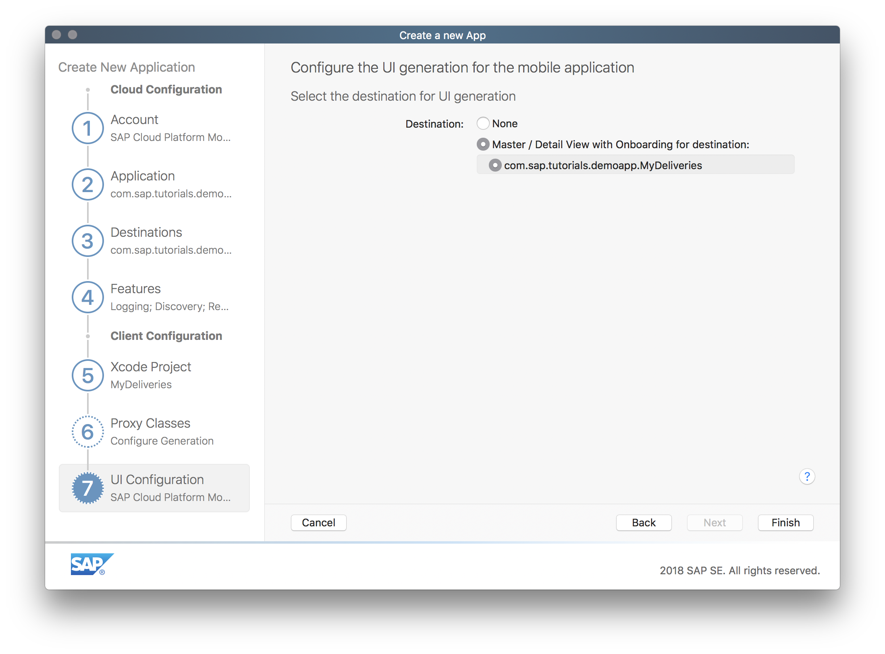

[DONE]
[ACCORDION-END]

[ACCORDION-BEGIN [Step 7: ](Generate the Xcode project)]

After you have clicked **Finish** in the previous step, the SDK Assistant now loads the OData service's metadata. This metadata describes the data model, and can be accessed via `<service URL>$metadata`. For your service, the metadata URL is `https://sapdevsdd27584c4.us2.hana.ondemand.com/codejam/wwdc/services/DeliveryService.xsodata/$metadata`
Based on this metadata, the OData proxy classes will be generated for the Xcode project.

In addition, the configuration settings you have provided in the SDK Assistant are now being sent to SAP Cloud Platform Mobile Services.

> **NB:** If you have already 5 native applications defined in SAP Cloud Platform Mobile Services, the SDK Assistant will give the following error:

> 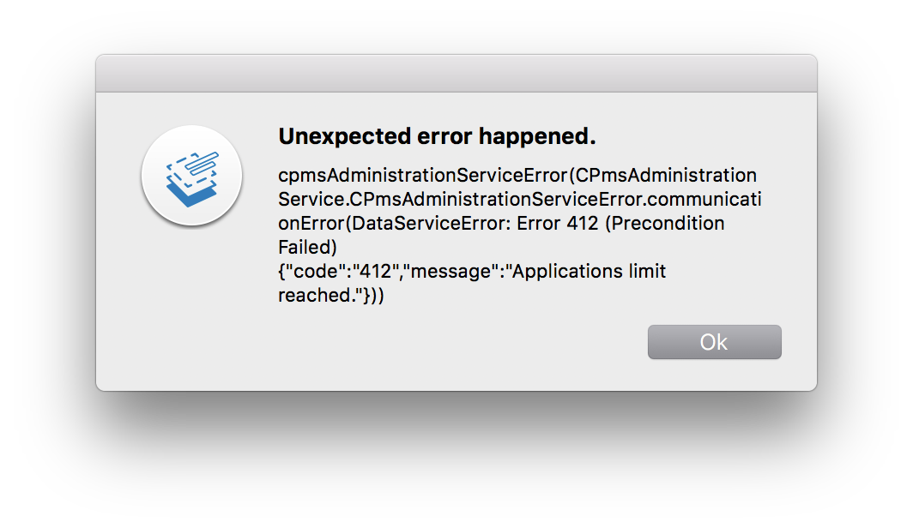

> In that case, log on to your **SAP Cloud Platform mobile Services** account at `https://hcpmsadmin-<your_user_id>trial.dispatcher.hanatrial.ondemand.com/` and navigate to **Mobile Applications > Native/Hybrid**. Select one of the available application configurations and delete it in order for the SDK Assistant to add the new application configuration.

[DONE]
[ACCORDION-END]

[ACCORDION-BEGIN [Step 8: ](Examine the generated Xcode project)]

You can now select the `MyDeliveries` application project under **Recent Projects** in you SDK Assistant.

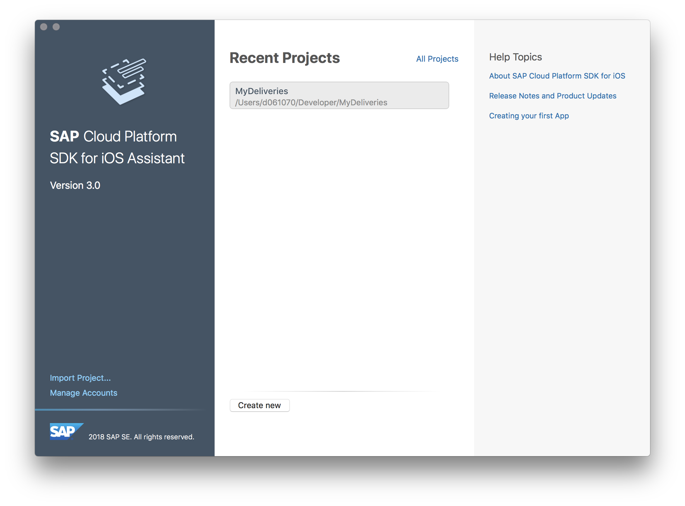

Next hover over the project name and click the down pointing arrow to see **Open** from the appearing menu. Click **Open** to open the Xcode application project.

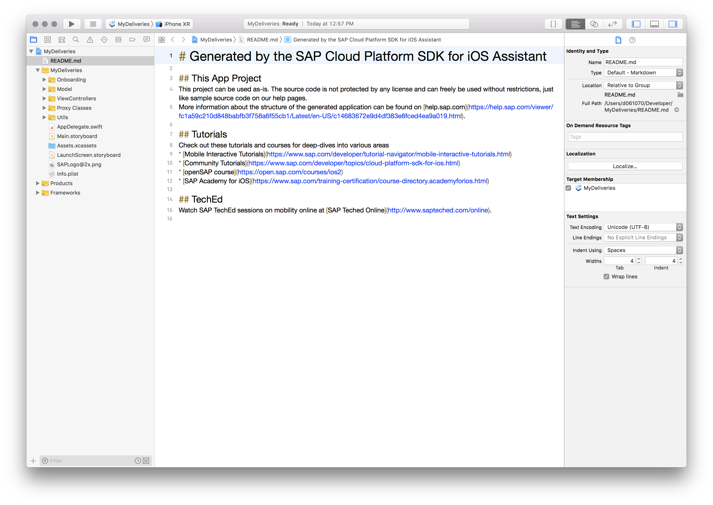

The `Main.storyboard` shows a split-view setup for the generated Master-Detail views.

Folder `MyDeliveries/Onboarding` contains logic for the user onboarding, authentication and handling of `passcodes` and Touch ID.

Folder `MyDeliveries/Proxy Classes` contains the OData proxy classes generated from the OData service. File `DeliveryService.swift` in the `Proxy Classes/public` folder acts as a data service provider to gain access to the OData entities. The two files `PackagesType.swift` and `DeliveryStatusType.swift` are classes for the OData entities `Packages` and `DeliveryStatus`, respectively. These classes give access to the various properties of the OData entities.

Folders `ViewControllers/PackagesType` and `ViewControllers/DeliveryStatusType` contain the master and detail view controllers as well as a storyboard for the `Packages` and `DeliveryStatus` entities, respectively.

[VALIDATE_1]
[ACCORDION-END]
