## Prerequisites  
- **Development environment:** Apple iMac, MacBook or MacBook Pro running Xcode 10 or higher
- **SAP Cloud Platform SDK for iOS:** Version 3.0

## Details
### You will learn  
  - How to build and run the application generated in the last tutorial
  - Details about the OData service so you can extend the application in later tutorials

---

[ACCORDION-BEGIN [Step 1: ](Build and run the generated application)]

Click the **Run** button to build and run the generated application:


The **Simulator** app now launches. If you have configured the app to allow for push notifications, you will get the following alert dialogue:

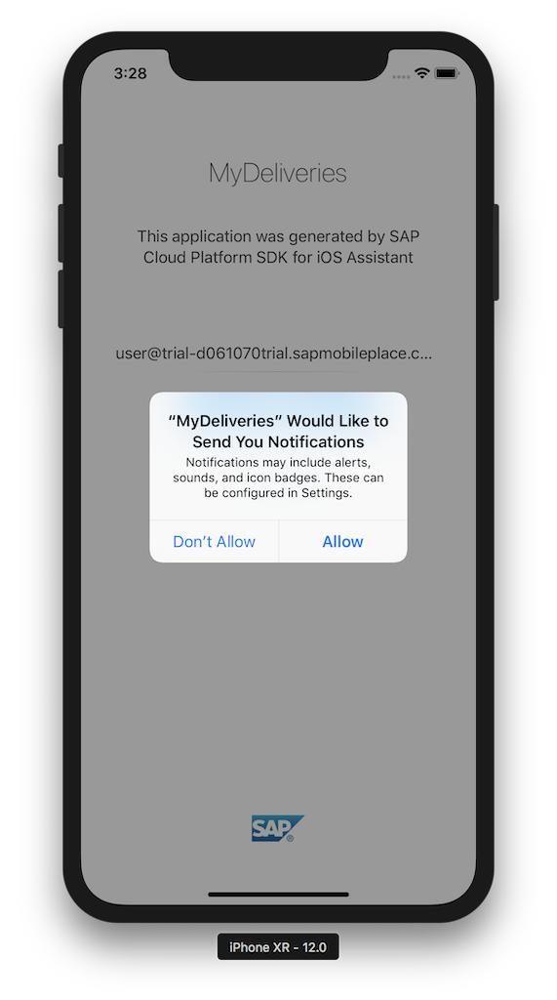

Press **Allow**. You now see the initial view:

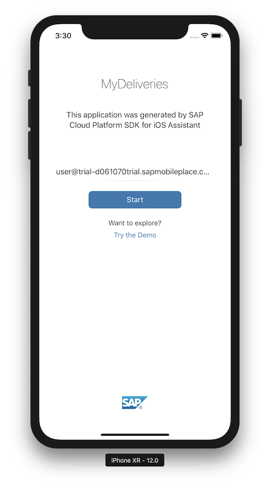

The application name is shown, with a description. You have the option to show a demo version of the application (this should be implemented by hand, as this is not generated by the iOS Assistant) or run the actual, live application.

In this tutorial, you use the live application. Tap the blue **Start** button to proceed.

The **OAuth** login screen of **SAP Cloud Platform Mobile Services** is shown. Enter your login credentials for the SAP Cloud Platform and tap the **Log On** button:

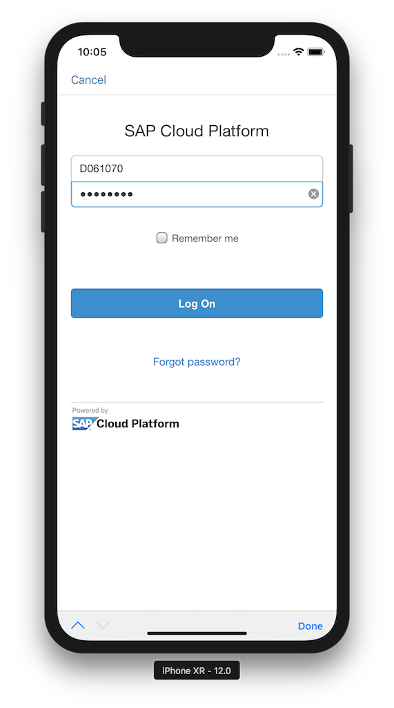

The app now displays the initial **Data Privacy** acknowledgement page. Tap **Allow** to proceed.

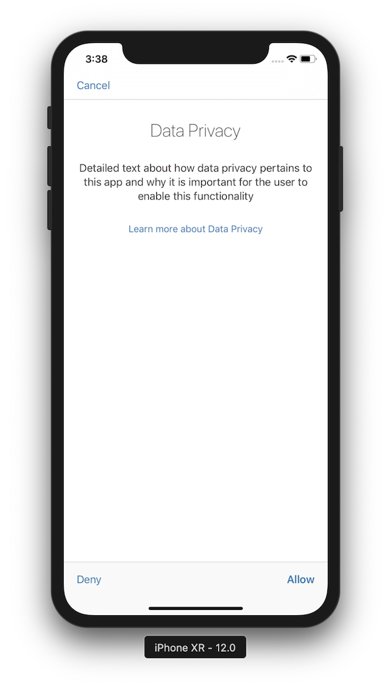

The app now proceeds with a 3-step process. First, you will see the **Data Privacy** detail page. Tap **Next** to proceed to the next step.

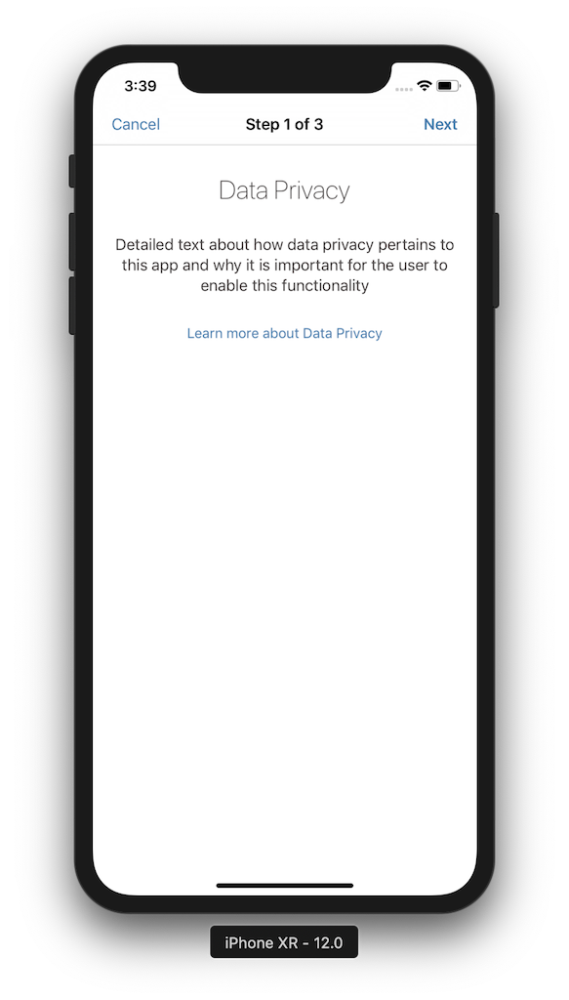

Next you will see the **Security** detail page. Tap **Next** to proceed to the next step.

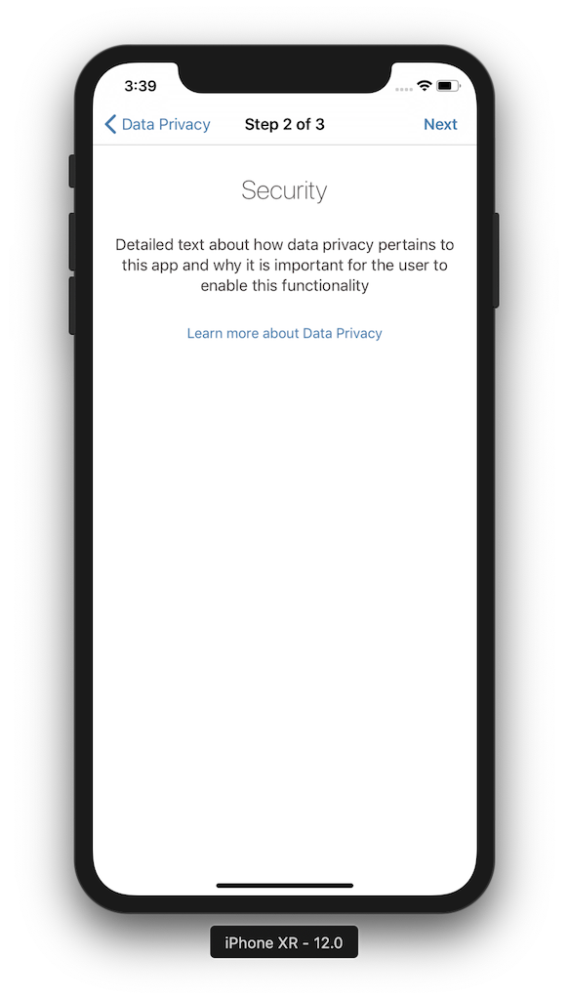

Lastly you are presented the **Consent** detail page. Tap **Allow** to proceed.

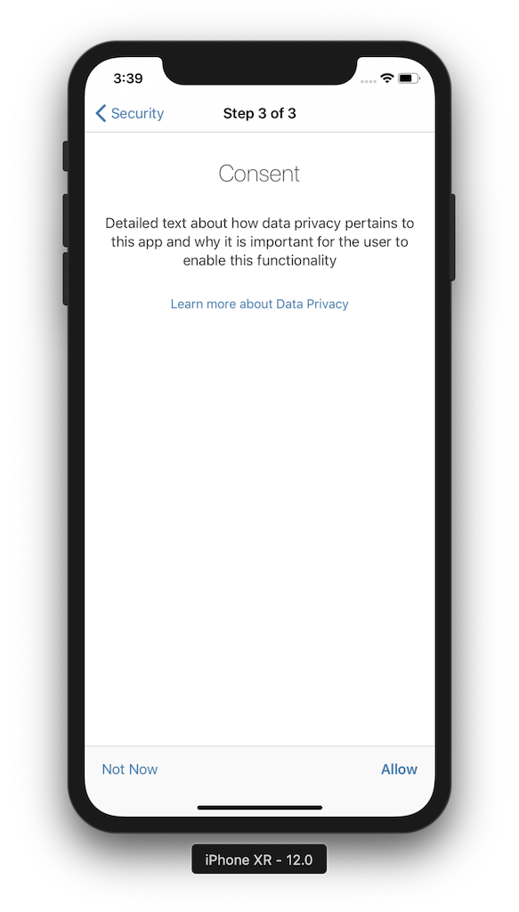

Choose a passcode to finish the onboarding process. Tap **Next** and confirm your passcode.

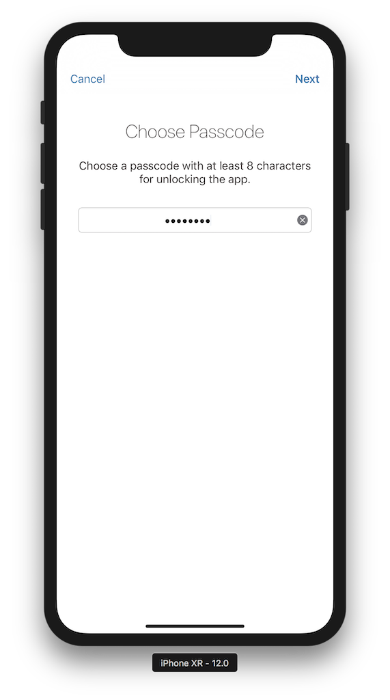

After you confirmed your passcode by tapping the **Done** button, the application starts with an overview of the available **Collections** of the OData service:

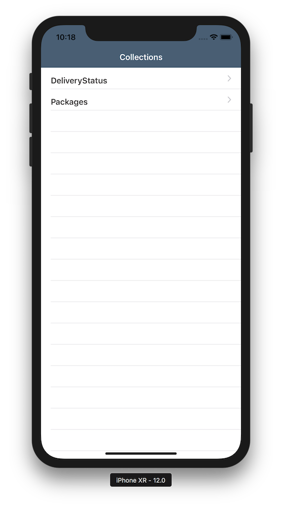

[DONE]
[ACCORDION-END]

[ACCORDION-BEGIN [Step 2: ](Examine the generated application)]

If you tap on the `Packages` collection, you navigate to a **Master** list with all available `Package` entities:

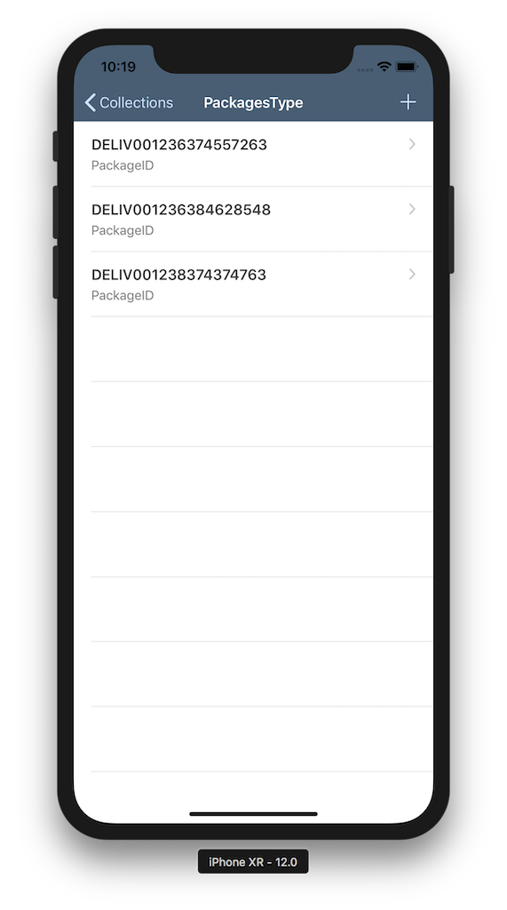

If you tap on one of the `Package` entities, you navigate to a **Detail** page which lists all the properties for the selected entity:

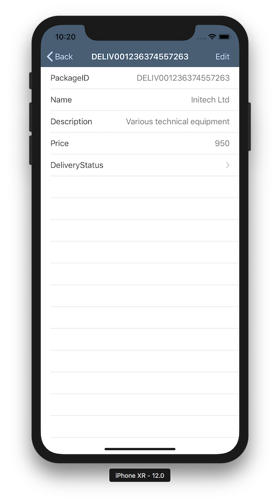

Notice the `DeliveryStatus` entry at the 5th row. If you tap on this, it will show the related `DeliveryStatus` entities for the current `Package`, based on the association in the OData service:

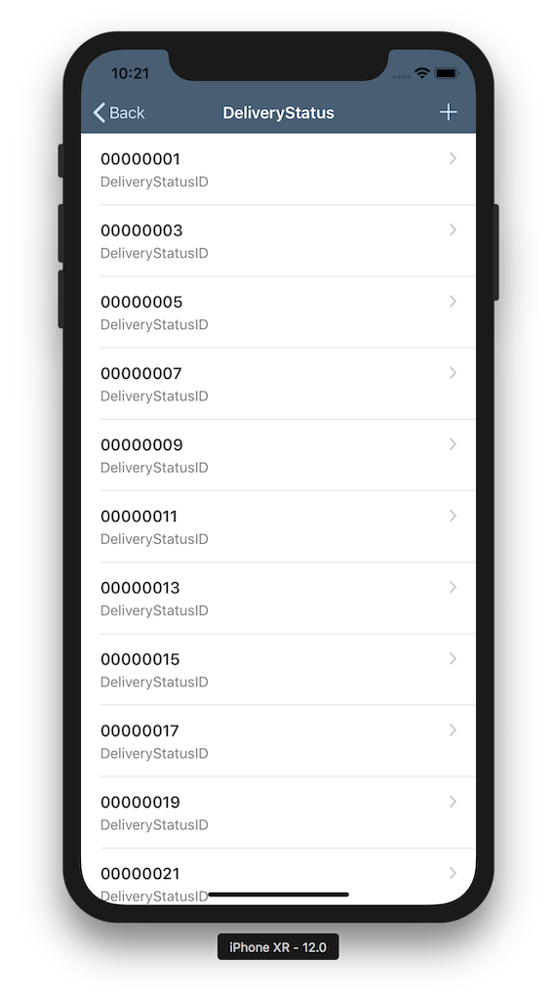

The OData service structure, and how the two entities are related, are explained in the next step.

[DONE]
[ACCORDION-END]

[ACCORDION-BEGIN [Step 3: ](Introduction to the SDK's OData API)]

The generated application demonstrates the OData proxy classes are working, it enables you to browse their properties, and demonstrates push notifications and the various authentication mechanisms.

To examine the OData service's metadata you have to enable the developer features in Safari first. For that open the Safari browser and click on **Safari**, then **Preferences** and click on **Advanced**. In the **Advanced** tab you can enable the **Show Develop menu in the menu bar** to enable the developer features. The **Develop** menu will now be visible in Safari. If you click on **Develop**, choose **Show Web Inspector** to display raw XML in Safari.

> **Note:** We provided you the XML below so you don't have to do this necessarily.

Examine the OData service's metadata, which can be accessed via `https://sapdevsdd27584c4.us2.hana.ondemand.com/codejam/wwdc/services/DeliveryService.xsodata/$metadata`

```xml
<?xml version="1.0" encoding="utf-8" standalone="yes" ?>
<edmx:Edmx Version="1.0" xmlns:edmx="http://schemas.microsoft.com/ado/2007/06/edmx">
  <edmx:DataServices m:DataServiceVersion="2.0" xmlns:m="http://schemas.microsoft.com/ado/2007/08/dataservices/metadata">
    <Schema Namespace="codejam.wwdc.services.DeliveryService" xmlns="http://schemas.microsoft.com/ado/2008/09/edm" xmlns:d="http://schemas.microsoft.com/ado/2007/08/dataservices" xmlns:m="http://schemas.microsoft.com/ado/2007/08/dataservices/metadata">
      <EntityType Name="DeliveryStatusType">
        <Key>
          <PropertyRef Name="DeliveryStatusID"/>
        </Key>
        <Property MaxLength="36" Name="DeliveryStatusID" Nullable="false" Type="Edm.String"/>
        <Property MaxLength="36" Name="PackageID" Type="Edm.String"/>
        <Property MaxLength="256" Name="Location" Type="Edm.String"/>
        <Property Name="DeliveryTimestamp" Type="Edm.DateTime"/>
        <Property MaxLength="16" Name="StatusType" Type="Edm.String"/>
        <Property Name="Selectable" Type="Edm.Int32"/>
        <Property MaxLength="128" Name="Status" Type="Edm.String"/>
      </EntityType>
      <EntityType Name="PackagesType">
        <Key>
          <PropertyRef Name="PackageID"/>
        </Key>
        <Property MaxLength="36" Name="PackageID" Nullable="false" Type="Edm.String"/>
        <Property MaxLength="256" Name="Name" Type="Edm.String"/>
        <Property MaxLength="256" Name="Description" Type="Edm.String"/>
        <Property Name="Price" Precision="10" Scale="2" Type="Edm.Decimal"/>
        <NavigationProperty FromRole="PackagesPrincipal" Name="DeliveryStatus" Relationship="codejam.wwdc.services.DeliveryService.PackageDeliveryStatusType" ToRole="DeliveryStatusDependent"/>
      </EntityType>
      <Association Name="PackageDeliveryStatusType">
        <End Multiplicity="1" Role="PackagesPrincipal" Type="codejam.wwdc.services.DeliveryService.PackagesType"/>
        <End Multiplicity="*" Role="DeliveryStatusDependent" Type="codejam.wwdc.services.DeliveryService.DeliveryStatusType"/>
        <ReferentialConstraint>
          <Principal Role="PackagesPrincipal">
            <PropertyRef Name="PackageID"/>
          </Principal>
          <Dependent Role="DeliveryStatusDependent">
            <PropertyRef Name="PackageID"/>
          </Dependent>
        </ReferentialConstraint>
      </Association>
      <EntityContainer Name="DeliveryService" m:IsDefaultEntityContainer="true">
        <EntitySet EntityType="codejam.wwdc.services.DeliveryService.DeliveryStatusType" Name="DeliveryStatus"/>
        <EntitySet EntityType="codejam.wwdc.services.DeliveryService.PackagesType" Name="Packages"/>
        <AssociationSet Association="codejam.wwdc.services.DeliveryService.PackageDeliveryStatusType" Name="PackageDeliveryStatus">
          <End EntitySet="Packages" Role="PackagesPrincipal"/>
          <End EntitySet="DeliveryStatus" Role="DeliveryStatusDependent"/>
        </AssociationSet>
      </EntityContainer>
    </Schema>
  </edmx:DataServices>
</edmx:Edmx>
```

As you can see, it is a fairly simple data model containing two Entity Sets (or tables) called `Packages` and `DeliveryStatus`. Each entity (or record) in the set is identified as a `PackagesType` and `DeliveryStatusType`, respectively.

There is also an association between `PackagesType` and `DeliveryStatusType`, where a single `PackagesType` can have related `DeliveryStatusType`'s with a `0..n` cardinality.

We will now show for each `PackageType` its related `DeliveryStatusType`s, shown in a timeline in ascending order (newest on top). The timeline is built using **SAP Fiori for iOS controls**.

Using the SDK's `SAPOData` framework, you can create OData queries in a simple way. Instead of executing SQL statements, the SDK provides a 'fluent interface' or 'method chaining' approach to constructing queries, which makes the code much more readable.

A query to get all `DeliveryStatus` entities for a particular `Package` would look something like this:

```swift
// Function 1
let query = DataQuery()
// SELECT * FROM DeliveryStatus
  .from(DeliveryServiceMetadata.EntitySets.deliveryStatus)
// WHERE DeliveryStatus.packageID == <selected package ID>
  .where(DeliveryStatusType.packageID.equal((currentEntity?.packageID)))
```

The result of this query is an array of `DeliveryStatusType` objects.

With OData, you can even have greater flexibility. Since there is a one-to-many association (or 'Navigation Link') between `Package` and `DeliveryStatus`, you could also load the `Package` object and all related child `DeliveryStatus` entities at once:

```swift
// Function 2
let query = DataQuery()
// SELECT * FROM Packages
  .from(DeliveryServiceMetadata.EntitySets.packages)
// WHERE <primary key> = <selected package ID>
  .withKey(PackagesType.key(packageID: currentEntity?.packageID))
// LEFT JOIN DeliveryStatus ON <abstracted, defined in association>
  .expand(PackagesType.deliveryStatus)
```

Using the generated OData Proxy classes, you can then simply access the `PackagesType` related `DeliveryStatusType` objects:


[VALIDATE_1]
[ACCORDION-END]

---
