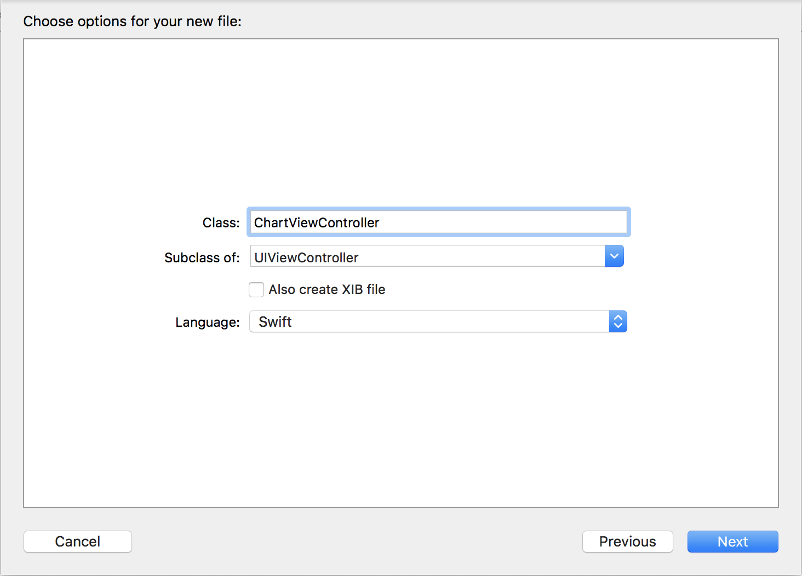
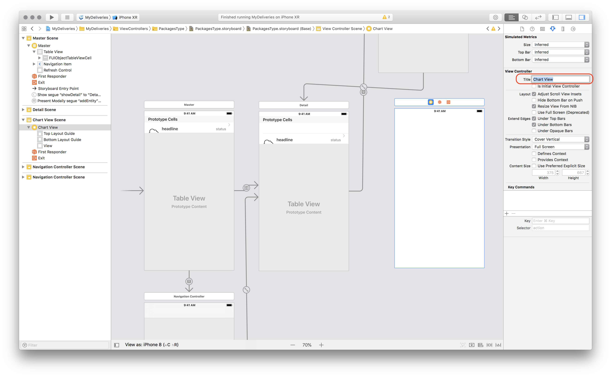
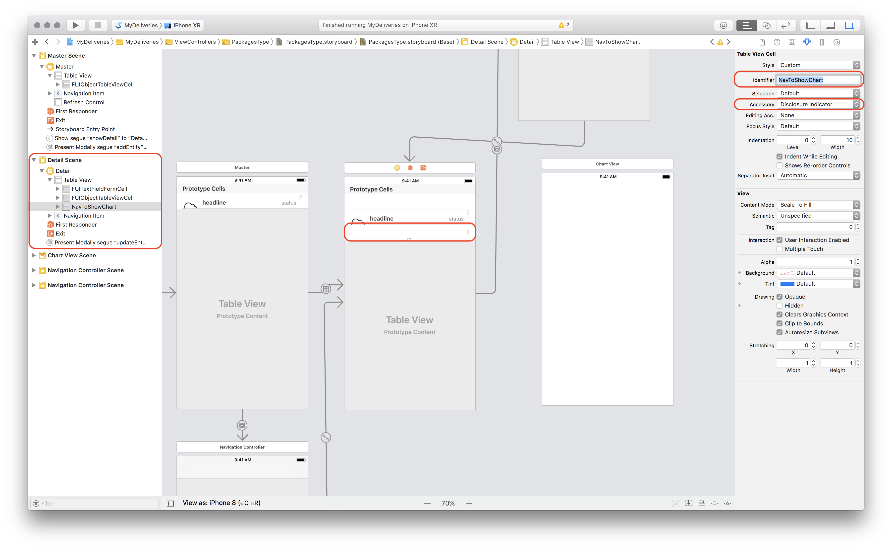
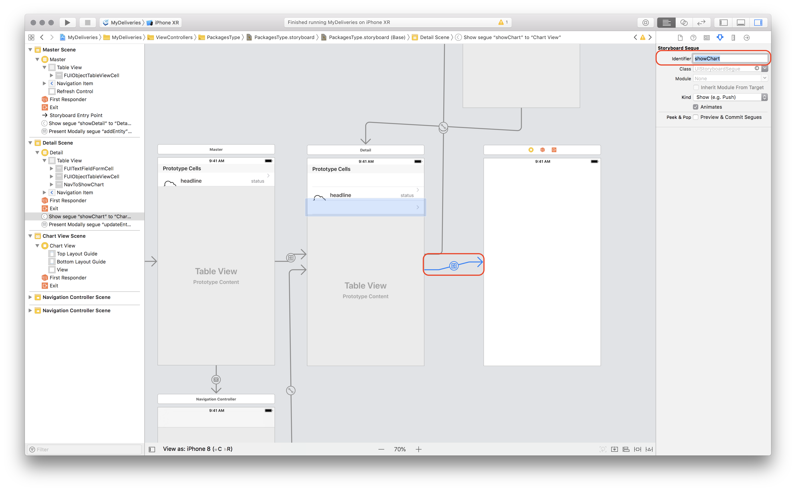
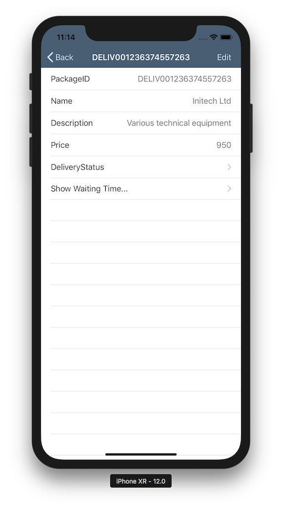
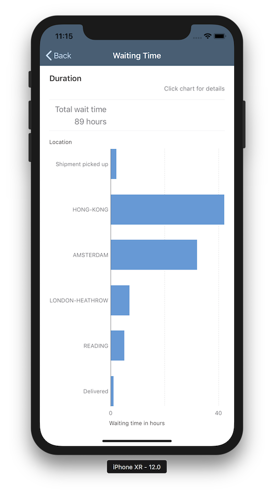
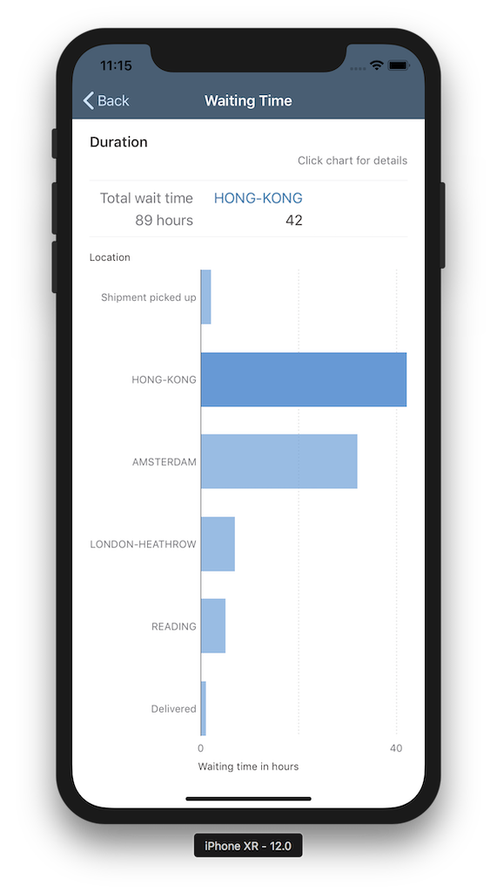

## Prerequisites  
- **Development environment:** Apple iMac, MacBook or MacBook Pro running Xcode 10 or higher
- **SAP Cloud Platform SDK for iOS:** Version 3.0

## Details
### You will learn  
  - About the data visualization capabilities of the SDK

For brevity, static data is used, but this can easily be changed to OData entities, like you did with the implementation of the timeline cell in the previous steps.

---

[ACCORDION-BEGIN [Step 1: ](Data visualization example)]

In the **Project navigator**, navigate to the `MyDeliveries/ViewControllers/PackagesType` folder. Right-click this folder, and from the context menu, select **New File...**

In the dialog, select **Cocoa Touch Class**:


Click **Next**.

First, set the **Subclass** to `UIViewController`.

Then, change the **Class** to `ChartViewController`.



Click **Next** to continue. Check that the file is saved in the `PackagesType` group, and click **Create** to create the class. The new file will open now.

In order to show the SDK's data visualizations, it should subclass `FUIChartFloorplanViewController`.

First add the necessary import statements:

```swift
import SAPFoundation
import SAPFiori
import SAPCommon
```
> You can remove the `import UIKit` import because the `SAPFiori` Framework has the `UIKit` in it's body.

Then change the signature of the class so it now extends from `FUIChartFloorplanViewController`:

```swift
class ChartViewController: FUIChartFloorplanViewController {

```

Now you have the scaffolding for the data visualizations class. We'll leave it for now, the actual implementation will be finalized in a later step.

[DONE]

[ACCORDION-END]

[ACCORDION-BEGIN [Step 2: ](Add view controller to storyboard)]

Open the `PackagesType.storyboard` file, and click the **Object Library** button in the right area of the toolbar. Drag a **View Controller** onto the storyboard.

Select the new **View Controller** and go to the **Attributes Inspector**. Set the **title** to **Chart View**:



Now switch to the **Identity Inspector**, enter `ChartViewController` for the **Custom Class**, and press Return. Be sure to get the spelling right; if it's correct, you'll see the Module change to MyDeliveries (the name of your project):


Drag a **Table View Cell** onto the **Detail Table View**, and set the following properties in the attribute inspector:

| Field | Value |
|----|----|
| Identifier | `NavToShowChart` |
| Accessory | `Disclosure Indicator` |



Control-click the just added **Table View Cell** and drag it onto the **Chart View Scene**. From the **Segue** pop-up, choose **Show**.

With the segue selected, go to the attributes inspector and provide the name `showChart` as its **Identifier**.



[DONE]

[ACCORDION-END]

[ACCORDION-BEGIN [Step 3: ](Implement Table View Cell for Chart)]

Open file `./MyDeliveries/ViewControllers/PackagesType/PackagesTypeDetailViewController.swift`.

Locate the function `tableView(_: UITableView, numberOfRowsInSection _: Int)`. Currently it returns **5** rows, the total number of properties the `Package` entity has. However, since you added an extra Table View Cell to navigate to the Chart View scene, you want to make this extra cell visible.

Set the return value to `6`:

```swift
override func tableView(_: UITableView, numberOfRowsInSection _: Int) -> Int {
  return 6
}
```
Next, locate the function `tableView(_ tableView: UITableView, cellForRowAt indexPath: IndexPath)`.

To display the added Table View Cell, add an extra `case` statement, just above the `default:` switch:

```swift
case 5:
  let navigationLink = tableView.dequeueReusableCell(withIdentifier: "NavToShowChart", for: indexPath) as UITableViewCell
  navigationLink.textLabel?.text = "Show Waiting Time..."
  navigationLink.textLabel?.textColor = UIColor.preferredFioriColor(forStyle: .primary1)

  return navigationLink
```

[DONE]
[ACCORDION-END]

[ACCORDION-BEGIN [Step 4: ](Implement chart view controller)]

In the **Project navigator**, navigate to the `MyDeliveries/ViewControllers/PackagesType` folder and open the `ChartViewController.swift` file you have created in step 18.

Replace the `viewDidLoad` function with the following:

```swift
override func viewDidLoad() {
  super.viewDidLoad()

  title = "Waiting Time"
  chartView.chartType = .bar

  // chartView.numberOfGridlines = 4

  chartView.dataSource = self
  summaryView.dataSource = self

  titleText.text = "Duration"
  status.text = "Click chart for details"
  categoryAxisTitle.text = "Location"
  valuesAxisTitle.text = "Waiting time in hours"
}
```

This sets the default settings for the chart, in this case, a bar chart.

A couple of errors are now shown. That is because the chart's data source is not yet implemented.

At the bottom of the file, add the following two extensions:

```swift
extension ChartViewController: FUIChartSummaryDataSource {
  func chartView(_ chartView: FUIChartView, summaryItemForCategory categoryIndex: Int) -> FUIChartSummaryItem? {
    let item = FUIChartSummaryItem()
    item.categoryIndex = categoryIndex
    item.isPreservingTrendHeight = false
    switch categoryIndex {
      case -1:
        item.isEnabled = false
        let values: [Double] = {
          var values: [Double] = []
          for series in chartView.series {
            let categoriesUpperBound = series.numberOfValues - 1
            if let valuesInSeries = series.valuesInCategoryRange((0...categoriesUpperBound), dimension: 0) {
              values.append(valuesInSeries.compactMap({ $0 }).reduce(0.0, +))
            }
          }
          return values
        }()

          let numberFormatter  = NumberFormatter()
          numberFormatter.maximumFractionDigits = 0
          item.valuesText = values.map { "\(numberFormatter.string(from: $0 as NSNumber)!) hours" }
          item.title.text = "Total wait time"

      default:
        item.isEnabled = true
        let values: [Double] = {
          var values: [Double] = []
          for series in chartView.series {
            values.append(series.valueForCategory(categoryIndex, dimension: 0)!)
          }
          return values
        }()
        item.valuesText = values.map { formattedTitleForDouble($0)! }
        item.title.text = chartCategoryTitles()[categoryIndex]
    }
    return item
  }
}

extension ChartViewController: FUIChartViewDataSource {
  // MARK: - FUIChartViewDataSource functions

  func numberOfSeries(in: FUIChartView) -> Int {
    return chartData().count
  }

  func chartView(_ chartView: FUIChartView, numberOfValuesInSeries seriesIndex: Int) -> Int {
    return chartData()[seriesIndex].count
  }

  func chartView(_ chartView: FUIChartView, valueForSeries seriesIndex: Int, category categoryIndex: Int, dimension dimensionIndex: Int) -> Double? {
    return chartData()[seriesIndex][categoryIndex]
  }

  func chartView(_ chartView: FUIChartView, formattedStringForValue value: Double, axis: FUIChartAxisId) -> String? {
    return formattedTitleForDouble(value)
  }

  func chartView(_ chartView: FUIChartView, titleForCategory categoryIndex: Int, inSeries seriesIndex: Int) -> String? {
    return chartCategoryTitles()[categoryIndex]
  }

  // MARK: - helper functions for generating & formatting sample data
  func chartSeriesTitles() -> [String] {
    return ["Actual", "Target"]
  }

  func chartCategoryTitles() -> [String] {
    return ["Shipment picked up", "HONG-KONG", "AMSTERDAM", "LONDON-HEATHROW", "READING", "Delivered"]
  }

  func chartData() -> [[Double]] {
    return [[2, 42, 32, 7, 5, 1]]
  }

  func formattedTitleForDouble(_ value: Double) -> String? {
    let numberFormatter = NumberFormatter()
    numberFormatter.maximumFractionDigits = 0
    return numberFormatter.string(from: value as NSNumber)
  }
}
```

The first extension is responsible for drawing the chart items.

The chart item at `categoryIndex` value `-1` is the "pinned" or "fixed position" item in the chart's summary header.
The chart item at the other or `default` positions are the actual chart items.

The second extension is the DataSource responsible for providing the data to the chart. Here you see the hard-coded values for the category titles and chart data.

If you build and run the application, and tap on one of the **Packages** entities, you can see the added cell which navigates to the chart:



If you tap the **Show Waiting Time...** cell, you will see the bar chart with the delivery waiting times, and calculated total waiting time (89 hours):



If you now tap on one of the bars in the chart, the item's details are shown in the summary header:



[VALIDATE_1]
[ACCORDION-END]

---
