## Prerequisites  
- **Development environment:** Apple Mac running macOS High Sierra or higher with Xcode 10 or higher
- **SAP Cloud Platform SDK for iOS:** Version 3.0

## Details
### You will learn  
  - How to use the storyboard to add a map view to your app
  - How to use outlet connections to refer to controls in code

[ACCORDION-BEGIN [Step 1: ](Create a new view controller class for the tracking map view)]

It would be great if the users of your delivery tracking app could see the location of their packages on a map. To do this, you'll add a `MKMapView` inside a new `UIViewController` that people can navigate to.

In the **Project navigator**, navigate to the `MyDeliveries/ViewControllers` folder. Control-click (or right-click) this folder, and from the context menu, select **New File...**

In the dialog, select **Cocoa Touch Class**:

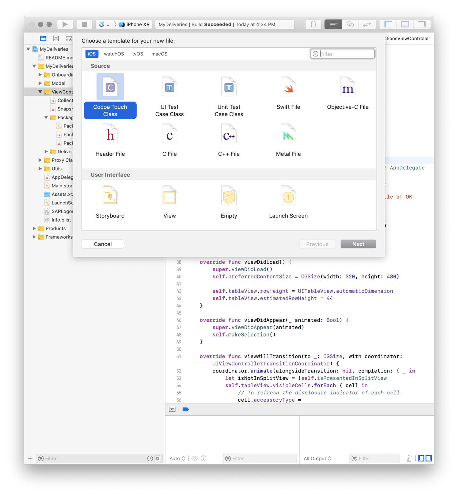

Click **Next**.

First, set the **Subclass** to `UIViewController`.

Then, change the **Class** to `TrackingMapViewController`.

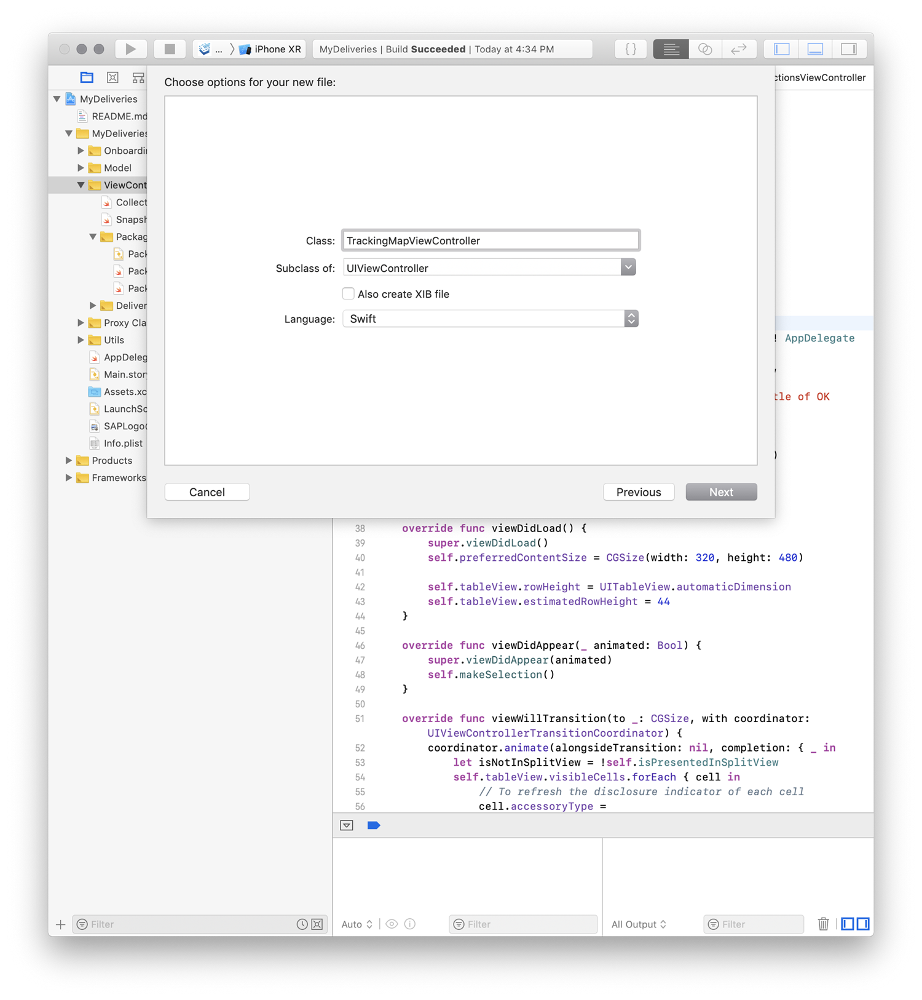

Click **Next** to continue. Check that the file is saved in the `ViewControllers` group, and click **Create** to create the class. The new file will open now.

[DONE]
[ACCORDION-END]

[ACCORDION-BEGIN [Step 2: ](Add the view controller to the storyboard)]

Select the `PackagesType.storyboard` and add a new **View Controller** from the **Object Library**.

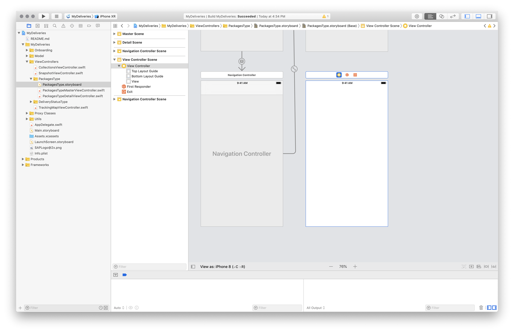

Make sure your new view controller is selected. Go to the Identity Inspector and set the class to **TrackingMapViewController**.

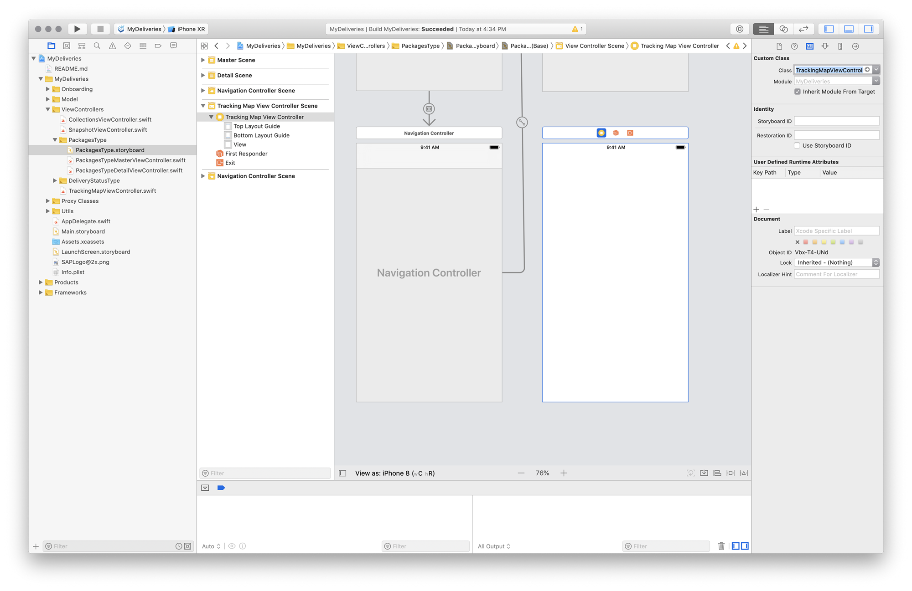

Go to the Attributes inspector and set the title to **TrackingMapViewController**.

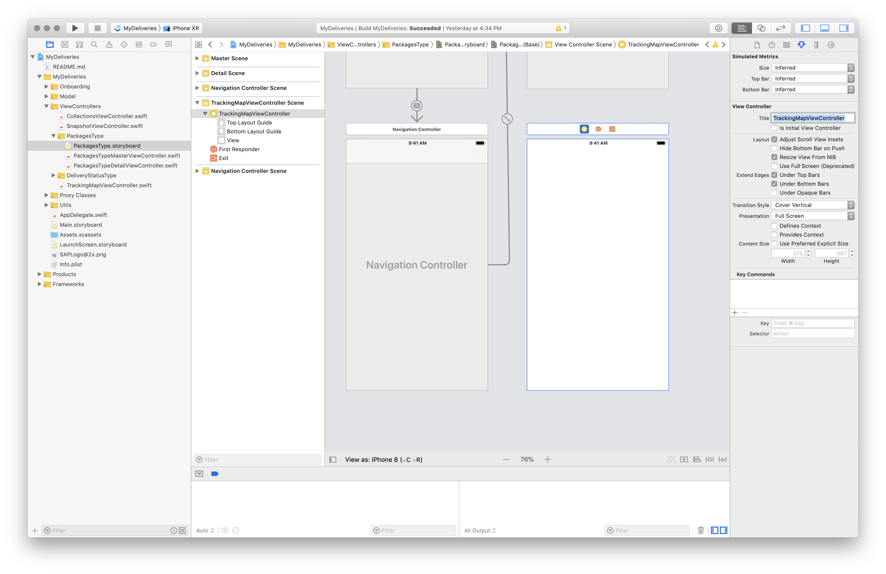

The next step is to add a segue from the **Detail Scene** to the **TrackingMapViewController Scene**.

Select the **Detail Scene** and add a new **Table View Cell** from the **Object Library** to the table view of the **Detail Scene**.

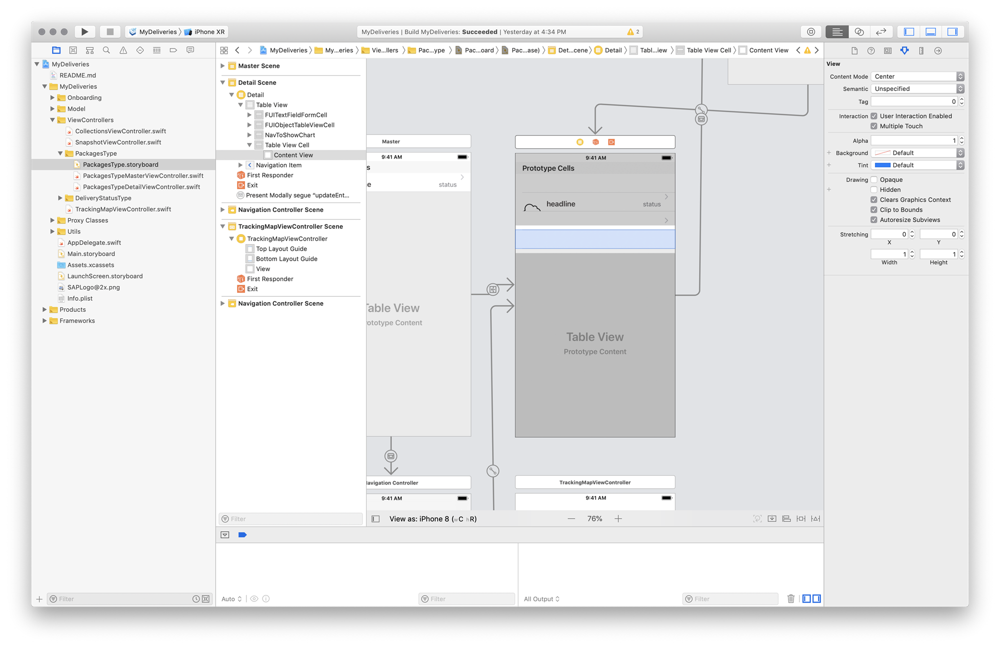

Select the **Detail Scene** and use the **Object Library** to drag a single **Table View Cell** onto the **Detail Table View**, and set the following properties in the attribute inspector:

| Field | Value |
|----|----|
| Identifier | `NavToShowTrackingMap` |
| Accessory | `Disclosure Indicator` |

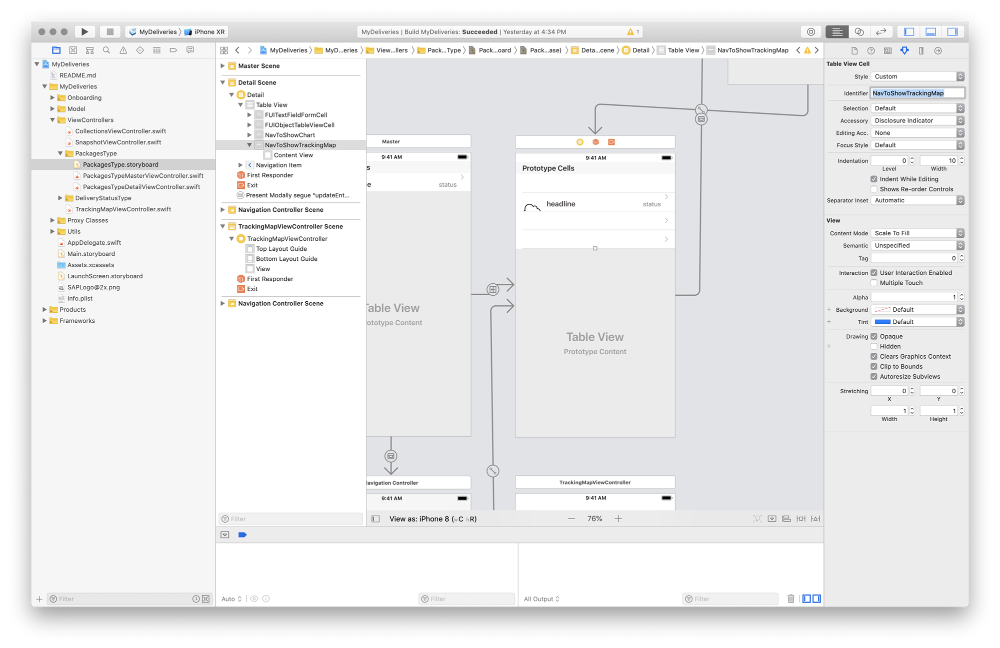

Hold down the Control key and drag from the just added **Table View Cell** to the **TrackingMapViewController Scene**, creating a connection line between them. From the **Segue** dialog, choose **Show**.

With the segue selected, go to the attributes inspector and provide the name `showTrackingMap` as its **Identifier**.

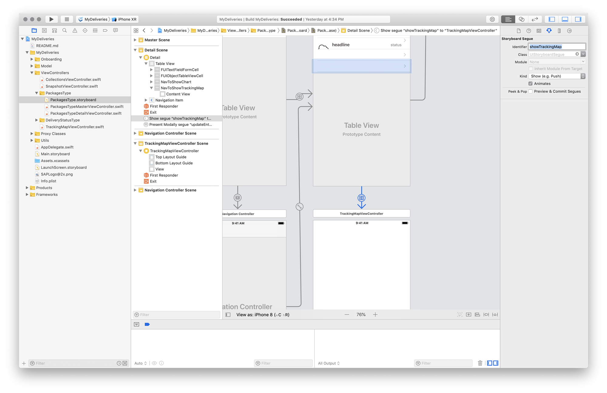

[DONE]
[ACCORDION-END]

[ACCORDION-BEGIN [Step 4: ](Implement the code for the detail table view cell)]

Next you'll add the code for displaying the table view cell that navigates to the map view. This is very similar to the code you wrote for the cell that navigates to the chart view.

Open the file `./MyDeliveries/ViewControllers/PackagesType/PackagesTypeDetailViewController.swift`.

Locate the function `tableView(_:numberOfRowsInSection:)`. Again, you can use the jump bar above the editor pane to quickly find this function.

Currently this returns **6** rows. However, since you added an extra Table View Cell to navigate to the tracking map scene, you will need to make this extra cell visible.

Set the return value to `7`:

```swift
override func tableView(_: UITableView, numberOfRowsInSection _: Int) -> Int {
    return 7
}
```
Next, locate the function `tableView(_ tableView: UITableView, cellForRowAt indexPath: IndexPath)`.

To display the added Table View Cell, add an extra `case` statement, just above the `default:` switch:

```swift
case 6:
    let mapNavigationCell = tableView.dequeueReusableCell(withIdentifier: "NavToShowTrackingMap", for: indexPath)
    mapNavigationCell.textLabel?.text = "Track Delivery"
    mapNavigationCell.textLabel?.textColor = .preferredFioriColor(forStyle: .primary1)
    return mapNavigationCell
```
[DONE]
[ACCORDION-END]

[ACCORDION-BEGIN [Step 4: ](Add the map view to the new view controller)]

Select the `PackagesType.storyboard` and add a **Map Kit View** from the **Object Library** to the **TrackingMapViewController**.

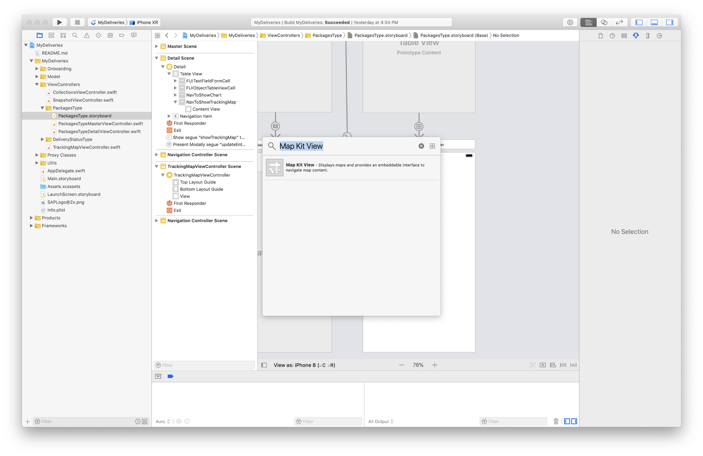

To ensure that the map view automatically sizes itself for different devices and orientations, you'll add Auto Layout **constraints** to the view.

To do this, select the map view and click on the **Add New Constraints** button in the bottom right of the storyboard editor.

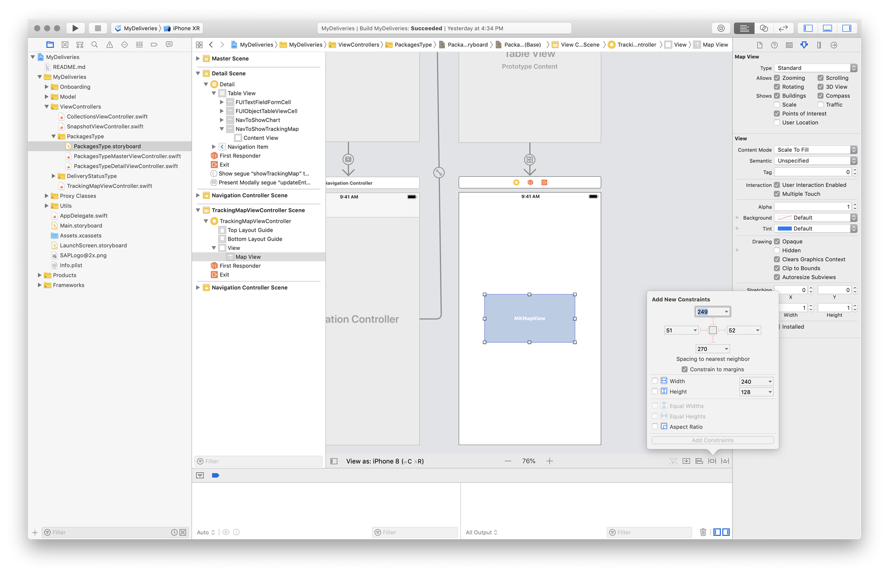

Enter **0** for each field to add 4 new constraints, and deselect **Constrain to margins** to make the MKMapView the size of the parent `UIViewController`. Then click the **Add Constraints** button.


[DONE]
[ACCORDION-END]

[ACCORDION-BEGIN [Step 5: ](Add an outlet connection for the map view)]

In order to access the map view from Swift code, an **outlet connection** needs to be added to the code that, at runtime, will refer to the map view in the storyboard.

While viewing the storyboard, click on the **Show the Assistant editor** button in the toolbar (which looks like a Venn diagram) to display the code associated with the storyboard, side-by-side.


Select the map view, hold down the Control key on the keyboard, and drag from the map view to the **TrackingMapViewController** source code, right above the `viewDidLoad()` function. Select **Outlet** from the pop-up, and set the name to `mapView`.

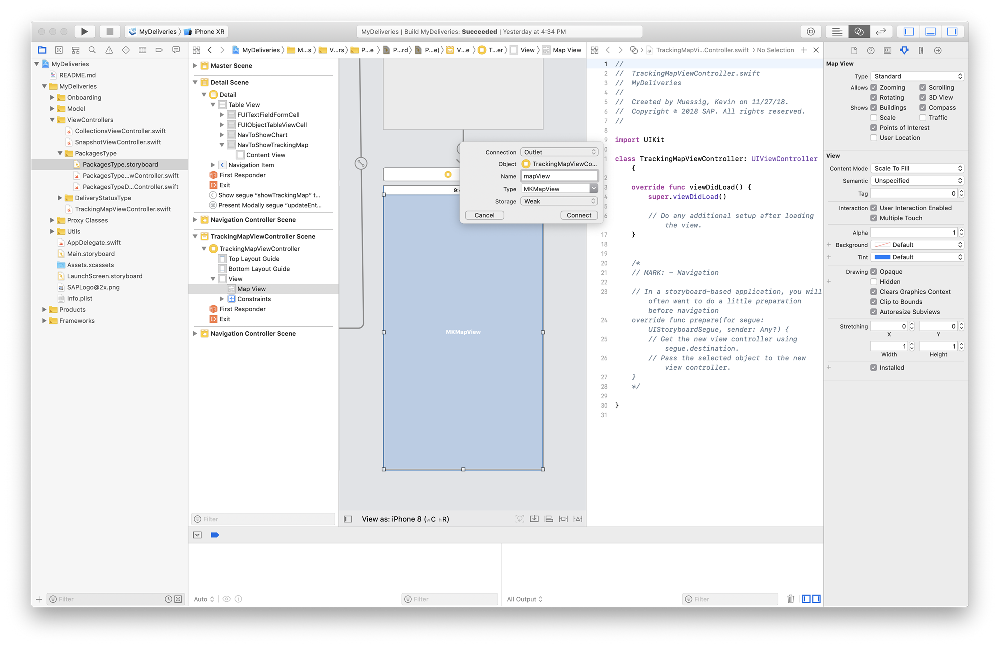

Close the assistant editor by clicking on the **Show the Standard editor** button (to the left of the Assistant editor button). Then open the `TrackingMapViewController.swift` file.

You may notice that an error is being shown for the `mapView` outlet. This is because you have to import `MapKit` in order to use the `MKMapView` class. Add the following statement right below the other imports:

```swift
import MapKit
```

If you run the app now you can navigate to your map view and back.

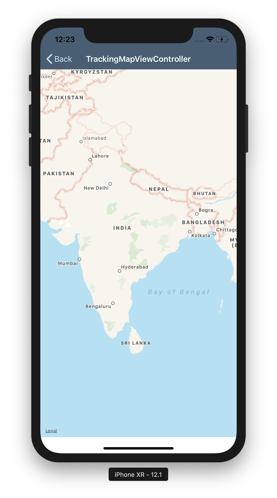

[VALIDATE_1]

[ACCORDION-END]

---
