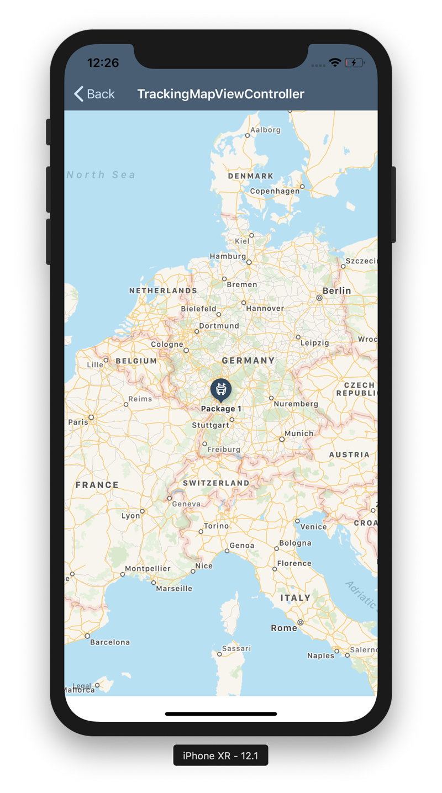
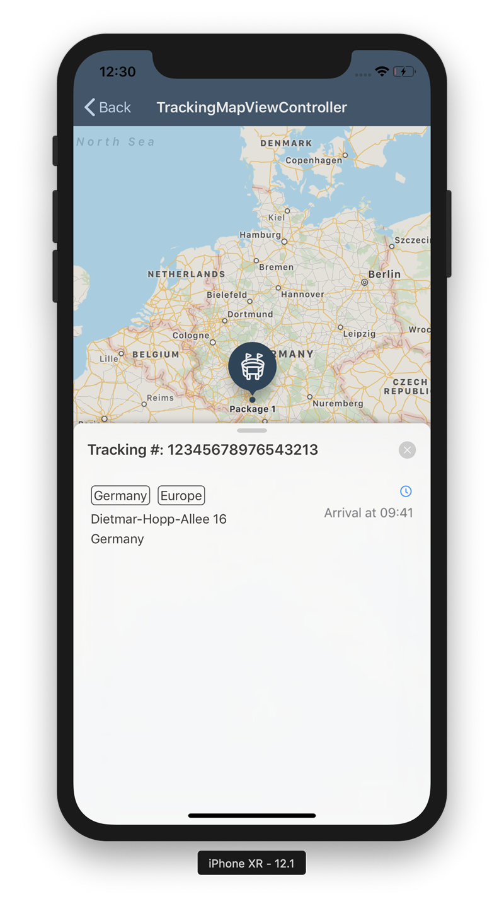

## Prerequisites  
- **Development environment:** Apple Mac running macOS High Sierra or higher with Xcode 10 or higher
- **SAP Cloud Platform SDK for iOS:** Version 3.0

## Details
### You will learn
  - How to display markers on a map
  - How to display a detail panel when a marker is selected

---

[ACCORDION-BEGIN [Step 1: ](Add a mock location to the TrackingInfoViewController)]

For this exercise, a static (mock) location will be used. As a challenge on your own, once you've got the map displaying the mock location, try implementing it with OData entities, like you did with the the timeline cell in previous tutorials.

Map coordinates on iOS are represented using `CLLocationCoordinate2D` instances. Add the following lines of code directly under the outlet at the top of the class:

```swift
let location = CLLocationCoordinate2D(latitude: 49.293843, longitude: 8.641369)
let visibleRegionMeters = 1_000_000.0
```

> **Note:** The `visibleRegionMeters` will be used later to determine how large of a region to display in the map.

[DONE]
[ACCORDION-END]

[ACCORDION-BEGIN [Step 2: ](Implement a MKPointAnnotation)]

In order to display the coordinate on a map as a marker, you will need to create an `MKPointAnnotation`.

Add the following lines under the location constant:

```swift
var annotation: MKPointAnnotation!
```

The annotation will be initialized when the view loads. Add the following lines on as the last statements in the `viewDidLoad()` function:

```swift
// Initialize the annotation with the coordinate.
annotation = MKPointAnnotation()
annotation.coordinate = location

// Set a title for the annotation.
annotation.title = "Package 1"

// Add the annotation to the map view.
mapView.addAnnotation(annotation)
```

[DONE]
[ACCORDION-END]

[ACCORDION-BEGIN [Step 3: ](Use a Fiori control for the annotation)]

To make the annotation look like it fits visually with the rest of the app, the `FUIMarkerAnnotationView` class from the `SAPFiori` framework can be used.

First import `SAPFiori`. Add the following import statement directly under the other imports:

```swift
import SAPFiori
```

Next create a private class for the marker. Add the following lines under the closing brace of the `viewDidLoad()` function:

```swift
private class FioriMarker: FUIMarkerAnnotationView {

    // Override the annotation property to customize it whenever it is set.
    override var annotation: MKAnnotation? {
        willSet {
            markerTintColor = .preferredFioriColor(forStyle: .map1)
            glyphImage = FUIIconLibrary.map.marker.venue.withRenderingMode(.alwaysTemplate)
            displayPriority = .defaultHigh
        }
    }
}
```

The map view now needs to be told to use the custom marker to display annotations. Add the following lines of code to the end of the `viewDidLoad()` function:

```swift
mapView.register(FioriMarker.self, forAnnotationViewWithReuseIdentifier: MKMapViewDefaultAnnotationViewReuseIdentifier)
```

When displaying a map, it's a good idea to set the visible region. It should be centered on the annotation, and show enough range around the annotation so that people can tell where the annotation is.

Add the following lines of code to the end of the `viewDidLoad()` function:

```swift
// Center the map.
let coordinateRegion = MKCoordinateRegion(center: location, latitudinalMeters: visibleRegionMeters, longitudinalMeters: visibleRegionMeters)
mapView.setRegion(coordinateRegion, animated: false)
```

Run the application and you should see the Fiori marker on the map view.



[DONE]
[ACCORDION-END]

[ACCORDION-BEGIN [Step 3: ](Add a FUIMapDetailPanel to show more details about the tracked package)]

When the marker is tapped, additional detail should appear about the annotation. The `FUIMapDetailPanel` class can be used to provide this.

First create a property right below the `MKPointAnnotation` property at the top of the `TrackingMapViewController`:

```swift
var detailPanel: FUIMapDetailPanel!
```

Next add the following two override functions right below the `viewDidLoad()` function.

```swift
// Ensures that the detail panel is present whenever the map view appears.
override func viewDidAppear(_ animated: Bool) {
    super.viewDidAppear(animated)
    detailPanel.presentContainer()
}

// Dismisses the detail panel whenever the map view disappears.
override func viewWillDisappear(_ animated: Bool) {
    super.viewWillDisappear(animated)
    presentedViewController?.dismiss(animated: false, completion: nil)
}
```

Next you will need a function for setting up the detail panel. Add the `setupDetailPanel()` function right below the `viewDidAppear()` function:

```swift
private func setupDetailPanel() {
    mapView.delegate = self
    detailPanel = FUIMapDetailPanel(parentViewController: self, mapView: mapView)

    // Configure the table view in the detail panel to use a custom cell type for map details.
    detailPanel.content.tableView.register(FUIMapDetailTagObjectTableViewCell.self, forCellReuseIdentifier: FUIMapDetailTagObjectTableViewCell.reuseIdentifier)

    // This view controller will supply the data for the detail panel's table view.
    detailPanel.content.tableView.dataSource = self
    detailPanel.content.tableView.delegate = self
    detailPanel.content.headlineText = "Tracking #: 12345678976543213"
}
```

At the end of the `viewDidAppear()` function, call your new setup function:

```swift
setupDetailPanel()
```

As the code above specifies, this view controller will supply the data for the detail panel's table view. To do this, you will need to implement the `UITableViewDataSource` and `UITableViewDelegate` protocols. In Swift, protocol implementations are often done as extensions.

Add the following lines of code **after the final closing brace** of the **TrackingMapViewController** class:

```swift
extension TrackingMapViewController: UITableViewDataSource {

    // The detail view will only show one row.
    func tableView(_ tableView: UITableView, numberOfRowsInSection section: Int) -> Int {
        return 1
    }

    // Returns a custom cell populated with sample data.
    func tableView(_ tableView: UITableView, cellForRowAt indexPath: IndexPath) -> UITableViewCell {
        let detailCell = tableView.dequeueReusableCell(withIdentifier: FUIMapDetailTagObjectTableViewCell.reuseIdentifier, for: indexPath) as! FUIMapDetailTagObjectTableViewCell

        detailCell.tags = ["Germany", "Europe"]
        detailCell.subheadlineText = "Dietmar-Hopp-Allee 16"
        detailCell.footnoteText = "Germany"
        detailCell.substatusText = "Arrival at 09:41"

        // Fiori includes a library of icons, such as a clock indicator.
        detailCell.statusImage = FUIIconLibrary.indicator.clock.withRenderingMode(.alwaysTemplate)

        return detailCell
    }
}

extension TrackingMapViewController: UITableViewDelegate {
    // You can add your own code here to handle detail view events.
}
```

[DONE]
[ACCORDION-END]

[ACCORDION-BEGIN [Step 4: ](Display or hide the detail panel when the annotation is tapped)]

Whenever the user taps on the annotation on the map, the detail panel should show or hide accordingly. Add the following lines of code **after the final closing brace** of the previous extensions:

```swift
extension TrackingMapViewController: MKMapViewDelegate {
    func mapView(_ mapView: MKMapView, didSelect view: MKAnnotationView) {
        detailPanel.pushChildViewController()
    }

    func mapView(_ mapView: MKMapView, didDeselect view: MKAnnotationView) {
        detailPanel.popChildViewController()
    }  
}
```

If you run the app now and tap on the annotation on your map, you should see the detail panel appear. On iPhone, you can swipe up on the panel to see more information.



[VALIDATE_1]
[ACCORDION-END]

---
