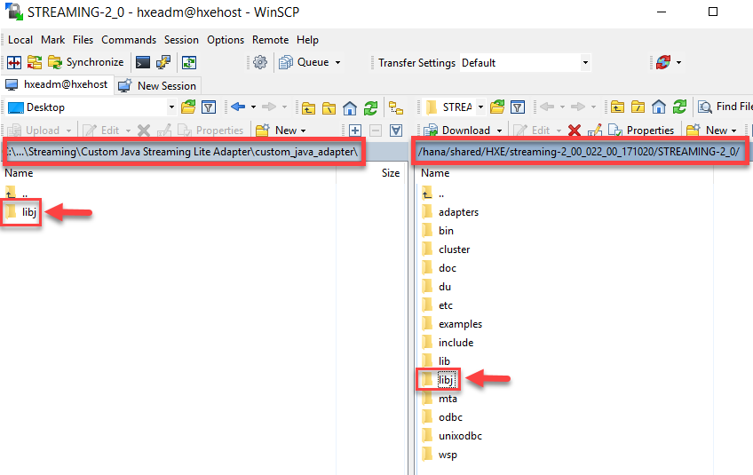
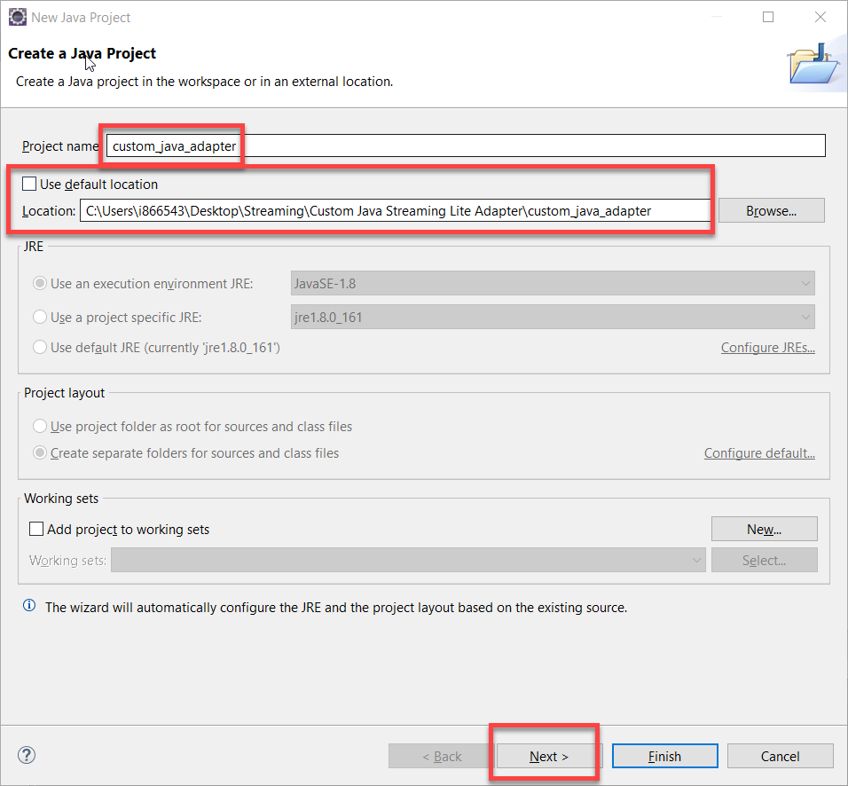
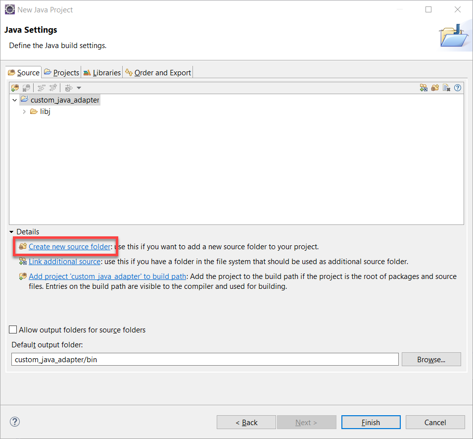
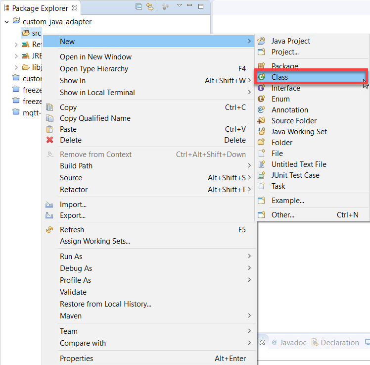
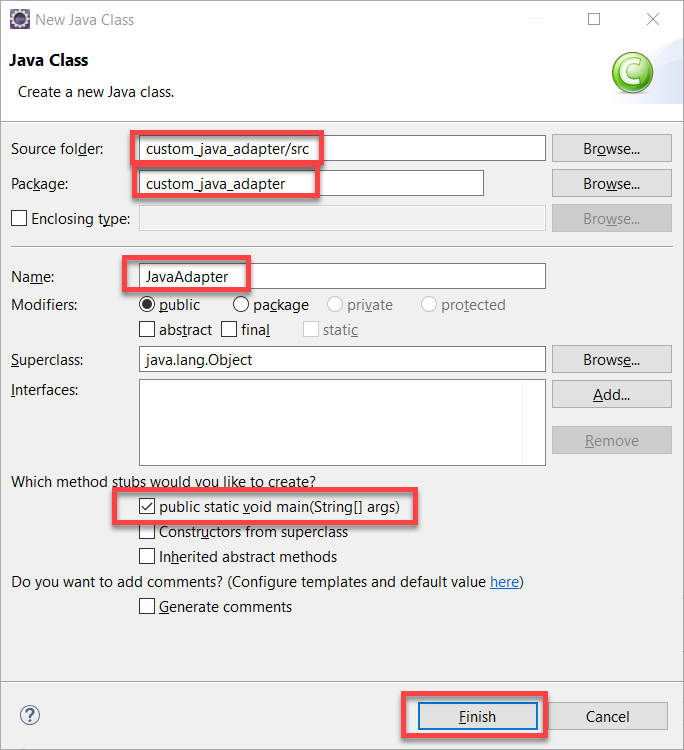
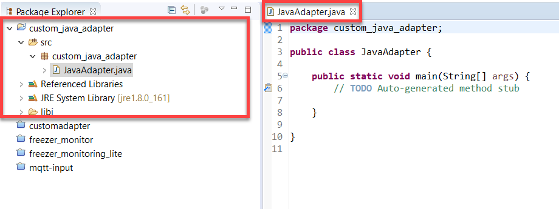

## Prerequisites  
 - **Proficiency:** Beginner
 - **Tutorial:** [Introduction to Writing a Custom Java Adapter for Freezer Monitoring Lite](https://www.sap.com/developer/tutorials/hsa-lite-custom-java-adapter-part1.html)

## Details
### You will learn  
- How to copy over the Java SDK files required from our HANA system to HANA Studio/Eclipse
- How to prepare the HANA Studio for Custom Java Adapter development

## Next Steps
- [Code the Streaming Lite Custom Java Adapter](https://www.sap.com/developer/tutorials/hsa-lite-custom-java-adapter-part3.html)

### Time to Complete
**15 Min**

---

[ACCORDION-BEGIN [Step 1: ](Copy Over Java SDK Files)]

  1. Create a folder on your computer to contain your project files. We will call our folder `"custom_java_adapter"`

  2. Connect to your SAP HANA system in `WinSCP`, and navigate to the directory `/hana/shared/<sid>/streaming-<Version>/STREAMING-2_0`. This is the Streaming Analytics installation folder, and its path is defined in `$STREAMING_HOME`

    > Don't forget to replace `<sid>` with your HANA System id and <Version> with your Streaming Analytics instance version

  3. Copy over the `"libj"` folder into your `"custom_java_adapter"` folder. These are Java SDK files required to build our custom Java Adapter.

    

For the question below, select the correct answer, and click **Validate**.

[VALIDATE_1]

[ACCORDION-END]

[ACCORDION-BEGIN [Step 2: ](Create a new Java Project)]

  1. Open Eclipse/HANA Studio

  2. Create a new Java Project

  3. Set the project location as our `"custom_java_adapter"` folder. Our project name is `custom_java_adapter`

  4. Click next

    

[DONE]

[ACCORDION-END]

[ACCORDION-BEGIN [Step 3: ](Create a new Source Folder)]

  1. Under the Source tab, click "Create new source folder"

    

  2. In the window which pops up, name the folder `"src"` and click finish, to create a folder called `"src"`. You will now see this folder displayed under our project directory in the "Source" tab.

  3. Check the box which says "Allow output folder for source folders", and click finish. You have now created a new package called `custom_java_adapter`. You can expand and view it under "Package Explorer".

    

[DONE]

[ACCORDION-END]

[ACCORDION-BEGIN [Step 4: ](Create a new Java Class)]

  1. Right click on our `"src"` folder, and select `New>Class` to create a new Java class.

    

  2. Create a new Java class in the folder `custom_java_adapter/src`. Set the package name as `custom_java_adapter`. Name the class `"JavaAdapter"`. Only select `"public static void main(String[] args)"`. Click `Finish`.

    

    We have now created a new class, and a corresponding `JavaAdapter.java` file in which we will develop our code.

    

[DONE]

[ACCORDION-END]

---

