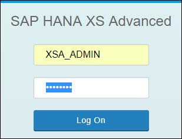
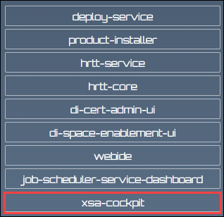
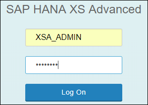
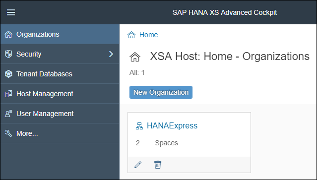
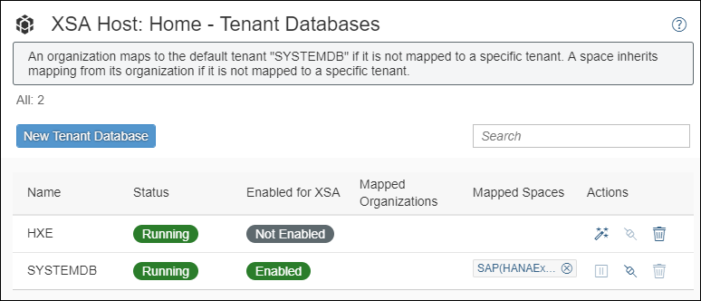
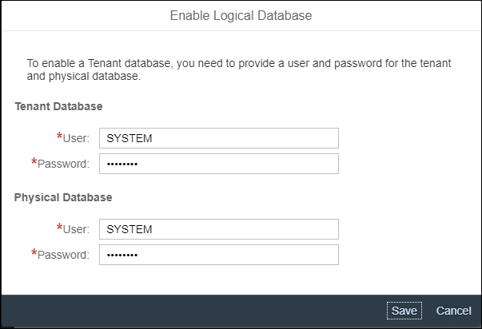
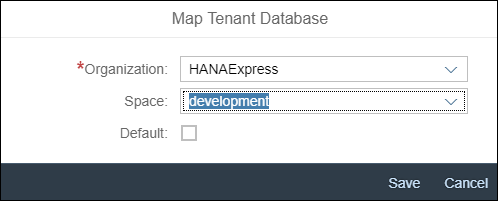
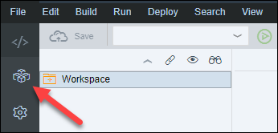
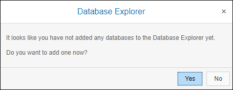
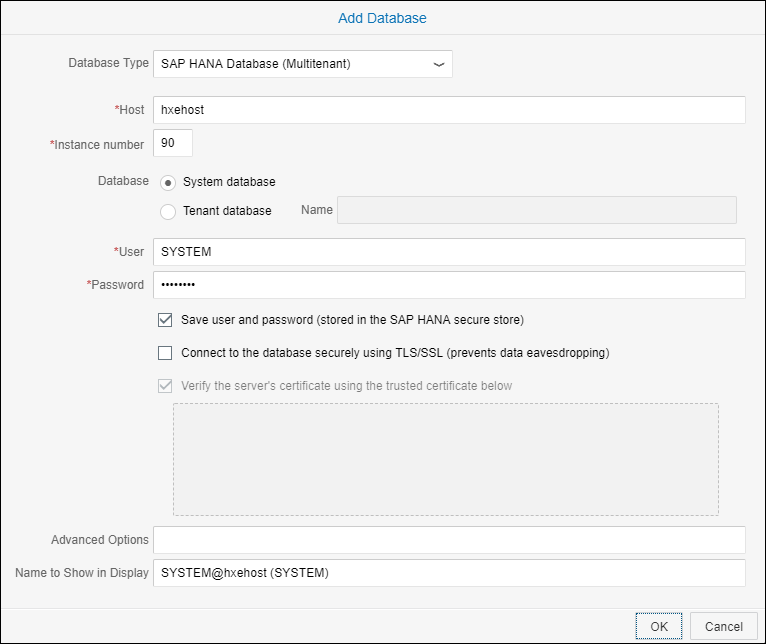

## Next Steps
 - [Use Machine Learning to Build a Forecasting application using the XS advanced development model](https://developers.sap.com/group.hxe-aa-forecast.html)

## Details
### You will learn
- Which flavor and version of SAP HANA, express edition is needed to complete this tutorial series
- Complete a series of required post-installation task
- Enable the builders for the development space
- Add a connection in the Database Explorer
- Enable the Script Server to allow the execution of `AFL`s functions

[ACCORDION-BEGIN [Step 1: ](Which SAP HANA flavor and version?)]

In order to complete this tutorial series, you need to use as a minimum version:

 - **SAP HANA, express edition 2.0 SPS03**

This version will allow you to complete all the steps described in the series. And thanks to the availability of the SAP HANA Automated Predictive Library (APL), you will be able to compare different predictive libraries.

As you may already know, SAP HANA, express edition comes in two different flavors. In this series, you will be leveraging the SAP Web IDE to complete both the execution of SQL and SAP HANA XSA development tasks. Therefore, you will need:

 - **Server + XSA Applications**

You can check the [SAP HANA, express edition installation flowchart](https://developers.sap.com/topics/sap-hana-express.html#flowchart) to find all the installation details.

If you don't have an instance up and running, be aware that you don't need to complete the installation of all optional packages (this will be described when needed).

[DONE]
[ACCORDION-END]

[ACCORDION-BEGIN [Step 1: ](Login with XS CLI)]

In order to complete the next steps, you will be using the XS CLI client which is locally installed with your SAP HANA 2.0, express edition instance.

Therefore, you can run these commands directly from the server using a SSH client like `PuTTY` for example.

First, make sure to switch to the `hxeadm` user:

```shell
sudo su - hxeadm
```

> ### **Note:** You may prefer to run XS CLI commands from your local desktop for example. To do so, you can complete the [XS CLI Client installation](https://developers.sap.com/tutorials/hxe-ua-install-xs-xli-client.html)

Execute the following XS CLI command.

#### Set the API endpoint:

```shell
xs login -a https://hxehost:39030 -o HANAExpress -s SAP -u XSA_ADMIN --cacert /hana/shared/HXE/xs/controller_data/controller/ssl-pub/router/default.root.crt.pem
```

You will be prompted for the ***`XSA_ADMIN`*** password (which is initially set to the master password during the first boot initialization).

> ### **Note:** if you receive the following error when executing the previous command:
>&nbsp;
```
FAILED: SSL connection error (supposedly untrusted connection, check the certificates)
```
>This probably mean that your `default.root.crt.pem` is not located in:
>
 - `/hana/shared/HXE/xs/controller_data/controller/ssl-pub/router/default.root.crt.pem`
>
>Locate the file and use the relevant path.

[DONE]
[ACCORDION-END]

[ACCORDION-BEGIN [Step 1: ](Verify the builders deployment)]

With some installations, the builders are not deployed in the ***development*** space which will prevent you from successfully building and running your projects in the SAP Web IDE.

Before deploying the builder, you will need to start the `di-space-enablement-ui` application which might be stopped be default.

#### Get the current status:

```shell
xs app di-space-enablement-ui
```

The output should look like this:

```
Showing status and information about "di-space-enablement-ui"
  name:             di-space-enablement-ui
  requested state:  STOPPED
  instances:        1
  memory:           16.0 MB
  disk:             <unlimited>
  buildpack:        ***************
  urls:             https://hxehost:510XX
```

#### Start the app:

Run the following command if the ***requested state*** is ***STOPPED***.

```shell
xs start di-space-enablement-ui
```

The output should look like this:

```
Starting app "di-space-enablement-ui"...
 Starting instances with the default OS user
 1 of 1 instances running

Showing status and information about "di-space-enablement-ui"
  name:             di-space-enablement-ui
  requested state:  STARTED
  instances:        1
  memory:           16.0 MB
  disk:             <unlimited>
  buildpack:        ***************
  urls:             https://hxehost:510XX

Instances of droplet 1 created at Apr 4, 2018 5:36:52 PM
index  created                 state    os user
----------------------------------------------------
0      Jun 4, 2018 1:35:36 PM  RUNNING  <not set>
```

#### Check the builder status:

You can now access the application ***`urls`*** displayed in the previous command output.

From the previous output, the URL is: `https://hxehost:510XX` (make sure to adjust the URL based on your current output).

Login using the **`XSA_ADMIN`** credentials.



Verify that the status for the ***development*** space is **Enabled**.

If not click, on **Enable**.


#### Stop the app:

In order to release the resources used by the `di-space-enablement-ui` application, you should stop if this one was stopped initially.

```shell
xs stop di-space-enablement-ui
```

Based on the outputs returned previously, provide an answer to the question below then click on **Validate**.

[VALIDATE_1]
[ACCORDION-END]

[ACCORDION-BEGIN [Step 4: ](Access the SAP HANA XS Advanced Cockpit)]

From the XSA Controller page, access the **SAP HANA XS Advanced Cockpit**.

As a reminder the default URL for the SAP HANA XS Advanced Cockpit is:

 - `https://hxehost:39030`



Login using the **`XSA_ADMIN`** credentials.



Once logged in, you will get access to the SAP HANA XS Advanced Cockpit:


[DONE]
[ACCORDION-END]

[ACCORDION-BEGIN [Step 1: ](Update the XSA tenant configuration)]

By default, the ***SYSTEMDB*** will be used when deploying or running your XSA application using HDI containers.

However, in order to leverage the SAP HANA AFL libraries, you will need to enable the *Script Server*, which is not possible on the ***SYSTEMDB***.

Therefore, you will need to map the HXE tenant to your development space.

On the left side bar, click on **Tenant Databases**.



As you can notice, by default, the HXE tenant is not enabled for XSA and is not mapped for the development space.



Click on the **Enable** icon  for the **HXE** tenant.

Provide the ***SYSTEM*** user credentials for the HXE tenant (in the ***Tenant Database*** section) and the SYSTEMDB (in the ***Physical Database*** section).



Wait for the activation process to complete.

Click on the **Map** icon  for the **HXE** tenant.

Set the following details:

Property     | Value
-------------|---------------
Organization | `HANAExpress`
Space        | `development`



Click on **Save**.

Once completed, the configuration should look like this:


[DONE]
[ACCORDION-END]

[ACCORDION-BEGIN [Step 1: ](Access the Web IDE)]

From the XSA Controller page, access the ***Web IDE***.


Login using the **`XSA_DEV`** credentials.


Once logged in, you will get access to the Web IDE:


As a reminder the default URL for the Web IDE is:

 - `https://hxehost:53075`

[DONE]
[ACCORDION-END]

[ACCORDION-BEGIN [Step 1: ](Add the database connection)]

On the left side bar, click on the Database Explorer icon  icon.



#### Add the SYSTEMDB connection

If you don't have any database listed you will receive the following popup message:



Click on **Yes**.

If not, then use the ***Add a database to the Database Explorer*** icon .

Select **SAP HANA Database (Multitenant)** as ***Database Type***.

Enter the HXE host name and instance number (default value is 90).

Select **System Database**.

Enter the **SYSTEM** user name and password (which is initially set to the master password during the first boot initialization).

You can also check the ***Save user and password*** to avoid entering credentials in the future.



Click on **OK**.


#### Add the HXE tenant connection

Use the ***Add a database to the Database Explorer*** icon .

Select **SAP HANA Database (Multitenant)** as ***Database Type***.

Enter the HXE host name and instance number (default value is 90).

Select **Tenant Database** and enter **HXE** as name.

Enter the **SYSTEM** user name and password (which is initially set to the master password during the first boot initialization).

You can also check the ***Save user and password*** to avoid entering credentials in the future.

Click on **OK**.


[DONE]
[ACCORDION-END]

[ACCORDION-BEGIN [Step 1: ](Check the Script Server)]

The **Script Server** is an auxiliary service that is required to execute **Application Function Libraries** ( **AFL** ).

For example, this applies to the SAP HANA AFL component like the ***SAP HANA Predictive Analysis Library*** (PAL) and other similar libraries.

By default, the Script Server is not activated on the **HXE** tenant.

Select the **HXE** tenant connection in the ***Database Explorer*** panel, then click on the **Open SQL Console** icon  (or press ***CTRL+ALT+C***).

Paste the following SQL statement in the console and click on the ***Run*** icon  icon:

```sql
SELECT SERVICE_NAME, PORT, ACTIVE_STATUS FROM SYS.M_SERVICES ORDER BY 1;
```

If no rows is returned for the `scriptserver`, then it means that the **Script Server** is not enabled on the **HXE** tenant.

To enable it, you will have to run the following SQL statement on the **SYSTEMDB**.

Select the **SYSTEMDB** connection in the ***Database Explorer*** panel, then click on the **Open SQL Console** icon  (or press ***CTRL+ALT+C***).

Paste the following SQL statement in the console and click on the ***Run*** icon  icon:

```sql
ALTER DATABASE HXE ADD 'scriptserver';
```

Select the **HXE** tenant connection in the ***Database Explorer*** panel, then click on the **Open SQL Console** icon  (or press ***CTRL+ALT+C***).

Now, you can now verify that the service is started using the following SQL statement:

```sql
SELECT SERVICE_NAME, PORT, ACTIVE_STATUS FROM SYS.M_SERVICES ORDER BY 1;
```

The result should return a list of service names, their associated port numbers and their statuses including an entry for the `scriptserver`.

Provide an answer to the question below then click on **Validate**.

[VALIDATE_2]
[ACCORDION-END]


[ACCORDION-BEGIN [Step 3: ](Run the memory collector script)]

If your environment is limited in term of memory resources and in order to ensure a smooth experience, you can execute the following commands at any time to collect back unused process memory.

```shell
/usr/sap/HXE/home/bin/hxe_gc.sh
```

[DONE]
[ACCORDION-END]
