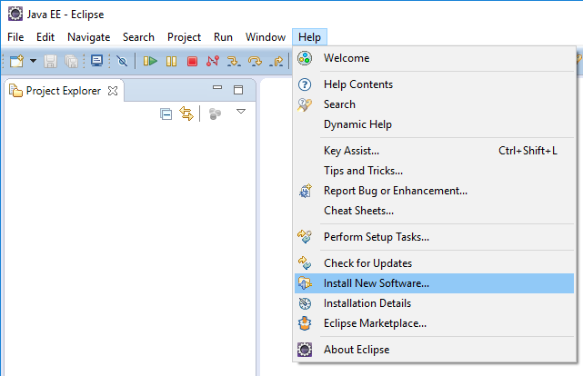
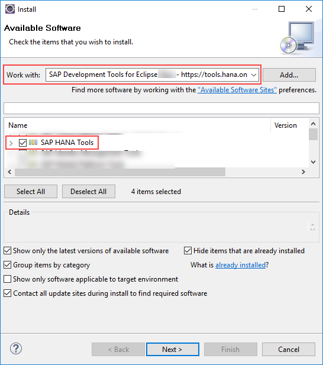
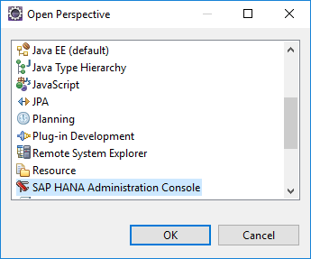
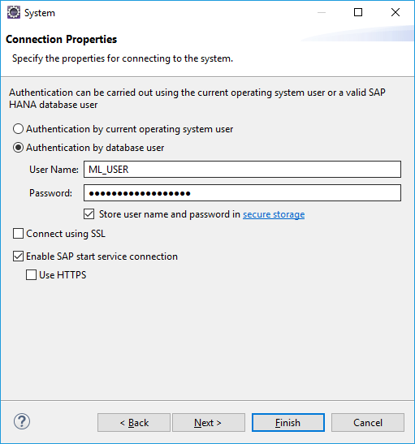

## Next Steps
 - [Use Machine Learning to Build a Movie Recommendation model using SQL](https://developers.sap.com/group.hxe-aa-movielens-sql.html)

## Details
### You will learn
- Which flavor and version of SAP HANA, express edition is needed to complete this tutorial series
- Complete a series of required post-installation task
- Enable the Script Server to allow the execution of `AFL`s functions

[ACCORDION-BEGIN [Info: ](Which SAP HANA flavor and version?)]

In order to complete this tutorial series, you need to use as a minimum version:

 - **SAP HANA, express edition 2.0 SPS03**

This version will allow you to complete all the steps described in the series. And thanks to the availability of the SAP HANA Automated Predictive Library (APL), you will be able to use and compare different predictive libraries.

As you may already know, SAP HANA, express edition comes in two different flavors. In this series, you will be running series of SQL statements.

Therefore, the **Server only** is the minimum required.

However, if you have a **Server + Apps** instance, you can use it too.

You can check the [SAP HANA, express edition installation flowchart](https://developers.sap.com/topics/sap-hana-express.html#flowchart) to find all the installation details.

If you don't have an instance up and running, be aware that you don't need to complete the installation of all the optional packages (this will be described when needed in the series).

[DONE]
[ACCORDION-END]

[ACCORDION-BEGIN [Prerequisite: ](Install the SAP HANA tools for Eclipse)]

In order to proceed with the next steps, you must have the latest [Eclipse IDE for Java Developers](https://www.eclipse.org/downloads/packages/release/oxygen/eclipse-ide-java-developers) installed (preferably the Eclipse Oxygen version), running and properly connected to the internet.

After starting the Eclipse IDE, choose in the menu bar **Help > Install New Software...**



In the **Work with** field, input the following ***Software Repository*** :

```url
https://tools.hana.ondemand.com/oxygen/
```

The ***Software Repository*** must match your current version of the Eclipse IDE (refer to the previous *Info: SAP HANA Tools for the Eclipse IDE* section).

Select the **SAP HANA Tools** from the list, then click on **Next**.



Click on **Next** again, then accept the licenses terms after reading them, then click on **Finish**

You may receive a security warning while the installation is in progress regarding unsigned content. Click on **OK**.


After the software update is completed, you will be prompted to restart Eclipse.

Click on **Yes**.


Change your current perspective using the  **Window > Perspective > Other** menu.


Select to **SAP HANA Administrative Console** and click **OK**.



[DONE]
[ACCORDION-END]

[ACCORDION-BEGIN [Step 1: ](Add a connection to the System Database)]

Click on the **Add System...**  icon.


Set your hostname ( ***`hxehost`***), the instance number ( ***90***).

Select **Multiple containers**, then select **System database**.


Click on **Next**.

Select **Authentication by database user**.

Enter your database credentials for the **SYSTEM** database user credentials.


Select if you want to **Store user name and password in a secure storage**.

Click on **Finish**


> ### **Note**:
>
> You may be asked to change the user password if this is the first login attempt.

[DONE]
[ACCORDION-END]

[ACCORDION-BEGIN [Step 4: ](Add a connection to the HXE tenant)]

Click on the **Add System...**  icon.


Set your hostname ( ***`hxehost`***), the instance number ( ***90***).

Select **Multiple containers**, then select **Tenant database**, and enter **HXE** in the name field.


Click on **Next**.

Select **Authentication by database user**.

Enter your database credentials for the **SYSTEM** database user credentials.


Select if you want to **Store user name and password in a secure storage**.

Click on **Finish**

[DONE]
[ACCORDION-END]

[ACCORDION-BEGIN [Step 1: ](Enable the Script Server)]

The **Script Server** is an auxiliary service that is required to execute **Application Function Libraries** (**AFL**).

For example, this applies to the SAP HANA AFL component like the ***SAP HANA Predictive Analysis Library*** (PAL) and other similar libraries.

By default, the Script Server is not activated on the **HXE** tenant.

Connect to the **SYSTEMDB** using the **SYSTEM** user credentials and execute the following SQL statement:

```sql
ALTER DATABASE HXE ADD 'scriptserver';
```

Now, you can now verify that the service is started;

Connect to the **HXE** tenant using the **SYSTEM** user credentials and execute the following SQL statement:

```sql
SELECT SERVICE_NAME, PORT, ACTIVE_STATUS FROM SYS.M_SERVICES ORDER BY 1;
```

The result should return a list of service names, their associated port numbers and their statuses including an entry for the `scriptserver`.

Provide an answer to the question below then click on **Validate**.

[VALIDATE_1]
[ACCORDION-END]

[ACCORDION-BEGIN [Step 4: ](Create a dedicated user)]

In order to perform your Machine Learning activities, it is recommended to create a dedicated user account on your SAP HANA, express edition instance.

Connect to the **HXE** tenant using the **SYSTEM** user credentials and execute the following SQL statement:

```sql
-- Uncomment this if you want to start from scratch
-- DROP USER ML_USER CASCADE;

CREATE USER ML_USER PASSWORD Welcome18Welcome18;

-- Use this if you don't want to be forced to update your password on the first connection.
-- CREATE USER ML_USER PASSWORD Welcome18Welcome18 NO FORCE_FIRST_PASSWORD_CHANGE;
-- or
-- ALTER USER ML_USER DISABLE PASSWORD LIFETIME;

GRANT AFLPM_CREATOR_ERASER_EXECUTE TO ML_USER;
GRANT AFL__SYS_AFL_AFLPAL_EXECUTE TO ML_USER;
GRANT DATA ADMIN TO ML_USER;
GRANT IMPORT TO ML_USER;

GRANT EXECUTE on _SYS_REPO.GRANT_ACTIVATED_ROLE TO ML_USER;
```

Connect to the **HXE** tenant using the **`ML_USER`** user credentials (default password is ***`Welcome18Welcome18`*** )

> You should be prompted to update you password on the first connection.
&nbsp;


```sql
SELECT * FROM SYS.PROCEDURES WHERE SCHEMA_NAME = '_SYS_AFL';
```

[DONE]
[ACCORDION-END]

[ACCORDION-BEGIN [Step 1: ](Add a connection to the HXE tenant for ML_USER)]

Click on the **Add System...**  icon.


Set your hostname ( ***`hxehost`***), the instance number ( ***90***).

Select **Multiple containers**, then select **Tenant database**, and enter **HXE** in the name field.


Click on **Next**.

Select **Authentication by database user**.

Enter your database credentials for the **`ML_USER`** user (the password was initially set to ***`Welcome18Welcome18`***).

Select if you want to **Store user name and password in a secure storage**.



Click on **Finish**

[DONE]
[ACCORDION-END]
