## Details
### You will learn  
  - Create a User in IAM
  - Create and configure a S3 bucket
  - Launch your SAP HANA, express edition instance on AWS

[ACCORDION-BEGIN [Step 1: ](Sign in or Create an Account on AWS)]

Sign in or create an account on <a href="https://aws.amazon.com" target="&#95;blank">Amazon Web Services</a>.

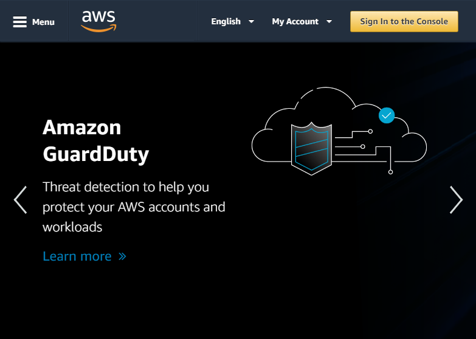

[DONE]
[ACCORDION-END]

[ACCORDION-BEGIN [Step 1: ](Access the AWS Management Console)]

Access the <a href="https://console.aws.amazon.com/console" target="&#95;blank">Amazon Web Services Management Console</a>.

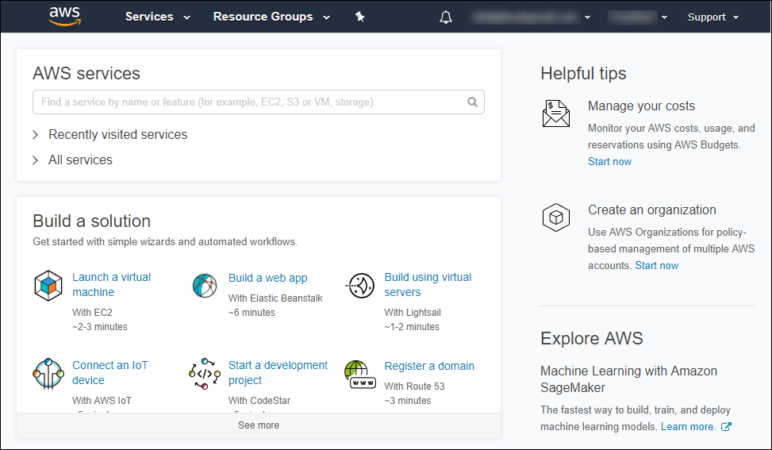

[DONE]
[ACCORDION-END]

[ACCORDION-BEGIN [Step 1: ](Create a User in AWS)]

In order to later configure the ODBC connection from SAP HANA, express edition to Amazon Athena, you will need to provide your credentials using the Access & Security Key.

Access the <a href="https://console.aws.amazon.com/iam" target="&#95;blank">IAM Management Console</a> (you also use the search for **IAM** in the Amazon Web Services Management Console).

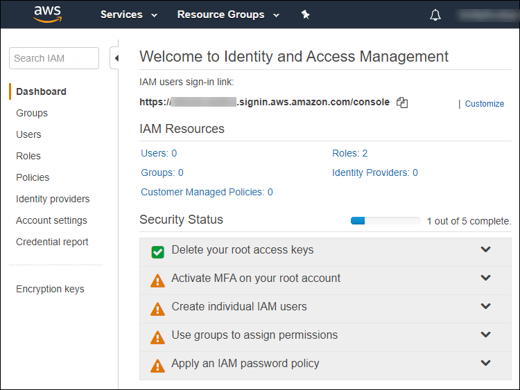

On the left side, click on **Users**, then click on **Add User**.

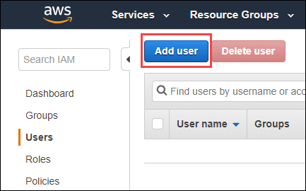

Enter a **User Name** like ***`athena`***.

Set the **Access type** to **Programmatic access**.

Click on **Next: Permissions**.

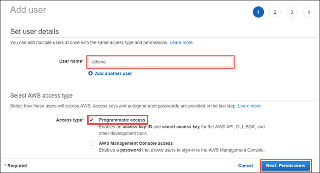

Select **Attach existing policies directly**.

Search and select the following policies:

 - **`AWSQuicksightAthenaAccess`**
 - **`AmazonAthenaFullAccess`**
 - **`AmazonS3FullAccess`**

Click on **Next: Review**.

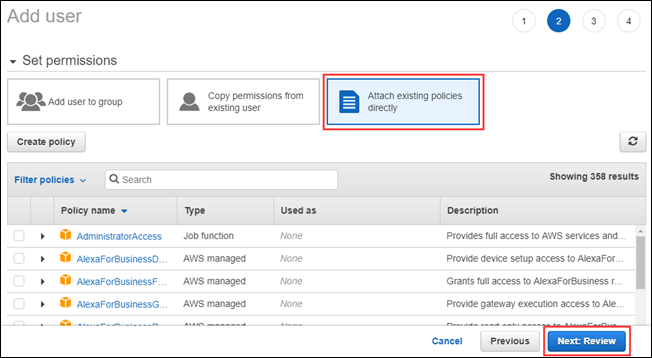

Review the user creation details then click on **Create User**.

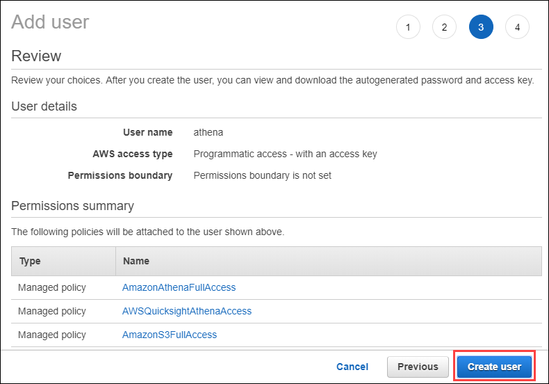

Click on **Download .`csv`** to download the **Access key ID** and **Secret access key**.

> ### **Note:** the **Access key ID** and **Secret access key** will be used as credentials to authenticate to Amazon Athena.

Click on **Close**.

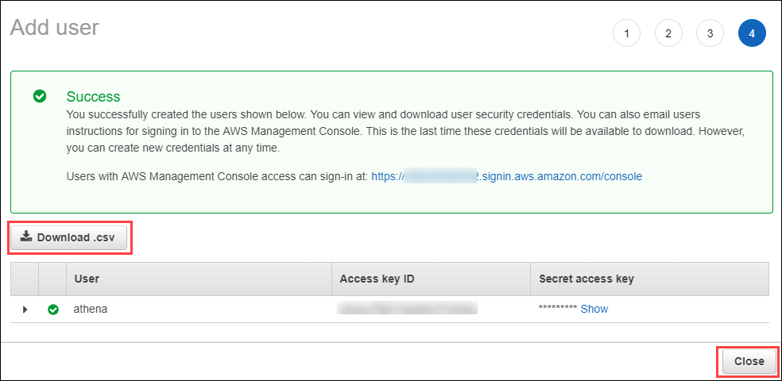

Click on the newly created user.

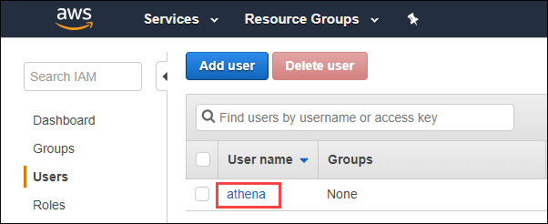

Click on the copy icon to copy the **User ARN**.

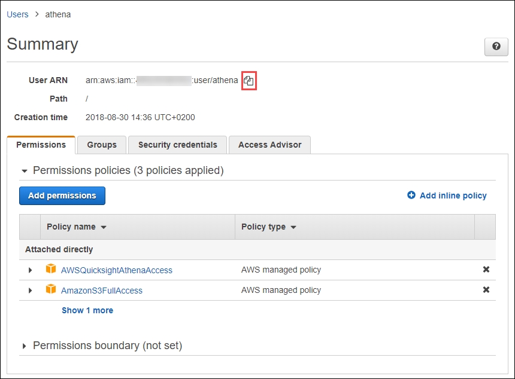

Save locally in a text editor the **User ARN**.

Provide an answer to the question below then click on **Validate**.

[VALIDATE_1]
[ACCORDION-END]

[ACCORDION-BEGIN [Step 1: ](Create a S3 bucket)]

If you have followed the ***<a href="https://docs.aws.amazon.com/athena/latest/ug/getting-started.html" target="&#95;blank">Getting Started</a>*** guide for Amazon Athena, a S3 bucket will be created automagically.

But for the purpose of this tutorial series, you will create a dedicated bucket.

Access the **<a href="https://s3.console.aws.amazon.com/s3/home" target="&#95;blank">S3 Management Console</a>**.

Click on **Create bucket**.

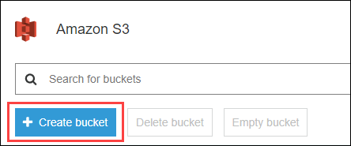

Enter a **Bucket name** like ***`sap-hana-athena`*** (this identifier must be unique).

Click on **Create**.

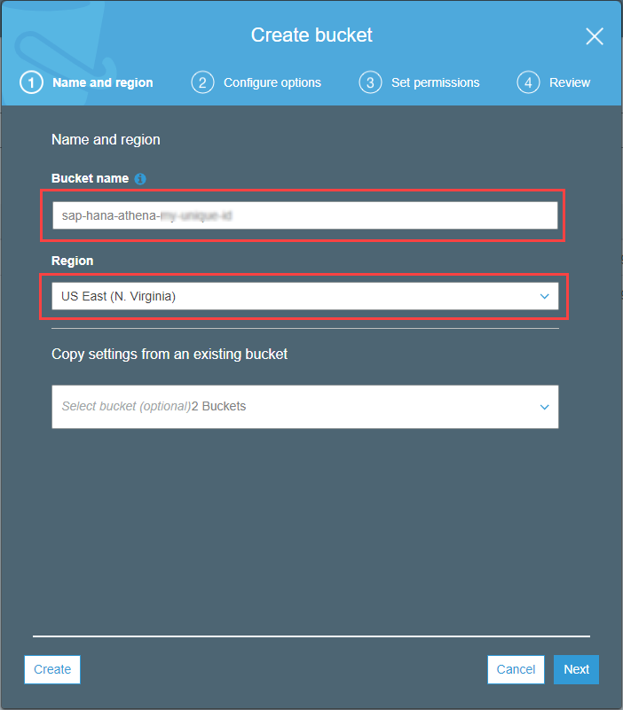

Click on the newly created bucket.

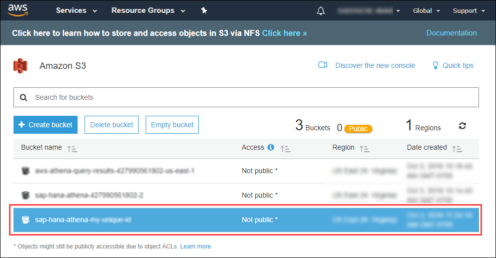

Select **Permissions**, then **Bucket policy**.

Paste the following code in the **Bucket Policy editor** after adjusting the **AWS Principal** using the User ARN saved previously:

```json
{
    "Id": "sap-hana-athena",
    "Version": "2012-10-17",
    "Statement": [
        {
            "Sid": "sap-hana-athena",
            "Action": [
                "s3:GetBucketLocation",
                "s3:GetObject",
                "s3:ListBucket",
                "s3:ListBucketMultipartUploads",
                "s3:ListMultipartUploadParts",
                "s3:AbortMultipartUpload",
                "s3:PutObject"
            ],
            "Effect": "Allow",
            "Resource": [
                "arn:aws:s3:::sap-hana-athena",
                "arn:aws:s3:::sap-hana-athena/*"
            ],
            "Principal": {
                "AWS": "arn:aws:iam::XXXXXXXXXXXXX:user/athena"
            }
        }
    ]
}
```

Click on **Save**.

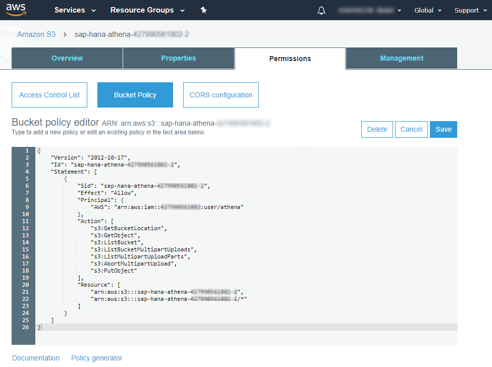

Provide an answer to the question below then click on **Validate**.

[VALIDATE_2]
[ACCORDION-END]

[ACCORDION-BEGIN [Step 1: ](Launch a SAP HANA, express edition instance)]

In order to complete this tutorial series, you need to use as a minimum version:

 - **SAP HANA, express edition 2.0 SPS03**

SAP HANA, express edition which is available on the <a href="https://aws.amazon.com/marketplace" target="&#95;blank">AWS Marketplace</a> comes in two different flavors, a **database core server** and a **server + applications** flavor.

During this series, you will mostly be running series of SQL statements.

So technically, you can use the **SAP HANA, express edition**. but you will need to install a SQL Query tool on top.

Therefore, in order to benefit from the SAP Web IDE, you could use the **SAP HANA, express edition (server + applications)**.

Before starting to follow the <a href="https://www.sap.com/developer/tutorials/hxe-xsa-aws-setup.html" target="&#95;blank">Set up SAP HANA, express edition, on Amazon Web Services</a> tutorial, make sure that:

 - you use the **SAP HANA, express edition (server + applications)** AMI
 - you say *no* when prompted about waiting for XSA configuration completion

Once completed, you should have access to your instance using:

  - a SSH client like ***`PuTTY`***
  - the SAP Web IDE from the following URL `https://hxehost:53075`

Provide an answer to the question below then click on **Validate**.

[VALIDATE_3]
[ACCORDION-END]
