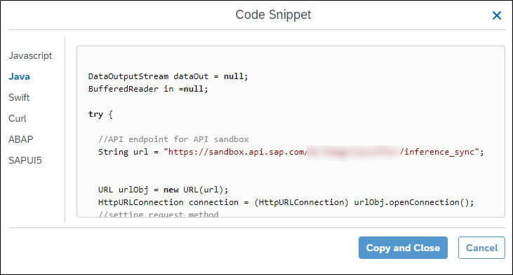
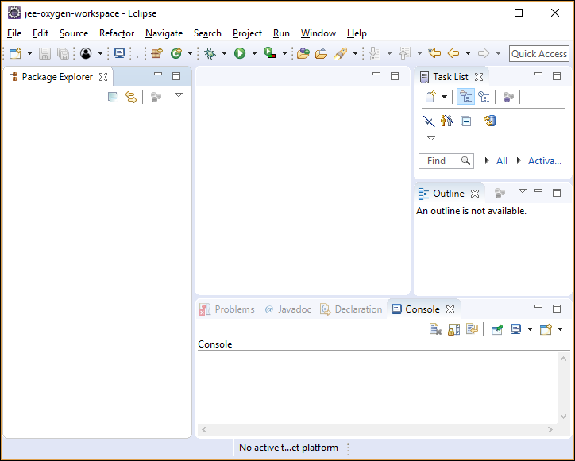
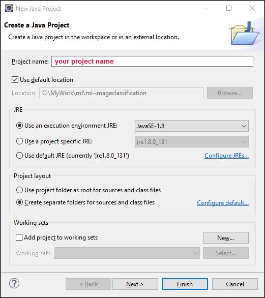
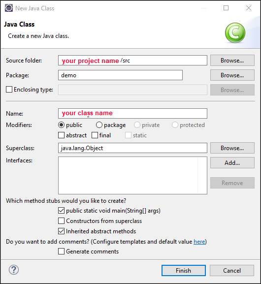

## Prerequisites  
 - [Sign up for an free trial account on the SAP Cloud Platform](https://www.sap.com/developer/tutorials/hcp-create-trial-account.html)

## Next Steps
 - Select your next tutorial from these SAP Leonardo Machine Learning groups: [SAP API Business Hub](https://www.sap.com/developer/groups/ml-fs-api-hub.html), [Java](https://www.sap.com/developer/groups/ml-fs-java.html) or [SAPUI5](https://www.sap.com/developer/groups/ml-fs-sapui5.html)

## Details
### You will learn  
In this tutorial, you will learn how to quickly integrate the **Topic Detection** SAP Leonardo Machine Learning Functional Services published from the SAP API Business Hub sandbox in a Java program.

The **Topic Detection** service allows you to extracts topics from documents and scores them according to the most relevant topics.

You will then be able to substitute the **Topic Detection** services with any other SAP Leonardo Machine Learning Functional Services that consumes images content.

For each API exposed in the SAP API Business Hub, you will be able to generate a code snippet which we will use in this tutorial.

This code snippet will be imported in a Java project built with the Eclipse IDE &trade;.

You can of course substitute the Eclipse IDE &trade; with alternate tools and adapt the current tutorial steps.

In this tutorial, you will learn the basics of making API calls against the Machine Learning Functional Services published in SAP API Business Hub.


---

[ACCORDION-BEGIN [Step 1: ](Get The Code Snippet And the API key)]

In order to consume the **Topic Detection API** SAP Leonardo Machine Learning Foundation service, you will first need to get the service URI, request and response parameters.

Go to [https://api.sap.com/](https://api.sap.com).


Then you will be able to search for the **SAP Leonardo Machine Learning - Functional Services**, then click on the package found.


Select **Inference Service for Topic Detection**.


You can also access the page directly from the following address:

 - <https://api.sap.com/api/topic_detection_api/resource>

As you can notice the API has only one resource (or service): `/topic-detection`.


> **Note**: the term *inference* refers to the application phase (scoring) an existing model (as opposed to the training or inception phase) and *sync* for synchronous.

Now, click on the **Code Snippet**, then, select **Java**.



As you will notice, the generated code is missing the Java import statements along with the `API_KEY`, the request expected form data for the file content.

Click on the **Copy and Close**, then, save the code snippet in your favorite text editor.

When using any of the APIs outside of the SAP API Business Hub, an application key is needed in every request header of your calls.

To get to your API key, click on the **Show API Key** button.


You will be prompted to login if you are not yet.

Then, the following pop-up should appear. Click on the **Copy Key and Close** button and save it in a text editor.


[DONE]
[ACCORDION-END]

[ACCORDION-BEGIN [Step 2: ](Analyze the service)]

As you can notice the API has only one resource (or service): `/topic-detection`.

Now click on the `/topic-detection` link to expand the section.

> **Note**: the term *inference* refers to the application phase (scoring) an existing model (as opposed to the training or inception phase) and *sync* for synchronous.

As stated in the description, the service accepts either:

 - an archive file with a zip/tar extensions containing multiple text files
 - a single text file
 - a list of text files as input

The service returns a list of detected topic with the associated keywords and scores (confidence).

The supported text file formats is plain text only.

The input file, files or archive file will be sent as a `FormData` query parameter in the service request.

A series of options are also required for the following parameters:

  - `numTopics`: Total number of topics to be detected
  - `numTopicsPerDoc`: Number of most relevant topics to be listed per document
  - `numKeywordsPerTopic`: Number of keywords to be listed per topic
  - `numFeatures`: Maximum number of keywords to be extracted from documents in total

[DONE]
[ACCORDION-END]

[ACCORDION-BEGIN [Step 3: ](Start the Eclipse IDE)]

Now, you can start the Eclipse IDE and select your workspace (either the default, a new or an existing one).

If you don't have the Eclipse IDE installed, you can download the latest version from the following link: [Eclipse Downloads](https://www.eclipse.org/downloads/eclipse-packages/)

You can pick either the **Eclipse IDE for Java EE Developers** or the **Eclipse IDE for Java Developers**.

By default the Java perspective should be Launched.

If not, use the menu bar and select **Window** > **Perspective** > **Open Perspective** > **Java**.

If the Java perspective is not listed, then use the **Other...** to open it.

You can also close the **Welcome Page**.



[DONE]
[ACCORDION-END]

[ACCORDION-BEGIN [Step 4: ](Create a New Project in the Eclipse IDE)]

Using the menu bar, go to **File** > **New** > **Java Project**.

You can name your project the way you want, here we will call it **`ml-topicdetection`**.

Click on **Finish**.

> **Note**: make sure you pick `JavaSE-1.8` as your project **Execution Runtime JRE**. This should help avoid coding compliance and runtime issues with the provided code.



[DONE]
[ACCORDION-END]

[ACCORDION-BEGIN [Step 5: ](Create a New Java Class)]

Using the menu bar, go to **File** > **New** > **Class**.

Make sure that your source folder is `ml-imageclassification/src`.

You can name your Java class the way you want, here we will call it **`DemoTopicDetection`** and put it in a **demo** package.

Check the **`public static void main(String[] arg)`** box in order to get the main function created.

Click on **Finish**.



The default code in your newly created class should be something this:

```Java
package demo;
public class DemoTopicDetection {
  public static void main(String[] args) {
    // TODO Auto-generated method stub
  }
}
```

You can now paste the generated code snippet that was collected during step 1 and copy it in the body of the main function.

Make sure you replace the **`<API_KEY>`** token in the code by your API key (collected during step 2).

You can now **Organize imports** by using either the **CTRL+SHIFT+O** keyboard shortcut, the **Source** > **Organize imports** from the menu bar or by using a right-click in your code.

The following import will be added to your class:

```Java
import java.io.BufferedReader;
import java.io.DataOutputStream;
import java.io.IOException;
import java.io.InputStreamReader;
import java.net.HttpURLConnection;
import java.net.URL;
```

Save your code.

[DONE]
[ACCORDION-END]

[ACCORDION-BEGIN [Step 6: ](Process the input parameters as Form Data)]

Now can add the following code snippet to process the input parameters and send it as form data.

Replace the code below in the main function:

```Java
  //sending POST request
  connection.setDoOutput(true);
  dataOut = new DataOutputStream(connection.getOutputStream());
  dataOut.writeBytes("-----011000010111000001101001\r\nContent-Disposition: form-data; name=\"options\"\r\n\r\nstring\r\n-----011000010111000001101001--");
  dataOut.flush();

  int responseCode = connection.getResponseCode();
  in = new BufferedReader(new InputStreamReader(connection.getInputStream()));
  String inputLine;
  StringBuffer response = new StringBuffer();
  while ((inputLine = in.readLine()) != null) {
    response.append(inputLine);
  }
  //printing response
  System.out.println(response.toString());
```

by

```Java
  // sending POST request
  connection.setDoOutput(true);

  // read the input file name from user input
  Scanner scanner = new Scanner(System.in);

  // Reading from System.in
  String filePath = "";
  File file = null;
  boolean formatOk = false;
  do {
    System.out.println("Enter the text archive full path: (only zip or tar format are supported)");
    filePath = scanner.nextLine().replaceAll("\\/", "/");
    file = new File(filePath);
    String format = Files.probeContentType(file.toPath());
    if (format != null && //
        (format.startsWith("application/x-zip") //
            || format.startsWith("application/x-tar") //
        )) {
      formatOk = true;
    } else {
      System.out.println("format " + format);
    }
  } while (!file.exists() || file.isDirectory() || !formatOk);

  String line = "";
  int numTopicsDefault = 2;
  int numTopics = numTopicsDefault;
  System.out.println(
      "Enter the total number of topic to be detected (default: \"" + numTopicsDefault + "\") : ");
  line = scanner.nextLine();
  while (!!line.matches("\\d+") && line.length() > 0)
    line = scanner.nextLine();
  if (line.length() > 0)
    numTopics = Integer.valueOf(line);

  int numTopicsPerDocDefault = 2;
  int numTopicsPerDoc = numTopicsPerDocDefault;
  System.out.println("Enter the number of most relevant topics to be listed per document (default: \"" + numTopicsPerDocDefault + "\") : ");
  line = scanner.nextLine();
  while (!!line.matches("\\d+") && line.length() > 0)
    line = scanner.nextLine();
  if (line.length() > 0)
    numTopicsPerDoc = Integer.valueOf(line);

  int numKeywordsPerTopicDefault = 10;
  int numKeywordsPerTopic = numKeywordsPerTopicDefault;
  System.out.println("What is the number of keywords to be listed per topic (default: \"" + numKeywordsPerTopicDefault + "\") : ");
  line = scanner.nextLine();
  while (!!line.matches("\\d+") && line.length() > 0)
    line = scanner.nextLine();
  if (line.length() > 0)
    numKeywordsPerTopic = Integer.valueOf(line);

  int numFeaturesDefault = 10;
  int numFeatures = numFeaturesDefault;
  System.out.println("Enter is the maximum number of keywords to be extracted per documents (default: \"" + numFeaturesDefault + "\") : ");
  line = scanner.nextLine();
  while (!!line.matches("\\d+") && line.length() > 0)
    line = scanner.nextLine();
  if (line.length() > 0)
    numFeatures = Integer.valueOf(line);

  scanner.close();

  // prepare the constant for the form data
  String LINE_FEED = "\r\n";
  String SEPARATOR = "--";
  String BOUNDARY = "------Boundary" + new BigInteger(128, new SecureRandom()).toString(32);

  // set the form content as multipart
  connection.setRequestProperty("Content-Type", "multipart/form-data; boundary=" + BOUNDARY);

  // open the input file
  FileInputStream fileInputStream = new FileInputStream(file);

  // write the form data content
  dataOut = new DataOutputStream(connection.getOutputStream());
  dataOut.writeBytes(SEPARATOR + BOUNDARY + LINE_FEED);
  dataOut.writeBytes("Content-Disposition: form-data; name=\"options\"" + LINE_FEED);
  dataOut.writeBytes(LINE_FEED);
  dataOut.writeBytes("{ " + //
      " \"numTopics\"           : \"" + numTopics + "\"" + //
      ",\"numTopicsPerDoc\"     : \"" + numTopicsPerDoc + "\"" + //
      ",\"numKeywordsPerTopic\" : \"" + numKeywordsPerTopic + "\"" + //
      ",\"numFeatures\"         : \"" + numFeatures + "\"" + //
      "}");
  dataOut.writeBytes(LINE_FEED);

  dataOut.writeBytes(SEPARATOR + BOUNDARY + LINE_FEED);
  dataOut.writeBytes("Content-Disposition: form-data; name=\"files\"; filename=\"" + filePath + "\"" + LINE_FEED);
  dataOut.writeBytes(LINE_FEED);

  // read the file as byte array
  int maxBufferSize = 1 * 1024 * 1024;
  int bytesAvailable = fileInputStream.available();
  int bufferSize = Math.min(bytesAvailable, maxBufferSize);
  byte[] buffer = new byte[bufferSize];
  int bytesRead = fileInputStream.read(buffer, 0, bufferSize);
  while (bytesRead > 0) {
    dataOut.write(buffer, 0, bufferSize);
    bytesAvailable = fileInputStream.available();
    bufferSize = Math.min(bytesAvailable, maxBufferSize);
    bytesRead = fileInputStream.read(buffer, 0, bufferSize);
  }

  // finish the form content
  dataOut.writeBytes(LINE_FEED);
  dataOut.writeBytes(SEPARATOR + BOUNDARY + SEPARATOR + LINE_FEED);
  dataOut.flush();
  fileInputStream.close();

  int responseCode = connection.getResponseCode();
  if (responseCode != 200) {
    in = new BufferedReader(new InputStreamReader(connection.getErrorStream()));
  } else {
    in = new BufferedReader(new InputStreamReader(connection.getInputStream()));
  }
  String inputLine;
  StringBuffer response = new StringBuffer();
  while ((inputLine = in.readLine()) != null) {
    response.append(inputLine);
  }
  // printing response
  System.out.println(response.toString());
```

You can now **Organize imports** by using either the **CTRL+SHIFT+O** keyboard shortcut, the **Source** > **Organize imports** from the menu bar or by using a right-click in your code.

The following import will be added to your class:

```Java
import java.math.BigInteger;
import java.security.SecureRandom;
import java.util.Scanner;
```

Save your code.

You can now run the code by either pressing **ALT** + **SHIFT** + **X** , **J** or by clicking on the **Run**  button.

Enter the relevant parameters as detailed in the console.

If you are missing some inspiration for the input text, use the following articles content to create your text files:

  - [Wikipedia article on Machine Learning](https://en.wikipedia.org/wiki/Machine_learning)
  - [Wikipedia article on Deep Learning](https://en.wikipedia.org/wiki/Deep_learning)
  - [Wikipedia article on Cheesecake](https://en.wikipedia.org/wiki/Cheesecake)

Create a zip out of these text files.

[DONE]
[ACCORDION-END]

[ACCORDION-BEGIN [Step 7: ](Solution)]

In case you had some issues in the previous steps, here is the full class code with a better displayed response.

Just remember to replace the **`<API_KEY>`** token in the code by your API key (collected during step 2).

```Java
package demo;

import java.io.BufferedReader;
import java.io.DataOutputStream;
import java.io.File;
import java.io.FileInputStream;
import java.io.IOException;
import java.io.InputStreamReader;
import java.math.BigInteger;
import java.net.HttpURLConnection;
import java.net.URL;
import java.nio.file.Files;
import java.security.SecureRandom;
import java.util.Scanner;

public class DemoTopicDetection {

  public static void main(String[] args) {
    DataOutputStream dataOut = null;
    BufferedReader in = null;
    FileInputStream fileInputStream = null;

    try {

      String url = "https://sandbox.api.sap.com/ml/topicdetection/topic-detection";

      URL urlObj = new URL(url);
      HttpURLConnection connection = (HttpURLConnection) urlObj.openConnection();
      // setting request method
      connection.setRequestMethod("POST");

      // adding headers
      connection.setRequestProperty("content-type", "multipart/form-data; boundary=---011000010111000001101001");
      connection.setRequestProperty("Accept", "application/json");
      connection.setRequestProperty("APIKey", "<API_KEY>");

      connection.setDoInput(true);

      // sending POST request
      connection.setDoOutput(true);

      // read the input file name from user input
      Scanner scanner = new Scanner(System.in);

      // Reading from System.in
      String filePath = "";
      File file = null;
      boolean formatOk = false;
      do {
        System.out.println("Enter the text archive full path: (only zip or tar format are supported)");
        filePath = scanner.nextLine().replaceAll("\\/", "/");
        file = new File(filePath);
        String format = Files.probeContentType(file.toPath());
        if (format != null && //
            (format.startsWith("application/x-zip") //
                || format.startsWith("application/x-tar") //
            )) {
          formatOk = true;
        } else {
          System.out.println("format " + format);
        }
      } while (!file.exists() || file.isDirectory() || !formatOk);

      String line = "";
      int numTopicsDefault = 2;
      int numTopics = numTopicsDefault;
      System.out.println(
          "Enter the total number of topic to be detected (default: \"" + numTopicsDefault + "\") : ");
      line = scanner.nextLine();
      while (!!line.matches("\\d+") && line.length() > 0)
        line = scanner.nextLine();
      if (line.length() > 0)
        numTopics = Integer.valueOf(line);

      int numTopicsPerDocDefault = 2;
      int numTopicsPerDoc = numTopicsPerDocDefault;
      System.out.println("Enter the number of most relevant topics to be listed per document (default: \"" + numTopicsPerDocDefault + "\") : ");
      line = scanner.nextLine();
      while (!!line.matches("\\d+") && line.length() > 0)
        line = scanner.nextLine();
      if (line.length() > 0)
        numTopicsPerDoc = Integer.valueOf(line);

      int numKeywordsPerTopicDefault = 10;
      int numKeywordsPerTopic = numKeywordsPerTopicDefault;
      System.out.println("What is the number of keywords to be listed per topic (default: \"" + numKeywordsPerTopicDefault + "\") : ");
      line = scanner.nextLine();
      while (!!line.matches("\\d+") && line.length() > 0)
        line = scanner.nextLine();
      if (line.length() > 0)
        numKeywordsPerTopic = Integer.valueOf(line);

      int numFeaturesDefault = 10;
      int numFeatures = numFeaturesDefault;
      System.out.println("Enter is the maximum number of keywords to be extracted per documents (default: \"" + numFeaturesDefault + "\") : ");
      line = scanner.nextLine();
      while (!!line.matches("\\d+") && line.length() > 0)
        line = scanner.nextLine();
      if (line.length() > 0)
        numFeatures = Integer.valueOf(line);

      scanner.close();

      // prepare the constant for the form data
      String LINE_FEED = "\r\n";
      String SEPARATOR = "--";
      String BOUNDARY = "------Boundary" + new BigInteger(128, new SecureRandom()).toString(32);

      // set the form content as multipart
      connection.setRequestProperty("Content-Type", "multipart/form-data; boundary=" + BOUNDARY);

      // open the input file
      fileInputStream = new FileInputStream(file);

      // write the form data content
      dataOut = new DataOutputStream(connection.getOutputStream());
      dataOut.writeBytes(SEPARATOR + BOUNDARY + LINE_FEED);
      dataOut.writeBytes("Content-Disposition: form-data; name=\"options\"" + LINE_FEED);
      dataOut.writeBytes(LINE_FEED);
      dataOut.writeBytes("{ " + //
          " \"numTopics\"           : \"" + numTopics + "\"" + //
          ",\"numTopicsPerDoc\"     : \"" + numTopicsPerDoc + "\"" + //
          ",\"numKeywordsPerTopic\" : \"" + numKeywordsPerTopic + "\"" + //
          ",\"numFeatures\"         : \"" + numFeatures + "\"" + //
          "}");
      dataOut.writeBytes(LINE_FEED);

      dataOut.writeBytes(SEPARATOR + BOUNDARY + LINE_FEED);
      dataOut.writeBytes("Content-Disposition: form-data; name=\"files\"; filename=\"" + filePath + "\"" + LINE_FEED);
      dataOut.writeBytes(LINE_FEED);

      // read the file as byte array
      int maxBufferSize = 1 * 1024 * 1024;
      int bytesAvailable = fileInputStream.available();
      int bufferSize = Math.min(bytesAvailable, maxBufferSize);
      byte[] buffer = new byte[bufferSize];
      int bytesRead = fileInputStream.read(buffer, 0, bufferSize);
      while (bytesRead > 0) {
        dataOut.write(buffer, 0, bufferSize);
        bytesAvailable = fileInputStream.available();
        bufferSize = Math.min(bytesAvailable, maxBufferSize);
        bytesRead = fileInputStream.read(buffer, 0, bufferSize);
      }

      // finish the form content
      dataOut.writeBytes(LINE_FEED);
      dataOut.writeBytes(SEPARATOR + BOUNDARY + SEPARATOR + LINE_FEED);
      dataOut.flush();
      fileInputStream.close();

      int responseCode = connection.getResponseCode();
      if (responseCode != 200) {
        in = new BufferedReader(new InputStreamReader(connection.getErrorStream()));
      } else {
        in = new BufferedReader(new InputStreamReader(connection.getInputStream()));
      }
      String inputLine;
      StringBuffer response = new StringBuffer();
      while ((inputLine = in.readLine()) != null) {
        response.append(inputLine);
      }
      // printing response
      String TAB = "\t";
      String QUOTE = "\"";
      String CR = "\r\n";
      System.out.println(response.toString()//
          .replace("  " + QUOTE + "", "" + TAB + "" + QUOTE + "")//
          .replace("  ", "" + TAB + "")//
          .replace("" + TAB + " ", "" + TAB + "")//
          .replace(", ", ",")//
          .replace(": {", ":{" + CR + "")//
          .replace(": [", ":[" + CR + "")//
          .replace(":" + CR + "" + TAB + "{", ": {")//
          .replace(":" + CR + "" + TAB + "[", ": [")///
          .replace("{" + TAB + "", "{" + CR + "" + TAB + "")//
          .replace("[" + TAB + "", "[" + CR + "" + TAB + "")//
          .replace("" + QUOTE + ",", "" + QUOTE + "," + CR + "")//
          .replace("," + TAB + "", "," + CR + "" + TAB + "")//
          .replace("" + QUOTE + "" + TAB + "", "" + QUOTE + "" + CR + "" + TAB + "")//
          .replace("" + TAB + " " + TAB + "", "" + TAB + "" + TAB + "")//
          .replace("" + TAB + " {", "" + TAB + "{")//
          .replace("" + TAB + " [", "" + TAB + "[")//
          .replace("]", "]" + CR + "")//
          .replace("}", "}" + CR + "")//
          .replace("]" + CR + "," + CR + "", "]," + CR + "")//
          .replace("}" + CR + "," + CR + "", "}," + CR + "")//
          .replace("[" + CR + "]", "[]")//
          .replace("{" + CR + "}", "{}")//
          .replaceAll("([0-9])(\t)", "$1" + CR + "$2"));
    } catch (Exception e) {
      // do something with exception
      e.printStackTrace();
    } finally {
      try {
        if (dataOut != null) {
          dataOut.close();
        }
        if (in != null) {
          in.close();
        }
        if (fileInputStream != null) {
          fileInputStream.close();
        }
      } catch (IOException e) {
        // do something with exception
        e.printStackTrace();
      }
    }
  }
}
```

[DONE]
[ACCORDION-END]

[ACCORDION-BEGIN [Step 8: ](Validation)]

Provide an answer to the question below then click on **Validate**.

[VALIDATE_1]
[ACCORDION-END]

## Next Steps
 - Select your next tutorial from these SAP Leonardo Machine Learning groups: [SAP API Business Hub](https://www.sap.com/developer/groups/ml-fs-api-hub.html), [Java](https://www.sap.com/developer/groups/ml-fs-java.html) or [SAPUI5](https://www.sap.com/developer/groups/ml-fs-sapui5.html)
