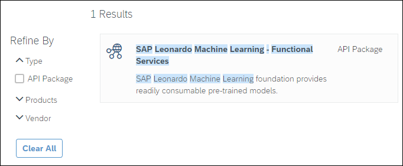
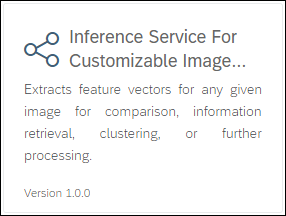
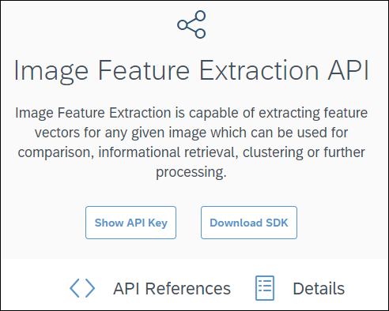
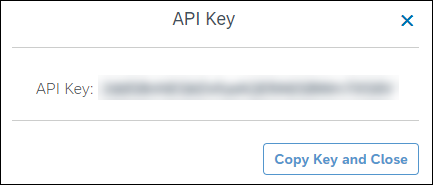
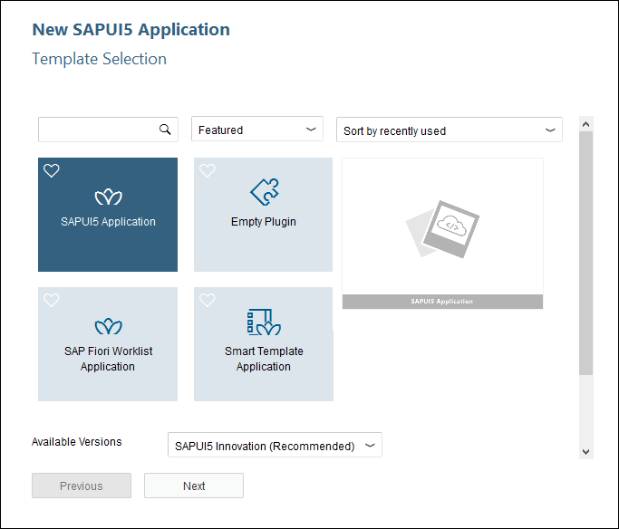
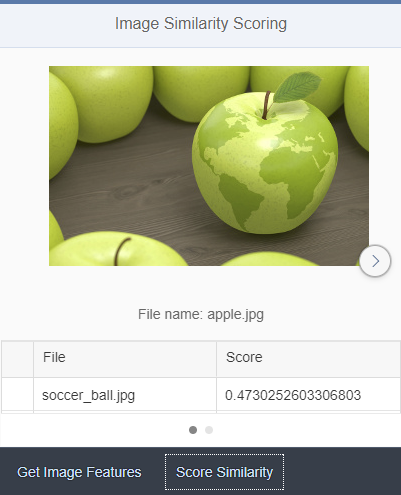

## Prerequisites  
 - **Proficiency:** Intermediate
 - [Sign up for an free trial account on the SAP Cloud Platform](https://www.sap.com/developer/tutorials/hcp-create-trial-account.html)

## Next Steps
 - Select your next tutorial from these SAP Leonardo Machine Learning groups: [SAP API Business Hub](https://www.sap.com/developer/groups/ml-fs-api-hub.html), [Java](https://www.sap.com/developer/groups/ml-fs-java.html) or [SAPUI5](https://www.sap.com/developer/groups/ml-fs-sapui5.html)
 - Select a tutorial group from the [Tutorial Navigator](https://www.sap.com/developer/tutorial-navigator.html) or the [Tutorial Catalog](https://www.sap.com/developer/tutorial-navigator.tutorials.html)

## Details
### You will learn  
In this tutorial, you will learn how to leverage the **Image Feature Extraction** & **Similarity Scoring** SAP Leonardo Machine Learning Functional Services published from the SAP API Business Hub sandbox in a SAPUI5 application.

The **Image Feature Extraction** service allows you to extract a vector of features for any given image which can be used with **Similarity Scoring** service to compare vectors of features and compute a similarity score (cosine distance) ranging from -1 to 1.

### Time to Complete
**40 Min**

[ACCORDION-BEGIN [Step 1: ](Get The API Sandbox URL And API Key)]

In order to consume the **Image Feature Extraction** & **Similarity Scoring** SAP Leonardo Machine Learning Foundation service, you will first need to get the service URI and your API key, request and response parameters.

Go to [https://api.sap.com/](https://api.sap.com).


Then you will be able to search for the **SAP Leonardo Machine Learning - Functional Services**, then click on the package found.



Select **Image Feature Extraction API**.



You can also access the page directly from the following address:

 - <https://api.sap.com/api/img_feature_extraction_api/resource>



To get to your API Sandbox URL, click on the **Details** tab.

The **Image Feature Extraction API** Sandbox URL should be:

```JSON
https://sandbox.api.sap.com/ml/featureextraction
```

Do the same for the **Similarity Scoring API**.

You can also access the page directly from the following address:

 - <https://api.sap.com/api/similarity_scoring_api/resource>

The **Similarity Scoring API** Sandbox URL should be:

```JSON
https://sandbox.api.sap.com/ml/similarityscoring
```

To get to your API key, click on the **Show API Key** button.

You will be prompted to login if you are not yet.

Then, the following pop-up should appear. Click on the **Copy Key and Close** button and save it in a text editor.



[DONE]
[ACCORDION-END]

[ACCORDION-BEGIN [Step 2: ](Analyze the services)]

As you will notice both API have only one resource (or service): `/inference_sync`.

You can click on `/inference_sync` to expand the section.

> **Note**: the term *inference* refers to the application phase (scoring) an existing model (as opposed to the training or inception phase) and *sync* for synchronous.

As stated in the description, the **Image Feature Extraction API** service accepts either:

 - an archive file with a zip/tar extensions containing multiple image files
 - a single image
 - a list of image as input

The service returns a feature vector extracted from the image.

The supported image formats are ***JPEG***, ***PNG***, ***TIF*** or ***BMP*** (the actual content format is validated, so renaming files may simply not work).

As stated in the description, the **Similarity Scoring API** service accepts either:

 - an archive file which should consist of files, each of them containing a feature vector.

A series of options are also required for the following parameters:

 - `numSimilarVectors`: Number of most similar vectors to return in response
 - `algorithm`: The algorithm to use for calculation, one of `naive`, `matrix_mult`, `clustering` (optional)

The service returns the associated similarity scores.

The input file, files or archive file will be sent as a `FormData` query parameter in the service request.

[DONE]
[ACCORDION-END]

[ACCORDION-BEGIN [Step 3: ](Access the SAP Cloud Platform Cockpit)]

Log into the <a href="https://account.hanatrial.ondemand.com/cockpit#/region/neo-eu1-trial/overview" target="new"><b>SAP Cloud Platform Cockpit Neo Trial</b></a> with your free trial account on **Europe (Rot) - Trial** and access ***Your Personal Developer Account***.

Click on your ***SAP Cloud Platform Account*** identifier (which ends with *trial* by default) as highlighted on the below screenshot.


You are now in your ***SAP Cloud Platform developer*** account!


> If you are unclear with what is your SAP Cloud Platform account name, you can refer to the following blog entry: [SAP Cloud Platform login, user name, account id, name or display name: you are lost? Not anymore!](https://blogs.sap.com/2017/01/31/sap-hana-cloud-platform-trial-login-name-user-name-account-name-account-identifier-you-are-lost-not-anymore/)

[DONE]
[ACCORDION-END]

[ACCORDION-BEGIN [Step 4: ](Configure your destination)]

You will need to create a destination in your SAP Cloud Platform account that allow will your applications to connect to external APIs such as the SAP API Business Hub.

On the left side bar, you can navigate in **Connectivity** > **Destinations**.

On the ***Destinations*** overview page, click on **New Destination**


Enter the following information:

Field Name           | Value
-------------------- | --------------
Name                 | `sapui5ml-api`
Type                 | `HTTP`
Description          | `SAP Leonardo Machine Learning APIs`
URL                  | `https://sandbox.api.sap.com/ml`
Proxy Type           | `Internet`
Authentication       | `NoAuthentication`

Then you will need to add the following properties to the destination:

Property Name          | Value
---------------------- | --------------
`WebIDEEnabled`        | `true`

Click on **Save**


You can use the **Check Connectivity** button  next to the new **Destination** to validate that the URL can be accessed.

You should receive a ***connection established*** message with potentially a ***404: Not Found*** response which is normal.

[DONE]
[ACCORDION-END]

[ACCORDION-BEGIN [Step 5: ](Open the Web IDE)]

On the left side bar, you can navigate in **Services**, then using the search box enter `Web IDE`.


Click on the tile, then click on **Go to Service**.


You will get access to the **SAP Web IDE** main page:


[DONE]
[ACCORDION-END]

[ACCORDION-BEGIN [Step 6: ](Create a project using the SAPUI5 template)]

Click on **New Project from Template** in the ***Create Project*** section or use the **File** > **New** > **Project from Template**.


Select the **SAPUI5 Application** tile, then click on **Next**



Enter the following information, then click on **Next**

Field Name           | Value
-------------------- | --------------
Project Name         | `sapui5ml-img-similarityscoring`
Namespace            | `demo`


Enter the following information, then click on **Finish**

Field Name           | Value
-------------------- | --------------
View Type            | `XML`
View Name            | `demo`


[DONE]
[ACCORDION-END]

[ACCORDION-BEGIN [Step 7: ](Extend the application resource roots)]

In order to ease the use of the provided code, we will add a new SAPUI5 resource roots. The main reason for this is that the rule used to generate the initial resource root by the project template has change many time over the time.

Edit the `index.html` file located under **`Workspace`** > **`sapui5ml`** > **`webapp`** and add the below element to the existing `data-sap-ui-resourceroots` property around line 15 (don't forget the comma in between the existing element and the new one).

```JavaScript
"sapui5ml": ""
```

It should eventually look something like this:

```
data-sap-ui-resourceroots='{"xxxx": "", "sapui5ml": ""}'
```

Click on the  button (or press CTRL+S).

[DONE]
[ACCORDION-END]

[ACCORDION-BEGIN [Step 8: ](Configure your SAPUI5 application)]

In order to use the previously configured destination, we need to add its declaration into the `neo-app.json` file along with the header white list configuration that will prevent HTTP header parameters to be filtered out.

Edit the `neo-app.json` file located under **`Workspace`** > **`sapui5ml-img-similarityscoring`** and replace the current content with the below code.

Then click on the  button (or press CTRL+S).

```JSON
{
  "welcomeFile": "/webapp/index.html",
  "routes": [{
    "path": "/resources",
    "target": {
      "type": "service",
      "name": "sapui5",
      "entryPath": "/resources"
    },
    "description": "SAPUI5 Resources"
  }, {
    "path": "/test-resources",
    "target": {
      "type": "service",
      "name": "sapui5",
      "entryPath": "/test-resources"
    },
    "description": "SAPUI5 Test Resources"
  }, {
    "path": "/ml-dest",
    "target": {
      "type": "destination",
      "name": "sapui5ml-api"
    },
    "description": "ML API destination"
  }],
  "sendWelcomeFileRedirect": true,
  "headerWhiteList": [
    "APIKey"
  ]
}
```

> ### **Note:** `headerWhiteList`
>
>By default, headers element like the `APIKey` will be blocked when used in a SAPUI5 control like the `FileUploader`. This is the reason why we add it to the white list.
>

&nbsp;

[DONE]
[ACCORDION-END]

[ACCORDION-BEGIN [Step 9: ](Store your API setting in a JSON model)]

There are multiple options to achieve this goal. Here we will use a pre-loaded JSON model configured in the `manifest.json` file.

Create a new file named **`demo.json`** under **`Workspace`** > **`sapui5ml-img-similarityscoring`** > **`webapp`** > **`model`**, copy the below code and make sure you replace `<<<<< COPY YOUR API KEY >>>>>` by your the API key we retrieved in step 2.

Then click on the  button (or press CTRL+S).

```JSON
{
  "url_featureextraction" : "/ml-dest/featureextraction/inference_sync",
  "url_similarityscoring" : "/ml-dest/similarityscoring/inference_sync",
  "APIKey":"<<<<< COPY YOUR API KEY >>>>>"
}
```

Edit the `manifest.json` file located under **`Workspace`** > **`sapui5ml-img-similarityscoring`** > **`webapp`** and locate the `models` section (around line 55), and update the section like this:

Then click on the  button (or press CTRL+S).

```JSON
"models": {
  "i18n": {
    "type": "sap.ui.model.resource.ResourceModel",
    "settings": {
      "bundleName": "demosapui5ml-img-similarityscoring.i18n.i18n"
    }
  },
  "demo": {
    "type": "sap.ui.model.json.JSONModel",
    "preload": true,
    "uri": "model/demo.json"
  }
}
```

[DONE]
[ACCORDION-END]

[ACCORDION-BEGIN [Step 10: ](Extend your SAPUI5 application With JSZip)]

`JSZip` is a JavaScript library for creating, reading and editing .zip files, with a lovely and simple API.

`JSZip` is dual licensed. You may use it under the MIT license or the `GPLv3` license. Make sure o have a look at the [LICENSE](https://github.com/Stuk/jszip/blob/master/LICENSE.markdown) condition before continuing with the tutorial.

For detailed instructions about how to configure you SAPUI5 application with `JSZip`, you can refer to the following blog: [Give the power of Zip to you SAPUI5 applications](https://blogs.sap.com/2017/12/15/give-the-power-of-zip-to-your-sapui5-applications/)

For more details `JSZip`, you can refer to : <https://stuk.github.io/jszip/>

[DONE]
[ACCORDION-END]

[ACCORDION-BEGIN [Step 11: ](Extend your SAPUI5 controller (1/4))]

In this step, you will add a generic function to call the API. You can notice that this function allows you to use either Ajax or XHR depending on the mode parameter.

Edit the `demo.controller.js` file located under **`Workspace`** > **`sapui5ml-img-similarityscoring`** > **`webapp`** > **`controller`** and add the following function to the controller.

Then click on the  button (or press CTRL+S).

```JavaScript
callService: function(oController, service, url, type, mode, apiKey, formData, fnPrecessResult) {
  var ajaxSuccess = function(data, status, jqXHR) {
    // set the response as JSON in the demo model
    var fileName = formData.values().next().value.name;
    var file = formData.get("files");
    fnPrecessResult(oController, data, file, fileName);

    // close the busy indicator if all request have completed
    oController.requestCount--;
    if (oController.requestCount <= 0) {
      // close the busy indicator
      oController.oBusyIndicator.close();
    }
  };
  var ajaxError = function(jqXHR, status, message) {
    oController.getView().getModel("demo").setProperty("/resultVisible-" + service, null);
    MessageBox.show("Error for file : " + formData.values().next().value.name + " \n status: " + status + "\n message: " + JSON.parse(jqXHR.responseText).error_description);
    oController.oBusyIndicator.close();
  };
  var xhrReadyStateChange = function() {
    if (this.readyState === this.DONE) {
      if (this.status === 200) {
        // set the response as JSON in the demo model
        var data = JSON.parse(this.response);
        var fileName = formData.values().next().value.name;
        var file = formData.get("files");
        fnPrecessResult(oController, data, file, fileName);
        // fnPrecessResult(oController, data, formData.values().next().value.name);
      } else {
        oController.getView().getModel("demo").setProperty("/resultVisible-" + service, null);
        MessageBox.show("Error for file : " + formData.values().next().value.name + " \n status: " + this.status + "\n message: " + JSON.parse(this.responseText).error_description);

      }
      // close the busy indicator if all request have completed
      oController.requestCount--;
      if (oController.requestCount <= 0) {
        // close the busy indicator
        oController.oBusyIndicator.close();
      }
    }
  };

  if (mode === "ajax") {
    $.ajax({
      type: type,
      url: url,
      headers: {
        'Accept': 'application/json',
        'APIKey': apiKey
      },
      success: ajaxSuccess,
      error: ajaxError,
      contentType: false,
      async: true,
      data: formData,
      cache: false,
      processData: false
    });
  } else if (mode === "xhr") {
    var xhr = new XMLHttpRequest();
    xhr.withCredentials = false;
    xhr.addEventListener("readystatechange", xhrReadyStateChange);
    // setting request method & API endpoint, the last parameter is to set the calls as synchyronous
    xhr.open(type, url, false);
    // adding request headers
    xhr.setRequestHeader("Accept", "application/json");
    // API Key for API Sandbox
    xhr.setRequestHeader("APIKey", apiKey);
    // sending request
    xhr.send(formData);
  } else {
    oController.oBusyIndicator.close();
  }
}
```

[DONE]
[ACCORDION-END]

[ACCORDION-BEGIN [Step 12: ](Extend your SAPUI5 controller (2/4))]
In this step, you will add the code to process the **Image Feature Extraction** API call.

Edit the `demo.controller.js` file located under **`Workspace`** > **`sapui5ml-img-similarityscoring`** > **`webapp`** > **`controller`** and add the following function to the controller.

Then click on the  button (or press CTRL+S).

```JavaScript
onPressExtractFeatures: function(oControlEvent) {
  // get the current controller & view
  var oView = this.getView();

  // start the busy indicator
  this.oBusyIndicator = new sap.m.BusyDialog();
  this.oBusyIndicator.open();

  this.requestCount = 0;

  // clear previous results from the model
  oView.getModel("demo").setProperty("/result-featureextraction", null);
  oView.getModel("demo").setProperty("/resultVisible-featureextraction", null);
  oView.getModel("demo").setProperty("/resultVisible-similarityscoring", null);

  var srcFileIsImage = false;
  var result = oView.getModel("demo").getProperty("/result-featureextraction");
  if (!result) {
    result = [];
  }
  var processResult = function(oController, data, file, fileName) {
    if (!srcFileIsImage) {
      JSZip.loadAsync(file).then(function(zip) {
        Object.keys(zip.files).forEach(function(zipEntry) {
          zip.files[zipEntry].async("blob").then(function(zipEntryFile) {
            for (var i = 0; i < data.predictions.length; i++) {
              if (zipEntry === data.predictions[i].name) {
                // Set the URL and file name
                data.predictions[i].fileURL = URL.createObjectURL(zipEntryFile);
                data.predictions[i].name = fileName + " --- " + data.predictions[i].name;
                // push the result
                result.push(data.predictions[i]);
                // set the result back
                oController.getView().getModel("demo").setProperty("/result-featureextraction", result);
                // display the result table
                oController.getView().getModel("demo").setProperty("/resultVisible-featureextraction", true);
              }
            }
          });
        });
      });
    } else {
      // Set the URL
      data.predictions[0].fileURL = URL.createObjectURL(file);
      // push the result
      result.push(data.predictions[0]);
      // set the result back
      oController.getView().getModel("demo").setProperty("/result-featureextraction", result);
      // display the result table
      oController.getView().getModel("demo").setProperty("/resultVisible-featureextraction", true);
    }
  };

  // keep a reference of the uploaded files
  var mode = oControlEvent.getSource().data("mode");
  var url = oView.getModel("demo").getProperty("/url_featureextraction");
  var type = "POST";
  var apiKey = oView.getModel("demo").getProperty("/APIKey");
  for (var fileIndex = 0; fileIndex < oControlEvent.getParameters().files.length; fileIndex++) {
    var srcFile = oControlEvent.getParameters().files[fileIndex];
    if (srcFile.type.match('image.*')) {
      srcFileIsImage = true;
    } else {
      srcFileIsImage = false;
    }
    // create the form data to be sent in the request
    var formData = new window.FormData();
    formData.append("files", srcFile, srcFile.name);

    // increase request countor to close busy indicator
    this.requestCount++;

    // call the service
    this.callService(this, "featureextraction", url, type, mode, apiKey, formData, processResult);
  }
}
```

> ### **Note: `JSZip` library**
> Make sure to include the following piece of code at the very beginning of the controller code, else you will see validation errors in your code:
>
> ```JavaScript
> /* global JSZip:true */
> ```

&nbsp;

[DONE]
[ACCORDION-END]

[ACCORDION-BEGIN [Step 13: ](Extend your SAPUI5 controller (2/4))]
In this step, you will add the code to process the **Similarity Scoring** API call.

Edit the `demo.controller.js` file located under **`Workspace`** > **`sapui5ml-img-similarityscoring`** > **`webapp`** > **`controller`** and add the following function to the controller.

Then click on the  button (or press CTRL+S).

```JavaScript
onPressScoreSimilarity: function(oControlEvent) {
  // get the current view
  var oView = this.getView();
  var oThis = this;

  // start the busy indicator
  this.oBusyIndicator = new sap.m.BusyDialog();
  this.oBusyIndicator.open();

  // clear previous results from the model
  oView.getModel("demo").setProperty("/resultVisible-similarityscoring", null);

  var zip = new JSZip();
  // create the files
  var result = oView.getModel("demo").getProperty("/result-featureextraction");
  for (var i = 0; i < result.length; i++) {
    zip.file(result[i].name + ".json", JSON.stringify(result[i].feature_vector));
    result[i].result = [];
  }

  var url = oView.getModel("demo").getProperty("/url_similarityscoring");
  var type = "POST";
  var apiKey = oView.getModel("demo").getProperty("/APIKey");
  var mode = oControlEvent.getSource().data("mode");
  var options = "{\"numSimilarVectors\" : " + (result.length - 1) + "}";
  var processResult = function(oController, data, file, fileName) {
    for (var ii = 0; ii < data.predictions.length; ii++) {
      for (var jj = 0; jj < result.length; jj++) {
        if (data.predictions[ii].id === result[jj].name + ".json") {
          result[jj].result = data.predictions[ii].similarVectors;
          break;
        }
      }
    }
    // set the result back
    oController.getView().getModel("demo").setProperty("/result-featureextraction", result);
    // display the result table
    oController.getView().getModel("demo").setProperty("/resultVisible-similarityscoring", true);
  };
  var processServiceCall = function(blob) {
    //saveAs(blob, "score.zip");
    var formData = new window.FormData();
    formData.append("files", blob, "score.zip");
    formData.append("options", options);

    oThis.callService(oThis, "similarityscoring", url, type, mode, apiKey, formData, processResult);
  };
  // call processServiceCall with the extracted features
  zip.generateAsync({
      type: "blob"
    })
    .then(processServiceCall);
}
```

[DONE]
[ACCORDION-END]

[ACCORDION-BEGIN [Step 14: ](Extend your SAPUI5 controller (4/4))]
In this step, you will add the **Type Mismatch** function that will be used when uploading the wrong type of files.

Edit the `demo.controller.js` file located under **`Workspace`** > **`sapui5ml-img-similarityscoring`** > **`webapp`** > **`controller`** and add the following function to the controller.

```JavaScript
fileTypeMissmatch: function(oControlEvent) {
  MessageBox.show("Wrong file type!");
}
```

Also make sure your `demo.controller.js` start like this:

```JavaScript
/* global JSZip:true */
sap.ui.define([
  "sap/ui/core/mvc/Controller",
  "sap/m/MessageBox"
], function(Controller, MessageBox) {
  // rest of the code
})
```

Then click on the  button (or press CTRL+S).

[DONE]
[ACCORDION-END]

[ACCORDION-BEGIN [Step 15: ](Extend your SAPUI5 view)]

The view will contain a carousel that will display the uploaded images along with a table to display the results along with a "File Upload" button to handle feature extraction call and a button for the similarity scoring.

Edit the `demo.view.xml` file located under **`Workspace`** > **`sapui5ml-img-similarityscoring`** > **`webapp`** > **`view`** and replace the existing code with the below code.

Then click on the  button (or press CTRL+S).

```XML
<mvc:View xmlns:mvc="sap.ui.core.mvc" xmlns:table="sap.ui.table" xmlns:unified="sap.ui.unified" xmlns:layout="sap.ui.layout" xmlns="sap.m"
	xmlns:core="sap.ui.core" xmlns:custom="http://schemas.sap.com/sapui5/extension/sap.ui.core.CustomData/1"
	controllerName="sapui5ml.controller.demo" displayBlock="true">
	<App>
		<pages>
			<Page title="Image Similarity Scoring">
				<content>
					<Carousel pages="{path:'demo>/result-featureextraction'}" width="100%" visible="{= ${demo>/resultVisible-featureextraction} === true }">
						<pages>
							<VBox width="100%" direction="Column" alignItems="Center">
								<ScrollContainer height="100%" width="100%" horizontal="true" vertical="true" focusable="true">
									<Image height="200px" class="sapUiLargeMargin" src="{demo>fileURL}"/>
									<Label text="File name: {demo>name}" class="sapUiLargeMargin"></Label>
									<table:Table rows="{demo>result}" enableBusyIndicator="true" selectionMode="Single" visibleRowCount="5" visible="{= ${demo>/resultVisible-similarityscoring} === true}">
										<table:columns>
											<table:Column sortProperty="id" filterProperty="label">
												<Label text="File"/>
												<table:template>
													<Text text="{demo>id}"/>
												</table:template>
											</table:Column>
											<table:Column sortProperty="score" filterProperty="score">
												<Label text="Score"/>
												<table:template>
													<Text text="{demo>score}"/>
												</table:template>
											</table:Column>
										</table:columns>
									</table:Table>
								</ScrollContainer>
							</VBox>
						</pages>
					</Carousel>
				</content>
				<footer>
					<Toolbar width="100%">
						<content>
							<unified:FileUploader buttonOnly="true" sameFilenameAllowed="true" multiple="true" buttonText="Get Image Features"
								change="onPressExtractFeatures" custom:mode="ajax" fileType="zip,png,jpeg,jpg,bmp,tiff,tif"
								mimeType="application/x-zip-compressed,application/zip,application/octet-stream,image/png,image/jpg,image/jpeg,image/bmp,image/tiff"
								typeMissmatch="fileTypeMissmatch"></unified:FileUploader>
							<Button text="Score Similarity" press="onPressScoreSimilarity" custom:mode="ajax" visible="{= ${demo>/resultVisible-featureextraction} === true}"/>
						</content>
					</Toolbar>
				</footer>
			</Page>
		</pages>
	</App>
</mvc:View>
```

[DONE]
[ACCORDION-END]

[ACCORDION-BEGIN [Step 16: ](Test the application)]

Click on the **Run** icon  or press `ALT+F5`.

In the bar at the bottom, click on **Get Image Features** to pick a series of local pictures (at least 2).

The service will be called, and the images will be displayed in a carousel.

You can also combine image files with a zip that contains multiple images.

Then the **Score Similarity** will be made visible.

Click on **Score Similarity** to get the similarity score between the images.



[DONE]
[ACCORDION-END]

[ACCORDION-BEGIN [Step 17: ](Validation)]

Run the application with the following images:

- `Bucephala`: <https://upload.wikimedia.org/wikipedia/commons/thumb/b/bf/Bucephala-albeola-010.jpg/1200px-Bucephala-albeola-010.jpg>
- `Mallard` : <https://upload.wikimedia.org/wikipedia/commons/thumb/a/a1/Mallard2.jpg/1200px-Mallard2.jpg>

Provide an answer to the question below then click on **Validate**.

[VALIDATE_1]
[ACCORDION-END]


[ACCORDION-BEGIN [Solution: ](Project files)]

In case you are having problems when running the application, the complete project code can be found on the SAP Tutorial public [GitHub repository](https://github.com/SAPDocuments/Tutorials/tree/master/tutorials/ml-fs-sapui5-img-similarityscoring/sapui5ml-img-similarityscoring).

However, this is not a repository you can clone and run the code.

You have to import the `sapui5ml-img-similarityscoring` directory content into your existing project directory.

Make sure you check the [LICENSE](https://github.com/SAPDocuments/Tutorials/blob/master/LICENSE.txt) before starting using its content.

[DONE]
[ACCORDION-END]


## Next Steps
 - Select your next tutorial from these SAP Leonardo Machine Learning groups: [SAP API Business Hub](https://www.sap.com/developer/groups/ml-fs-api-hub.html), [Java](https://www.sap.com/developer/groups/ml-fs-java.html) or [SAPUI5](https://www.sap.com/developer/groups/ml-fs-sapui5.html)
 - Select a tutorial from the [Tutorial Navigator](https://www.sap.com/developer/tutorial-navigator.html) or the [Tutorial Catalog](https://www.sap.com/developer/tutorial-navigator.tutorials.html)
