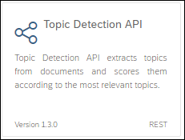
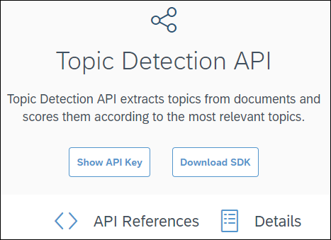
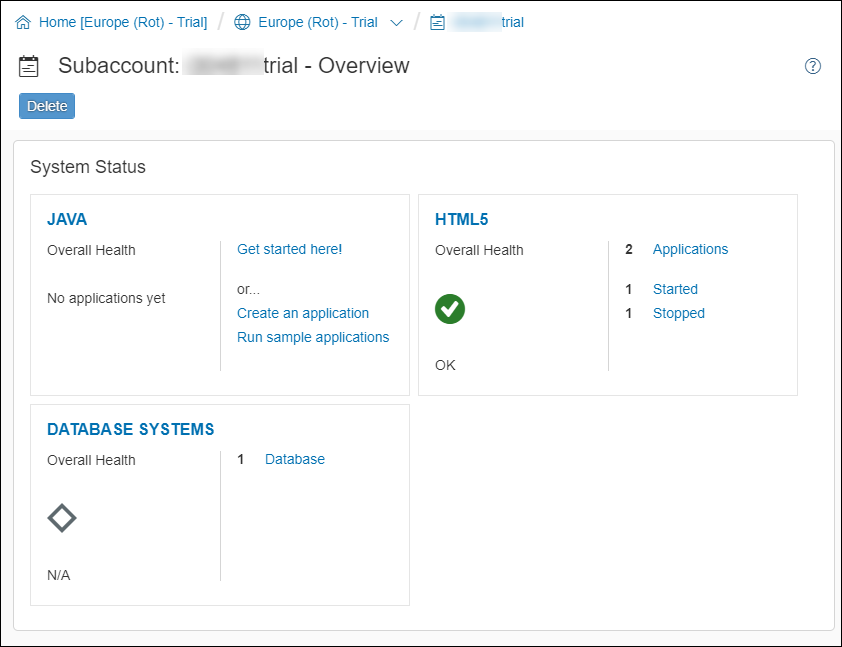
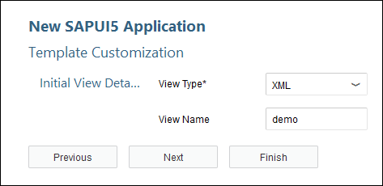

## Prerequisites  
  - [Sign up for an free trial account on the SAP Cloud Platform](https://developers.sap.com/tutorials/hcp-create-trial-account.html)

## Details
### You will learn  
  - How to quickly integrate the **Topic Detection** SAP Leonardo Machine Learning Functional Services published from the SAP API Business Hub sandbox in a SAPUI5 application

The **Topic Detection** service allows you to extracts topics from documents and scores them according to the most relevant topics.

You will then be able to substitute the **Topic Detection** services with any other SAP Leonardo Machine Learning Functional Services that consumes text content.

---

[ACCORDION-BEGIN [Step 1: ](Get The API Sandbox URL And API Key)]

In order to consume the **Topic Detection** SAP Leonardo Machine Learning Foundation service, you will first need to get the service URI and your API key, request and response parameters.

Go to [https://api.sap.com/](https://api.sap.com).


Then you will be able to search for the **SAP Leonardo Machine Learning - Functional Services**, then click on the package found.


Select **Inference Service for Topic Detection**.



You can also access the page directly from the following address:

 - <https://api.sap.com/api/topic_detection_api/resource>



To get to your API Sandbox URL, click on the **Details** tab.

The API Sandbox URL should be:

```JSON
https://sandbox.api.sap.com/ml/topicdetection
```

To get to your API key, click on the **Show API Key** button.

You will be prompted to login if you are not yet.

Then, the following pop-up should appear. Click on the **Copy Key and Close** button and save it in a text editor.


[DONE]
[ACCORDION-END]

[ACCORDION-BEGIN [Step 2: ](Analyze the service)]

As you can notice the API has only one resource (or service): `/topic-detection`.

Now click on the `/topic-detection` link to expand the section.

> **Note**: the term *inference* refers to the application phase (scoring) an existing model (as opposed to the training or inception phase) and *sync* for synchronous.

As stated in the description, the service accepts either:

 - an archive file with a zip/tar extensions containing multiple text files
 - a single text file
 - a list of text files as input

The service returns a list of detected topic with the associated keywords and scores (confidence).

The supported text file formats is plain text only.

The input file, files or archive file will be sent as a `FormData` query parameter in the service request.

A series of options are also required for the following parameters:

  - `numTopics`: Total number of topics to be detected
  - `numTopicsPerDoc`: Number of most relevant topics to be listed per document
  - `numKeywordsPerTopic`: Number of keywords to be listed per topic
  - `numFeatures`: Maximum number of keywords to be extracted from documents in total

[DONE]
[ACCORDION-END]

[ACCORDION-BEGIN [Step 3: ](Access the SAP Cloud Platform Cockpit)]

Log into the <a href="https://account.hanatrial.ondemand.com/cockpit#/region/neo-eu1-trial/overview" target="new"><b>SAP Cloud Platform Cockpit Neo Trial</b></a> with your free trial account on **Europe (Rot) - Trial** and access ***Your Personal Developer Account***.

Click on your ***SAP Cloud Platform Account*** identifier (which ends with *trial* by default) as highlighted on the below screenshot.


You are now in your ***SAP Cloud Platform developer*** account!



> If you are unclear with what is your SAP Cloud Platform account name, you can refer to the following blog entry: [SAP Cloud Platform login, user name, account id, name or display name: you are lost? Not anymore!](https://blogs.sap.com/2017/01/31/sap-hana-cloud-platform-trial-login-name-user-name-account-name-account-identifier-you-are-lost-not-anymore/)

[DONE]
[ACCORDION-END]

[ACCORDION-BEGIN [Step 4: ](Configure your destination)]

You will need to create a destination in your SAP Cloud Platform account that allow will your applications to connect to external APIs such as the SAP API Business Hub.

On the left side bar, you can navigate in **Connectivity** > **Destinations**.

On the ***Destinations*** overview page, click on **New Destination**


Enter the following information:

Field Name           | Value
-------------------- | --------------
Name                 | `sapui5ml-api`
Type                 | `HTTP`
Description          | `SAP Leonardo Machine Learning APIs`
URL                  | `https://sandbox.api.sap.com/ml`
Proxy Type           | `Internet`
Authentication       | `NoAuthentication`

Then you will need to add the following properties to the destination:

Property Name          | Value
---------------------- | --------------
`WebIDEEnabled`        | `true`

Click on **Save**


You can use the **Check Connectivity** button  next to the new **Destination** to validate that the URL can be accessed.

You should receive a ***connection established*** message with potentially a ***404: Not Found*** response which is normal.

[DONE]
[ACCORDION-END]

[ACCORDION-BEGIN [Step 5: ](Open the Web IDE)]

On the left side bar, you can navigate in **Services**, then using the search box enter `Web IDE`.


Click on the tile, then click on **Go to Service**.


You will get access to the **SAP Web IDE** main page:


[DONE]
[ACCORDION-END]

[ACCORDION-BEGIN [Step 6: ](Create a project using the SAPUI5 template)]

Click on **New Project from Template** in the ***Create Project*** section or use the **File** > **New** > **Project from Template**.


Select the **SAPUI5 Application** tile, then click on **Next**


Enter the following information, then click on **Next**

Field Name           | Value
-------------------- | --------------
Project Name         | `sapui5ml-topicdetection`
Namespace            | `demo`


Enter the following information, then click on **Finish**

Field Name           | Value
-------------------- | --------------
View Type            | `XML`
View Name            | `demo`



[DONE]
[ACCORDION-END]

[ACCORDION-BEGIN [Step 7: ](Extend the application resource roots)]

In order to ease the use of the provided code, we will add a new SAPUI5 resource roots. The main reason for this is that the rule used to generate the initial resource root by the project template has change many time over the time.

Edit the **`index.html`** file located under **`Workspace`** > **`sapui5ml`** > **`webapp`** and add the below element to the existing `data-sap-ui-resourceroots` property around line 15 (don't forget the comma in between the existing element and the new one).

```JavaScript
"sapui5ml": ""
```

It should eventually look something like this:

```
data-sap-ui-resourceroots='{"demo.sapui5ml-topicdetection": "./", "sapui5ml": ""}'
```

Click on the  button (or press CTRL+S).

[DONE]
[ACCORDION-END]

[ACCORDION-BEGIN [Step 8: ](Configure your SAPUI5 application)]

In order to use the previously configured destination, we need to add its declaration into the `neo-app.json` file along with the header white list configuration that will prevent HTTP header parameters to be filtered out.

Edit the **`neo-app.json`** file located under **`Workspace`** > **`sapui5ml-topicdetection`** and replace the current content with the below code.

Then click on the  button (or press CTRL+S).

```JSON
{
  "welcomeFile": "/webapp/index.html",
  "routes": [{
    "path": "/resources",
    "target": {
      "type": "service",
      "name": "sapui5",
      "entryPath": "/resources"
    },
    "description": "SAPUI5 Resources"
  }, {
    "path": "/test-resources",
    "target": {
      "type": "service",
      "name": "sapui5",
      "entryPath": "/test-resources"
    },
    "description": "SAPUI5 Test Resources"
  }, {
    "path": "/ml-dest",
    "target": {
      "type": "destination",
      "name": "sapui5ml-api"
    },
    "description": "ML API destination"
  }],
  "sendWelcomeFileRedirect": true,
  "headerWhiteList": [
    "APIKey"
  ]
}
```

> ### **Note:** `headerWhiteList`
>
>By default, headers element like the `APIKey` will be blocked when used in a SAPUI5 control like the `FileUploader`. This is the reason why we add it to the white list.
>

&nbsp;

[DONE]
[ACCORDION-END]

[ACCORDION-BEGIN [Step 9: ](Store your API setting in a JSON model)]

There are multiple options to achieve this goal. Here we will use a pre-loaded JSON model configured in the `manifest.json` file.

Create a new file named **`demo.json`** under **`Workspace`** > **`sapui5ml-topicdetection`** > **`webapp`** > **`model`**, copy the below code and make sure you replace `<<<<< COPY YOUR API KEY >>>>>` by your the API key we retrieved in step 2.

Then click on the  button (or press CTRL+S).

```JSON
{
	"defaultOptions": {
		"numTopics": 3,
		"numTopicsPerDoc": 3,
		"numKeywordsPerTopic": 15,
		"numFeatures": 20
	},
	"url": "/ml-dest/topicdetection/topic-detection",
	"method": "POST",
	"accept": "application/json",
	"fileType": "zip,tar",
	"mimeType": "application/x-zip-compressed,application/zip,application/octet-stream",
	"APIKey": "<<<<< COPY YOUR API KEY >>>>>"
}
```

Edit the **`manifest.json`* file located under **`Workspace`** > **`sapui5ml-topicdetection`** > **`webapp`** and locate the `models` section (around line 55), and update the section like this:

Then click on the  button (or press CTRL+S).

```JSON
"models": {
  "i18n": {
    "type": "sap.ui.model.resource.ResourceModel",
    "settings": {
      "bundleName": "demosapui5ml-topicdetection.i18n.i18n"
    }
  },
  "demo": {
    "type": "sap.ui.model.json.JSONModel",
    "preload": true,
    "uri": "model/demo.json"
  }
}
```

[DONE]
[ACCORDION-END]

[ACCORDION-BEGIN [Step 10: ](Extend the main SAPUI5 view)]

The view will contain a table to display the results along with a canvas to display the selected image (if a single one is selected) and 2 buttons, one to import a snapshot and the other one to take snapshot using the webcam (if any, this button won't be visible on mobile device because it is not supported).

Edit the **`demo.view.xml`** file located under **`Workspace`** > **`sapui5ml-topicdetection`** > **`webapp`** > **`view`** and replace the existing code with the below code.

Then click on the  button (or press CTRL+S).

```XML
<mvc:View xmlns:mvc="sap.ui.core.mvc" xmlns:table="sap.ui.table" xmlns:unified="sap.ui.unified" xmlns="sap.m" xmlns:micro="sap.suite.ui.microchart" xmlns:html="http://www.w3.org/1999/xhtml" controllerName="sapui5ml.controller.demo" displayBlock="true">
	<App>
		<pages>
			<Page title="Topic Detection">
				<content>
					<Table>
						<columns>
							<Column vAlign="Middle"/>
							<Column vAlign="Middle"/>
						</columns>
						<items>
							<ColumnListItem >
								<cells>
									<Label text="Total number of topics to be detected"/>
									<StepInput value="{demo>/defaultOptions/numTopics}" required="true"/>
								</cells>
							</ColumnListItem>
							<ColumnListItem>
								<cells>
									<Label text="Number of most relevant topics to be listed per document"/>
									<StepInput value="{demo>/defaultOptions/numTopicsPerDoc}" required="true"/>
								</cells>
							</ColumnListItem>
							<ColumnListItem>
								<cells>
									<Label text="Number of keywords to be listed per topic"/>
									<StepInput value="{demo>/defaultOptions/numKeywordsPerTopic}" required="true"/>
								</cells>
							</ColumnListItem>
							<ColumnListItem>
								<cells>
									<Label text="Maximum number of keywords to be extracted from documents in total"/>
									<StepInput value="{demo>/defaultOptions/numFeatures}"/>
								</cells>
							</ColumnListItem>
						</items>
					</Table>
					<VBox width="100%" direction="Column" alignItems="Center">
						<Carousel pages="{demo>/result}" width="100%" visible="{= ${demo>/resultVisible} === true}">
							<pages>
								<VBox width="100%" direction="Column" alignItems="Center">
									<ScrollContainer height="100%" width="100%" horizontal="true" vertical="true" focusable="true">
										<Label text="File name: {demo>name}" class="sapUiLargeMargin"></Label>
										<table:Table rows="{demo>topics}" enableBusyIndicator="true" selectionMode="Single" visibleRowCount="5">
											<table:columns>
												<table:Column sortProperty="rank" filterProperty="rank">
													<Label text="Topic id"/>
													<table:template>
														<Text text="{demo>id}"/>
													</table:template>
												</table:Column>
												<table:Column sortProperty="rank" filterProperty="rank">
													<Label text="Rank"/>
													<table:template>
														<Text text="{demo>rank}"/>
													</table:template>
												</table:Column>
												<table:Column sortProperty="score" filterProperty="score">
													<Label text="Score"/>
													<table:template>
														<micro:RadialMicroChart size="XS" fraction="{demo>score}" total="1" class="sapUiSmallMargin"/>
													</table:template>
												</table:Column>
												<table:Column>
													<Label text="Keywords"/>
													<table:template>
														<Text text="{demo>keywords}"/>
													</table:template>
												</table:Column>
											</table:columns>
										</table:Table>
									</ScrollContainer>
								</VBox>
							</pages>
						</Carousel>
					</VBox>
				</content>
				<footer>
					<Toolbar width="100%">
						<content>
							<unified:FileUploader buttonOnly="true" buttonText="Upload Text File Archive" sameFilenameAllowed="true" multiple="false"
								fileType="{demo>/fileType}" mimeType="{demo>/mimeType}" typeMissmatch="fileTypeMissmatch" change="fileUploaderChange"
								uploadComplete="fileUploaderComplete" name="files" uploadUrl="{demo>/url}" useMultipart="true" sendXHR="true" uploadOnChange="true">
								<unified:headerParameters>
									<unified:FileUploaderParameter name="APIKey" value="{demo>/APIKey}"/>
									<unified:FileUploaderParameter name="Accept" value="{demo>/accept}"/>
								</unified:headerParameters>
								<unified:parameters>
									<unified:FileUploaderParameter name="options" value="{demo>/options}"/>
								</unified:parameters>
							</unified:FileUploader>
						</content>
					</Toolbar>
				</footer>
			</Page>
		</pages>
	</App>
</mvc:View>
```

[DONE]
[ACCORDION-END]

[ACCORDION-BEGIN [Step 11: ](Extend the main SAPUI5 controller)]

Edit the `demo.controller.js` file located under **`Workspace`** > **`sapui5ml-topicdetection`** > **`webapp`** > **`controller`** and replace the existing code with the below code.

Then click on the  button (or press CTRL+S).

```JavaScript
sap.ui.define([
	"sap/ui/core/mvc/Controller",
	"sap/m/MessageBox",
	"sap/m/Image"
], function (Controller, MessageBox, Image) {
	"use strict";
	return Controller.extend("sapui5ml.controller.demo", {
		fileUploaderChange: function (oControlEvent) {
			// get the current view
			var oView = this.getView();
			// start the busy indicator
			var oBusyIndicator = new sap.m.BusyDialog();
			oBusyIndicator.open();
			// generate the options and stringify
			oView.getModel("demo").setProperty("/options", JSON.stringify(oView.getModel("demo").getProperty("/defaultOptions")));
			// keep a reference in the view to close it later
			this.oBusyIndicator = oBusyIndicator;
		},
		fileUploaderComplete: function (oControlEvent) {
			// get the current view
			var oView = this.getView();
			if (oControlEvent.getParameters().status === 200) {
				// get the resvice respnse as JSON
				var oTopicDetection = JSON.parse(oControlEvent.getParameters().responseRaw).predictions;

				// create a JSON model
				var documents = new Array(oTopicDetection.length);
				for (var iTopicDetection = 0; iTopicDetection < oTopicDetection.length; iTopicDetection++) {
					var oTopicDetectionDocument = {
						"name": oTopicDetection[iTopicDetection].docName
					};
					oTopicDetectionDocument.topics = [];
					for (var iTopics = 0; iTopics < oTopicDetection[iTopicDetection].topics.length; iTopics++) {
						var oTopicDetectionTopic = {
							"rank": iTopics,
							"id": oTopicDetection[iTopicDetection].topics[iTopics],
							"score": oTopicDetection[iTopicDetection].scores[iTopics],
							"keywords": oTopicDetection[iTopicDetection].keywords[iTopics]
						};
						oTopicDetectionDocument.topics.push(oTopicDetectionTopic);
					}
					documents[iTopicDetection] = oTopicDetectionDocument;
				}
				oView.getModel("demo").setProperty("/result", documents);
				// display the result table
				oView.getModel("demo").setProperty("/resultVisible", true);
			} else {
				oView.getModel("demo").setProperty("/resultVisible", false);
				var response = JSON.parse(oControlEvent.getParameters().responseRaw);
				MessageBox.show("Error " + response.error.code + " : " + response.error.message);
			}
			this.oBusyIndicator.close();
		}
	});
});
```

[DONE]
[ACCORDION-END]

[ACCORDION-BEGIN [Step 12: ](Test the application)]

Click on the **Run** icon  or press `ALT+F5`.

In the bar at the bottom, click on **Upload Text File Archive** to pick your local zip archive that contains plain text files.

The service will be called, and the result displayed in a table.


[DONE]
[ACCORDION-END]

[ACCORDION-BEGIN [Step 13: ](Validation)]

Provide an answer to the question below then click on **Validate**.

[VALIDATE_1]
[ACCORDION-END]

[ACCORDION-BEGIN [Solution: ](Project files)]

In case you are having problems when running the application, the complete project code can be found on the SAP Tutorial public [GitHub repository](https://github.com/SAPDocuments/Tutorials/tree/master/tutorials/ml-fs-sapui5-topic-detection/source).

However, this is not a repository you can clone and run the code.

You have to import the `sapui5ml-imageclassifier` directory content into your existing project directory.

Make sure you check the [LICENSE](https://github.com/SAPDocuments/Tutorials/blob/master/LICENSE.txt) before starting using its content.

[DONE]
[ACCORDION-END]
