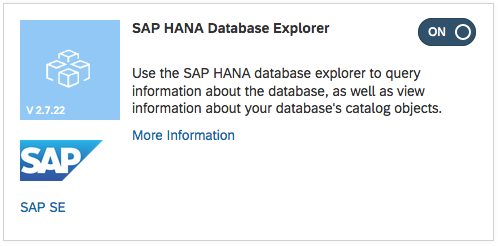
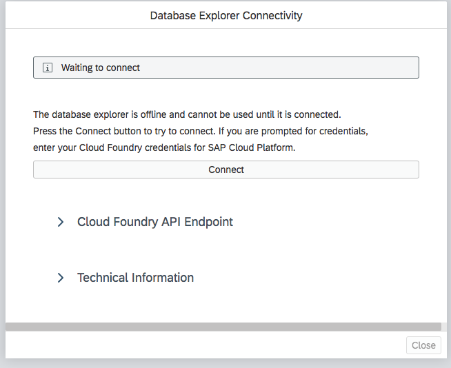
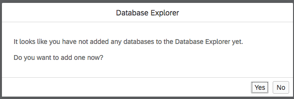
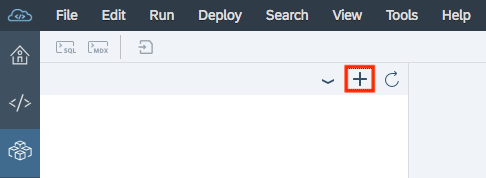
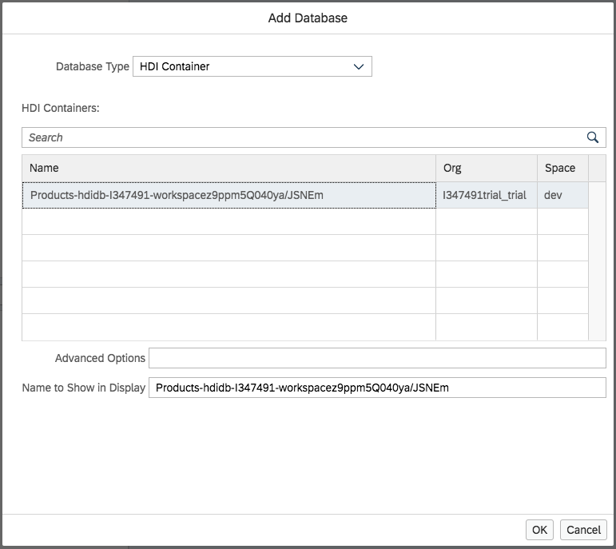
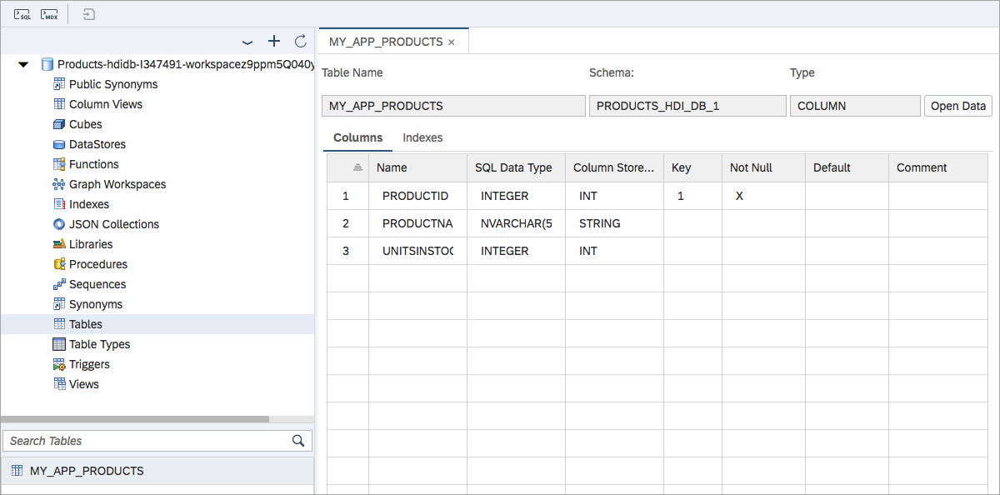
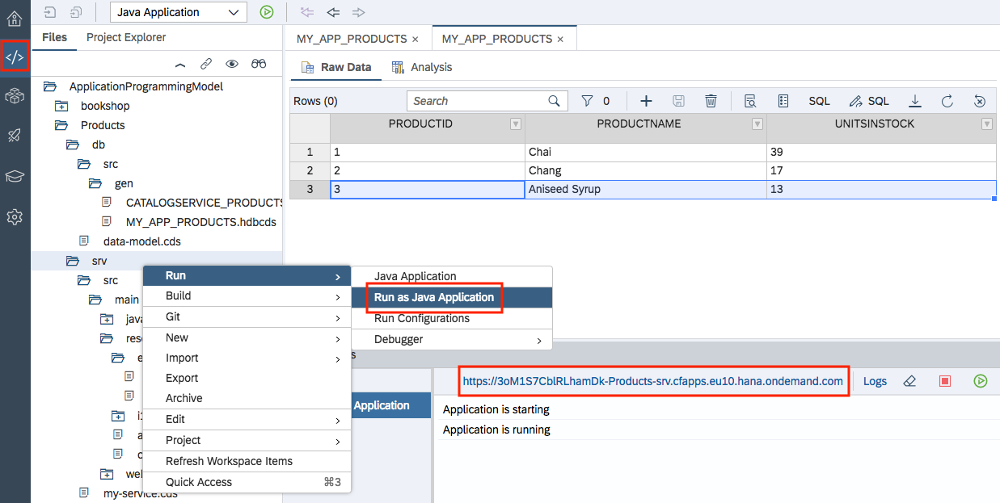
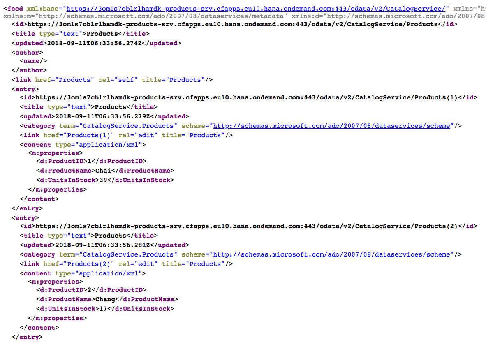

## Details
### You will learn
- How to enable the Database Explorer
- How to use some of the basic features of the Database Explorer

This tutorial assumes you've completed the tutorial [Define a Simple Data Model and OData Service with CDS](https://www.sap.com/developer/tutorials/odata-05-data-model-service.html). If you have done, you'll have a brand new OData service of your own to use. However, while that service is backed by a persistence layer (in this case a SAP HANA database), there's no data, so any querying of the data will return no results.

In this tutorial, you'll enable the Database Explorer in SAP Web IDE, and use it to connect to your database and populate the table related to the Products entity type you've defined, so you can start to see results for your queries.

> In this tutorial and others the general name "SAP Web IDE" is used. Specifically, the "Full-Stack" version is implied throughout.

---

[ACCORDION-BEGIN [Step 1: ](Start up the SAP Web IDE)]

Access SAP Web IDE from your trial SAP Cloud Platform cockpit. Use the details in the tutorial [Enable the SAP Web IDE Full Stack](https://www.sap.com/developer/tutorials/webide-multi-cloud.html) to find out how to access it, or simply invoke it using a URL which will look like this:

`https://webidecp-XYZ.dispatcher.hanatrial.ondemand.com/`

Here, `XYZ` represents your trial subaccount name, such as `p999999trial`.

You can find out more about accessing SAP Web IDE in the Help Portal, specifically in the [Open SAP Web IDE](https://help.sap.com/viewer/825270ffffe74d9f988a0f0066ad59f0/CF/en-US/51321a804b1a4935b0ab7255447f5f84.html) section.

[DONE]
[ACCORDION-END]

[ACCORDION-BEGIN [Step 2: ](Ensure the Database Explorer feature is enabled)]

In order to use the Database Explorer in SAP Web IDE, you'll need to make sure it's enabled first.

In SAP Web IDE, select the Preferences perspective either with the cog icon or via menu path **Tools** > **Preferences**. At the **Workspace Preferences** level, select **Features** and make sure that this feature is enabled.



> If you're enabling the feature for the first time, you'll be asked to refresh SAP Web IDE.

[DONE]
[ACCORDION-END]

[ACCORDION-BEGIN [Step 3: ](Start up the Database Explorer and connect)]

At this point you're ready to start up the Database Explorer and connect it to your database.

Open it up, either using the menu path **Tools** > **Database Explorer** or simply by choosing the appropriate perspective icon on the far left hand side of SAP Web IDE.

If you're starting up the feature for the first time, you will be presented with a popup asking you to connect.



> If you're interested, you can expand the Cloud Foundry **Endpoint** section to check that the API endpoint specified is indeed the same one as you set in your Cloud Foundry preferences in the tutorial that's a prerequisite to this one.

Hit the **Connect** button and after a short time you'll be presented with another popup, this time asking you to add a database.



> If you don't get this popup, you can always use the **Add a database** button as shown here:
> 

When the database was created for you in your trial subaccount, it was created as an HANA Deployment Infrastructure (HDI) container, within the context of the `hdi-shared` plan for the HANA trial service in the SAP Cloud Platform's Cloud Foundry (CF) environment.

Make sure, therefore, when you see the **Add Database** popup, that **HDI Container** is specified for the **Database Type** field.

The database itself should appear in the **HDI Containers** listing. Note that the CF organization and space are also shown, denoting where the HDI container is deployed.



Select the database and confirm with **OK**.

[VALIDATE_3]
[ACCORDION-END]

[ACCORDION-BEGIN [Step 4: ](Find the products table)]

Now you're connected to your database, you can find the table that was defined for your `Products` entity definition, and add data to it.

Remember that the `Products` entity definition in `data-model.cds` looks like this:

```
namespace my.app;

entity Products {
  key ProductID : Integer;
  ProductName   : String;
  UnitsInStock  : Integer;
}
```

Within the new database entry in the Database Explorer, find the **Tables** and select the only table that's listed -- the **`MY_APP_PRODUCTS`** table.

> The name of this table, as you can guess, is made up from the data model namespace and the entity name itself.

You should be presented with the table's definition, like this:



> Observe how the data definition reflects the CDS based definition in the `data-model.cds` file. If you're curious, check in the `MY_APP_PRODUCTS.hdbcds` file, which is the artifact generated when you built the `db` module in the [Define a Simple Data Model and OData Service with CDS](https://www.sap.com/developer/tutorials/odata-05-data-model-service.html) tutorial. You'll see the specific SQL-level table name and field types there.

Use the **Open Data** button on the far right to open up a new tab to show data in the table, in an editor. There's no data right now, so it should look something like this:


[DONE]
[ACCORDION-END]


[ACCORDION-BEGIN [Step 5: ](Add product entries)]

Now for the fun part -- adding sample data. This is the beauty of using the Core Data and Services based approach to build OData services persisted by an HDI container -- you can have the service generated for you, and comfortably edit the data, all from within SAP Web IDE.

In the **Raw Data** tab of the data editor, use the **+** button to add new rows, entering values for each of the fields.


Fill in your own values, or use the Northwind `Products` data that you looked at in [Define a Simple Data Model and OData Service with CDS], via this URL:

<https://services.odata.org/V3/Northwind/Northwind.svc/Products?$format=json&$select=ProductID,ProductName,UnitsInStock>

When you're done, don't forget to use the **Save** button -- a diskette icon, very retro!

At this stage, you have a fully functioning OData service populated with test data. You can check this by following the same link as in the [Define a Simple Data Model and OData Service with CDS](https://www.sap.com/developer/tutorials/odata-05-data-model-service.html) tutorial. If you don't have that on hand, just switch back to the **Development** perspective, and use the context menu on the **`srv`** folder to start the application, with **Run** > **Run as Java Application**. The Run Console will appear with the URL you need.



Following the URL, through the link to the service document, you can specify the `Products` entity set and see your OData service serving the data you just entered.



Congratulations!

[DONE]
[ACCORDION-END]
