## Details
### You will learn  
  - How to create a multi-dimensional report from a CDS query

---

[ACCORDION-BEGIN [Step 1: ](Execute app Custom Analytical Queries)]

Go back to the SAP Fiori launchpad home, select and execute from **Query Design** > **Custom Analytical Queries**.

[DONE]
[ACCORDION-END]

[ACCORDION-BEGIN [Step 2: ](Search and customize relevant query)]

Search for the query **`ZC_APSEMTAGSTATISTICAL`**

Copy the query  **`ZC_APSEMTAGSTATISTICAL`** by checking it and clicking **Copy**.

In the **Copy Source Query** window, provide the new query name:
**`APSEMTAGSTATISTIC_XXXX`**  
>Replace  XXXX with your initial (e.g., **`APSEMTAGSTATISTIC_1111`**).

Click **OK**.

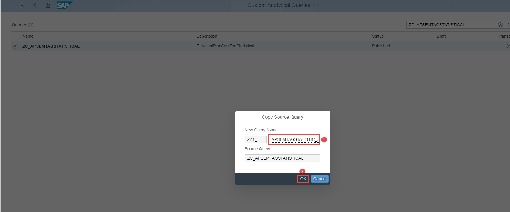

[VALIDATE_1]
[ACCORDION-END]

[ACCORDION-BEGIN [Step 3: ](Explore query and choose your fields)]

Explore the details of the Tab General:

  - Label
  - Name
  - Data Source

Explore **Field Selection** tab, including the available fields and selected fields.

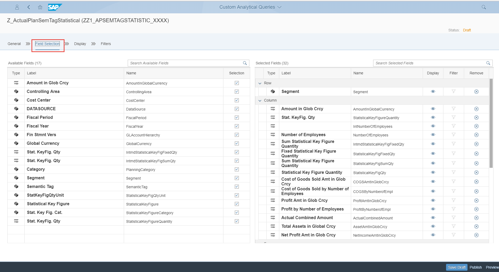

Explore the details of the **Display** tab, including the display fields and properties.

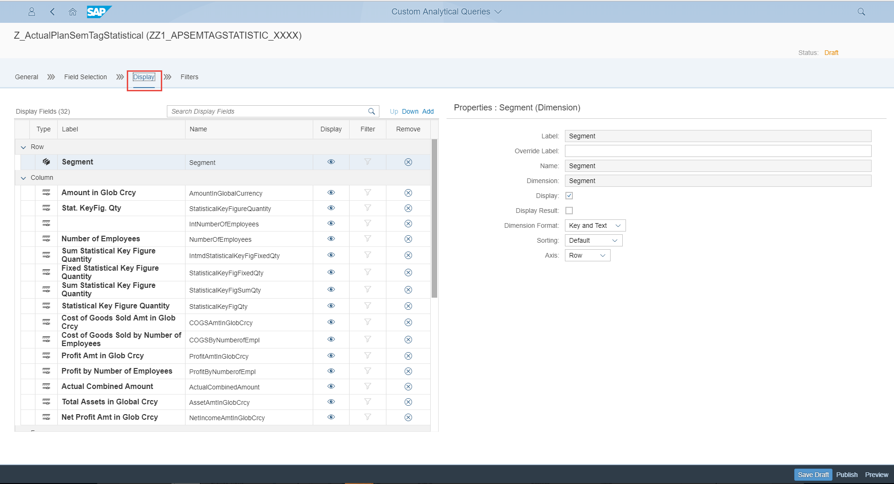

Explore the details of the **Filter** tab, including the filter fields and filters.

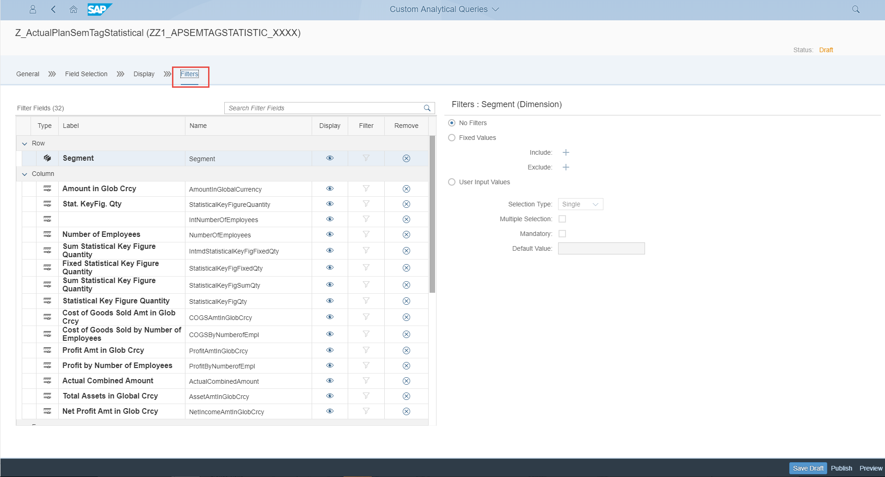

[DONE]
[ACCORDION-END]

[ACCORDION-BEGIN [Step 4: ](Activate and publish query)]

Go back to the **General** tab. Click **Publish** to activate and publish your query with the name **`ZZ1_APSEMTAGSTATISTIC_XXXX`** where you must replace **`XXXX`** with your initials.

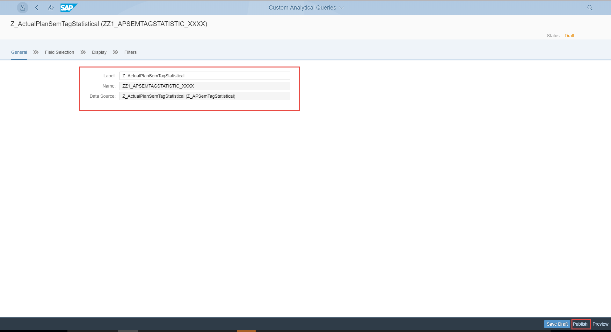

After publishing, the status will change from **Draft** to **Publish**. You will have a similar picture to this one:

[DONE]
[ACCORDION-END]

[ACCORDION-BEGIN [Step 5: ](Display content of query)]

Execute from the Group Query Design the App View Browser and display the content of your query **`ZZ1_APSEMTAGSTATISTIC_XXXX`**  with the following values:

|  Field Name                | Value
|  :-------------------------| :-------------
|  To-Period                 | `7`
|  Category                  | `ATC01`
|  Fin Statement Version     | `L000`
|  Fiscal Year               | `2018`
|  Controlling Area          | `A000`

[DONE]
[ACCORDION-END]

[ACCORDION-BEGIN [Step 6: ](Explore content of  query)]

1. Drill-down by segment.
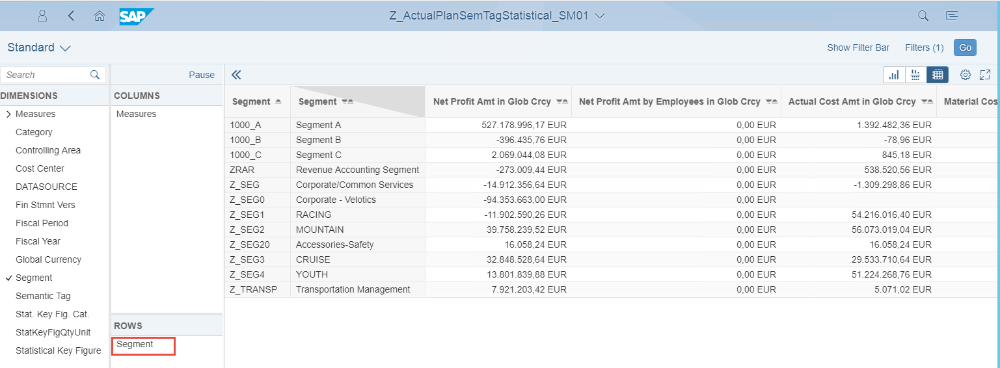

2. Drill-down by cost center.
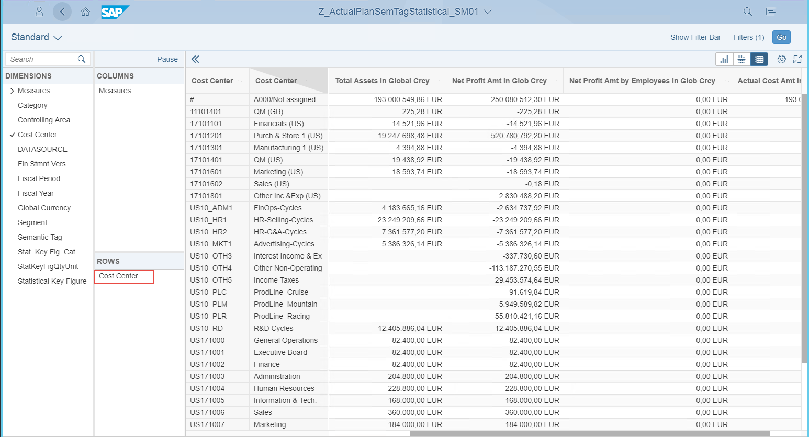

[DONE]
[ACCORDION-END]

[ACCORDION-BEGIN [Step 7: ](Create custom key figure for report)]

1. Go back to the entry point of the app Custom Analytical Queries. In the search field, enter `ZZ1_APSEMTAGSTATISTIC_XXXX`, which is the name of the view you have created previously, and then click the search button.

    

2. Check the view **`ZZ1_APSEMTAGSTATISTIC_XXX`** and afterwards click the arrow button to display the details of the query, and afterwards click **Edit**.

    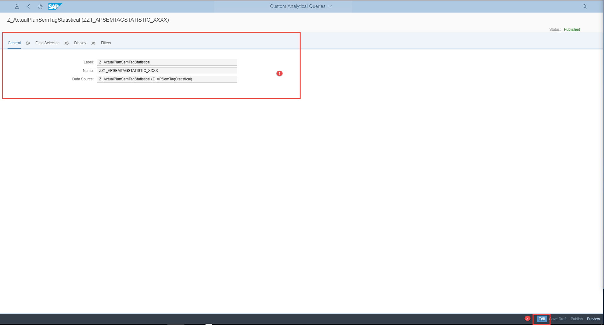

3. Move to the **Display** tab, click **Add** and double-click **Add Calculated Measure**. You will see a screen similar to the one below:

    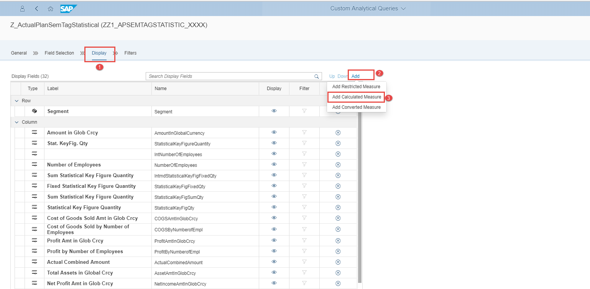

4. In the screen **New Calculated Measure**, maintain the fields as follow:

    |  Field Name                | Value
    |  :-------------------------| :-------------
    |  Label                     | `Net Profit Amt by Empl in Glob Crcyxxxx`

    > The field Name will be filled automatically by the system !

    Afterwardsm, click **OK**.

    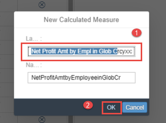

5. A new field labelled `Net Profit Amt by Empl in Glob Crcyxxxx` appears on the right of the screen, showing the properties of the newly created field.

    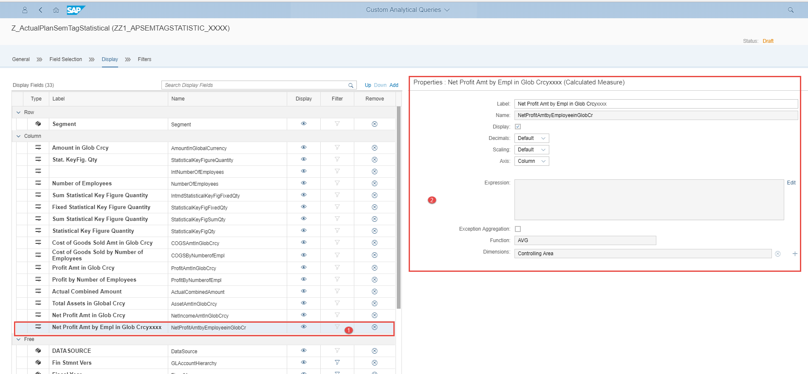

6. On the properties panel of the newly created field, click **Edit** to open the expression editor in order to insert the formula for the calculation of the value of the key figure `Net Profit Amt by Empl in Glob Crcyxxxx`.

    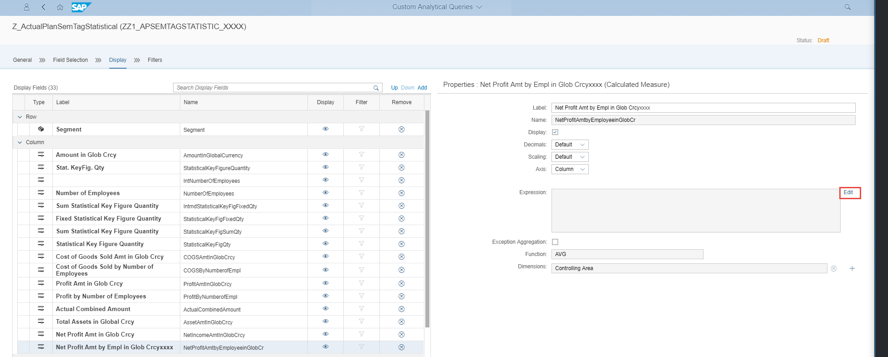

7. In the expression editor, enter the following expression for the calculation as depicted in the following pictures:

    

    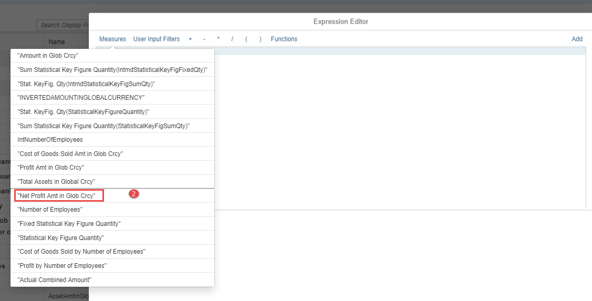

    

    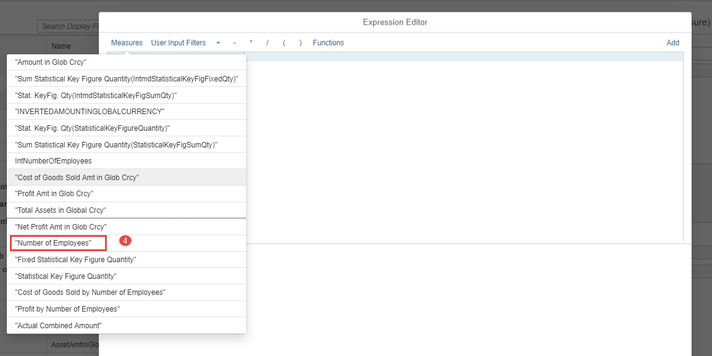

    Afterwards, click **OK**.

    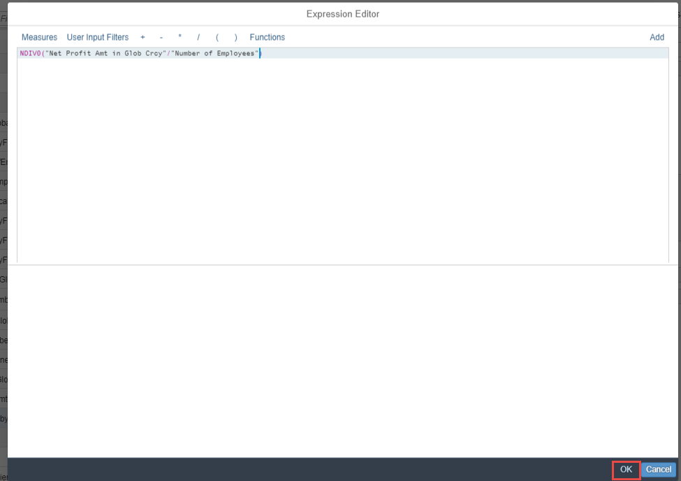

13. Finally, you will have a screen similar to the one below. After exploring this, click the **Save Draft** to save all your work in this step.

    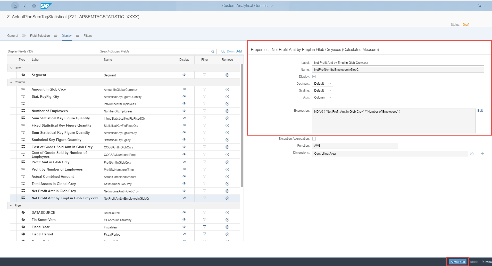

14. After you save you work, click **Publish** to make it available for use. Doing so will change the status of the query from draft to publish. Afterwards, click **Preview** to see your new key figure field.

[VALIDATE_3]
[ACCORDION-END]

[ACCORDION-BEGIN [Step 8: ](Create launchpad tile for report)]

1. Click the **Action** icon.

2. Click **Save as Tile**.
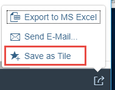
3. In the **Save Tile** window, maintain the fields as follows:

    - **Title:** Actual Cost and Headcount XXXX Report
    - **Subtitle:** Filter by Cost Center
    - **Group:** My Home
    - **Save title:** `report_aq_15.png`

4. Afterwards click on the OK button
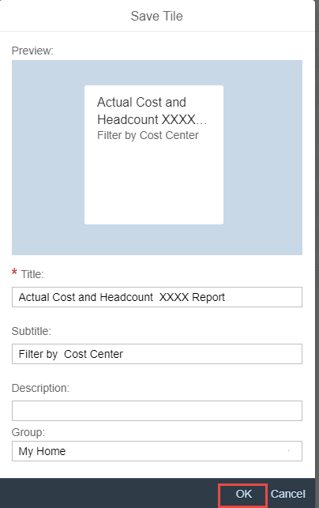

5. Go to SAP Fiori launchpad home page, and navigate to the group **My Home**, and
make sure that you see a tile labeled with **Actual Cost and Headcount XXXX Report**.

[DONE]
[ACCORDION-END]
