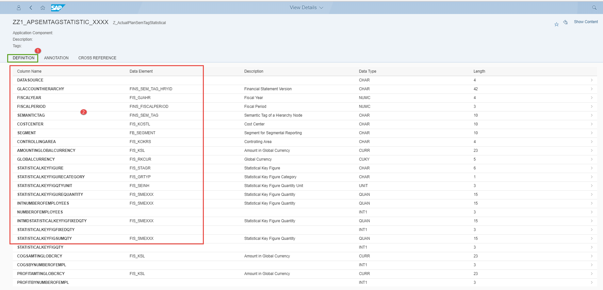
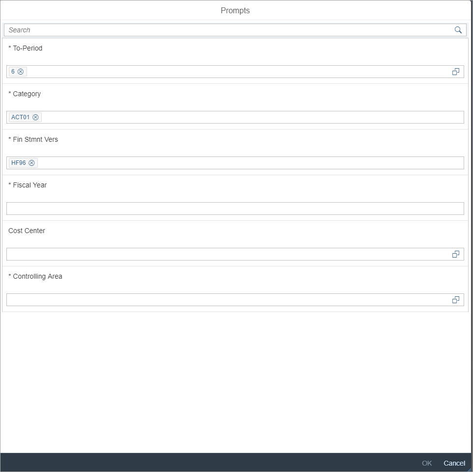
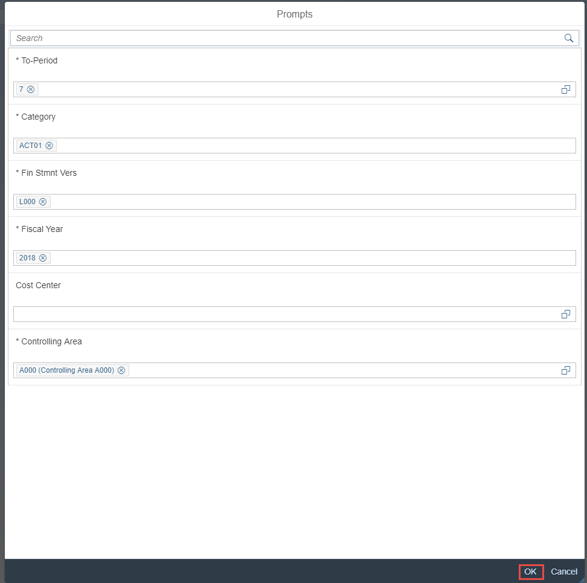
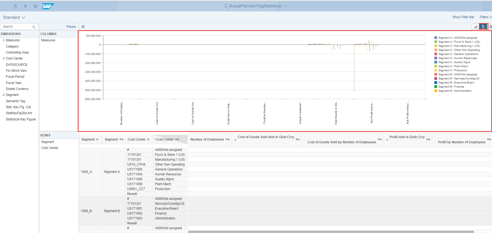

## Details
### You will learn  
  - About the Virtual Data Model(VDM) to get an overview of the available data sources in S/HANA that match your business

---

[ACCORDION-BEGIN [Step 1: ](Log into SAP Fiori launchpad)]
First you need to log into the SAP Fiori launchpad.
1. Double clicks on the **Remote Desktop icon** on the taskbar of your windows desktop.

    

2. The Remote Desktop Connection gets open and you are redirected to the SAP FIORI Launchpad.

You should see this page:

    

3. Login now with your user and password

> Your user is `S4HANAPUT-XX` where **XX** is your desktop number. Your password will be given to you by your instructors.

[DONE]
[ACCORDION-END]

[ACCORDION-BEGIN [Step 2: ](Execute the App View browser)]

In the Fiori Launchpad, from the group Query Design select the App View Browser and double click on it as on the below picture:

[DONE]
[ACCORDION-END]

[ACCORDION-BEGIN [Step 3: ](Search for view)]

After you have successfully executed the App View Browser, the below window gets open. In the search field, enter `ZZ1_APSEMTAGSTATISTIC_XXXX`, which is the name of the view you are looking for and hit the search button.

[VALIDATE_1]
[ACCORDION-END]

[ACCORDION-BEGIN [Step 4: ](Explore the result view)]

1. To have the details on the view **`ZZ1_APSEMTAGSTATISTIC_XXX`** displayed, double clicks on the selected row to open the  **View Details**  screen.

    

2. In the **View Details** window, you have the choice between several tabs (**Definition**, **Annotation**, **Cross Reference**) on which you can view details of the considered view for analysis purposes. For example, on **Definition**, you can see the available fields as well as their data elements, descriptions, data types, and lengths.

    

3. On the tab **Cross Reference** , you, can easily see that the cross reference to the related view is **`Z_APSEMTAGSTATISTICAL`**

    

4. Now, you would like to see the content of the view **`ZZ1_APSEMTAGSTATISTIC_XXX`**. To do so, you must click on **Show Content** which will open Design Studio to display the multi-dimensional report as this CDS view is an analytical query.

    

5. The **Prompts** window of the report to maintain the selection parameters gets open as shown below:

    

    In the **Prompts** window maintain:

    |  Field Name                | Value
    |  :-------------------------| :-------------
    |  To-Period                 | `7`
    |  Category                  | `ATC01`
    |  Fin Statement Version     | `L000`
    |  Fiscal Year               | `2018`
    |  Controlling Area          | `A000`

Afterward click on the OK button to start the display of the content of the selected View.

[VALIDATE_2]
[ACCORDION-END]

[ACCORDION-BEGIN [Step 5: ](Show view content)]

The content of the selected view is shown after clicking **OK** from the previous step. You should see a screen like the one below.

You can also have a graphical holistic view of your result set including all available **Cost Center** values.
To do so, you have to click the chart icon. Afterwards, the expected graphic with its legend are displayed in the result set as well.

[DONE]
[ACCORDION-END]
