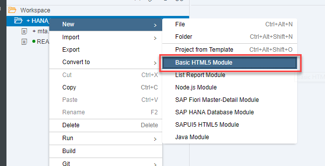
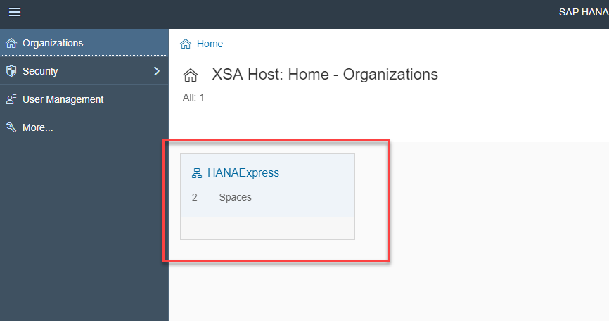
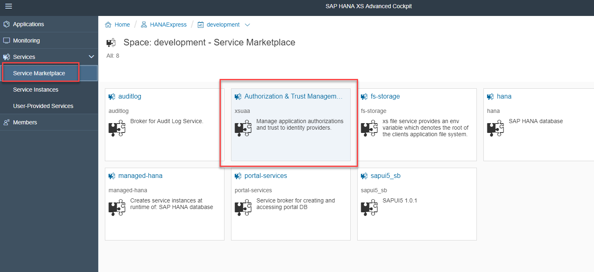
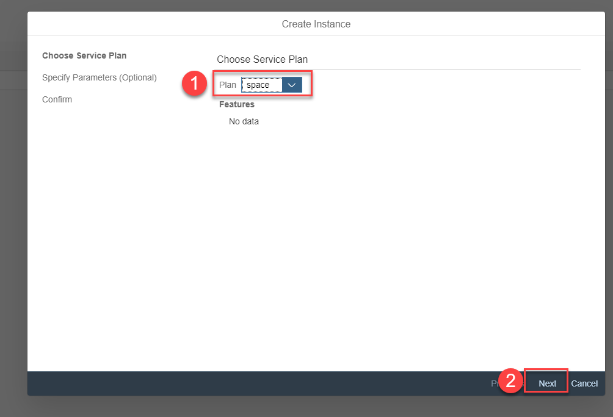
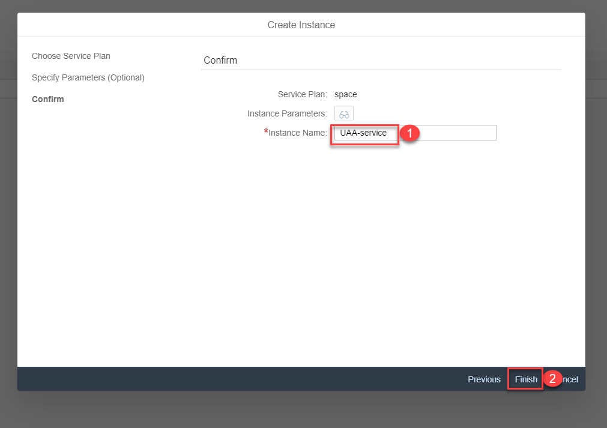
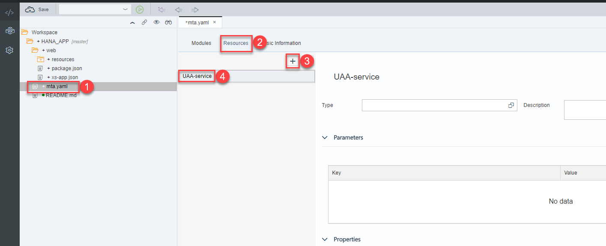
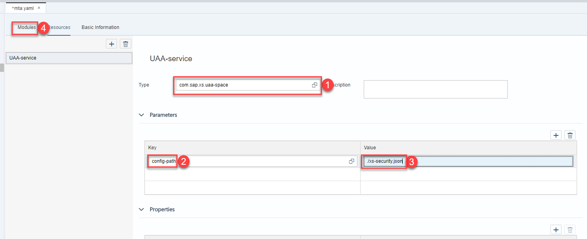
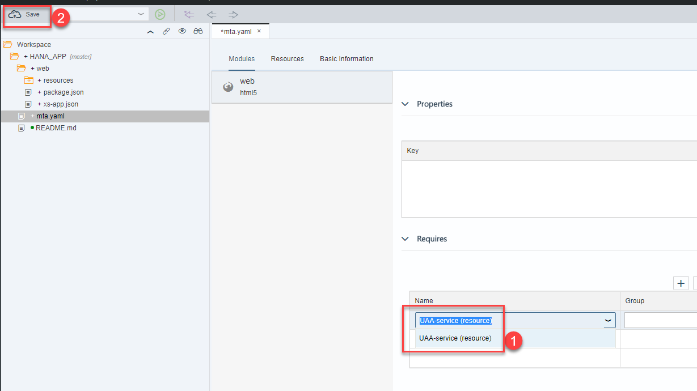
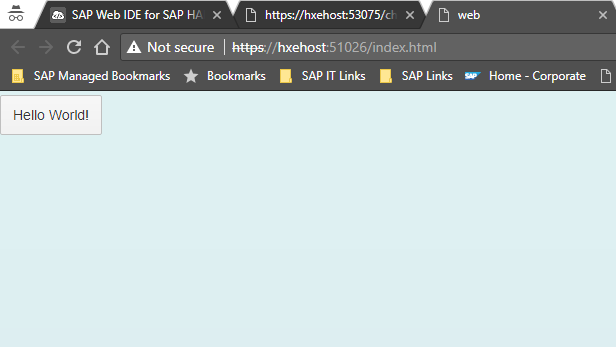

## Prerequisites  
 - You have created a  Multi-Target Application as explained in this tutorial: [SAP HANA XS Advanced Connect to Web IDE and clone Git Repository](https://www.sap.com/developer/tutorials/xsa-connecting-webide.html)


## Details
### You will learn  
You will learn how to create an HTML5 endpoint with authentication using the User Account and Authorization (UAA) service.


### Time to Complete
**15 Min**.

---


[ACCORDION-BEGIN [Step 1: ](Add the HTML5 Module in your existing MTA project)]

> ***What is a Multi-Target Application?***: The XS Advanced application platform is based on Cloud Foundry, an open-source platform that provides a layer of abstraction between your application and the underlying infrastructure. This is useful because it allows you to deploy the same application in different cloud providers. Cloud Foundry allows for a micro-service approach. A Multi-Target Application allows you to bundle all the different micro-services conforming `your business application into the same lifecycle`.

 Begin by right-clicking on your project and then choosing `New -> HTML5 Module`



Name the module `web`. Press Next to see the confirmation. Then press **Finish**.


You will notice a new folder under the project folder. SAP Web IDE has automatically created the appropriate folder structure for you. Open the `resources` folder to answer the validation below.

[VALIDATE_1]

[ACCORDION-END]

[ACCORDION-BEGIN [Step 2: ](Create the UAA service instance for your application)]

Before you can use the UAA service, you need to create a instance for your application.

If you have installed the XS Advanced administration cockpit (included by default in SAP HANA, express edition SPS03 or higher), you can use the graphical interface to create an instance of the UAA service.

The default URL for the cockpit in HANA express is `https://hxehost:51036`, you can find out using the XS CLI as below:


Open the XSA cockpit **with a different browser or alternate between private/incognito and normal mode**. Log in with `XSA_ADMIN` (or an appropriate user) if prompted. Click on the organization you are using for development:



Then continue to select the same space you have chosen for your MTA project


Expand the **Services** menu, select **Service Marketplace** and click **Authorization and Trust management**:



Use **Instances** and press **New Instance**. Choose service plan **space**



When prompted for an optional `.json` file, click **next**. Use `UAA-service` as the name of the Instance



Click **Finish** and you will see your instance is created.


Alternatively, if you do not have the XS Advanced Cockpit in your server, you can use the Command Line Interface:

This can be downloaded from the SAP HANA Developer Edition directly, using the Download Manager and choosing "Clients" from the [SAP HANA, Express Edition, getting started](https://www.sap.com/developer/topics/sap-hana-express.html) or via the [SAP Service Marketplace](https://websmp208.sap-ag.de/~SAPIDP/002006825000000234912001E)

```
xs login -a http://<hostname>:3XX30 -o HANAExpress -s development -u XSA_ADMIN
```

If you are not using HANA Express, change the organization (`HANAExpress`), space (`development`) and user (`XSA_DEV`) accordingly. The API endpoint may also be different.

The space has to match the space that was setup in the Project Settings. You can check it by right-clicking on the repository folder and opening "Project Settings"


To create the UAA service issue the following command:

```
xs create-service xsuaa space APP_UAA
```


[DONE]

[ACCORDION-END]


[ACCORDION-BEGIN [Step 3: ](Add the UAA service as a dependent resource)]

The User Account and Authentication service validates users and their roles and provides them with an authentication token. You can find more information on the UAA service in [the developer guide](https://help.sap.com/viewer/4505d0bdaf4948449b7f7379d24d0f0d/2.0.03/en-US/c6f36d5d49844bd790798ea36538e024.html).

Before you can establish a dependency between your HTML5 module and the UAA service instance you created in the previous step, you need to list the UAA service instance as a resource in your applications. Open the `mta.yaml` file in graphical mode and got to the resources tab. Create a new resource using the **+** Sign




Fill in the name,  choose `com.sap.xs.uaa-space` from the search help and add the following key-value pairs to the parameters: `config-path` and `./xs-security.json`.


Click **Modules** to add the dependency to the UAA service in the web module



>***What is this `mta.yaml` file for?***
>We have so far created a Multi Target Application, that is, an application that will contain different modules, such as an HTML5 module and some database artifacts within a HANA Database Module. This file is a design-time descriptor, that will be used by the platform to create a deployment descriptor. This file contains information related to the application (ID, version, description) as well as resources, modules and parameters that will be deployed and required at runtime.

</br>


And click on **Save**


Open the `Code Editor` tab in the bottom to see the actual contents of the  `mta.yaml` file.


[DONE]
[ACCORDION-END]


[ACCORDION-BEGIN [Step 5: ](Change Authentication Method)]

The web folder in your project contains the resources that will be served out by this HTML5 module. This HTML5 module manages all HTML/client side UI resources (in the resources folder) and performs the task of reverse proxy for all other internal services, like a application router. This way you have a single HTTP endpoint and avoid any CORS issues. AMong other files, the `Basic HTML5 Module` wizard created a file called `xs-app.json`.

In this file you can map the routes to destinations you defined in the `mta.yaml`. We can also set authentication and other options. Go ahead and change the `authenticationMethod` to route in the `xs-app.json` file.

```
{
	"welcomeFile": "index.html",
	"authenticationMethod": "route",
	"routes": [ ]
}
```

You will learn how to add routes to backend modules in the next tutorials. You can check [this post](https://blogs.sap.com/2018/02/16/xs-advanced-for-not-so-dummies-routing/) to learn more about how this works.

[DONE]

[ACCORDION-END]

[ACCORDION-BEGIN [Step 6: ](Build and Run!)]

Your initial development is done and you are ready to deploy your application onto the XS Advanced server. Right-click on the project and press **Build**.


And check the results in the log.


Click on the web folder and click on **Run**. This  will open a new browser tab to the default page of this web service.


The console will be updated with the status of the service. Notice there is a **logs** URL that will be of use if something goes wrong.


> Did you get a red cross and an error in the logs saying the UAA service has not been found? The name of the service in the `yaml` definition needs to match the name of the service you created. The application and the service need to be in the same space too.

A new tab will open and you will see the default **Hello World** button has been placed for you:



[VALIDATE_2]

[ACCORDION-END]

